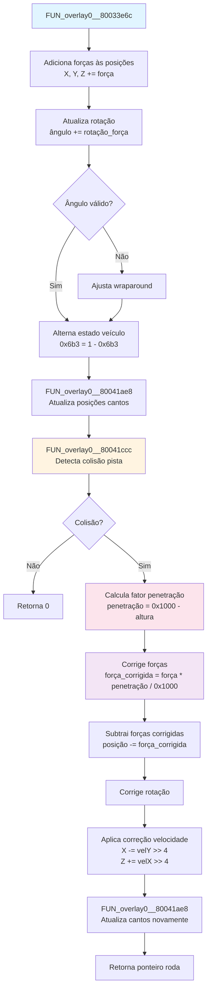
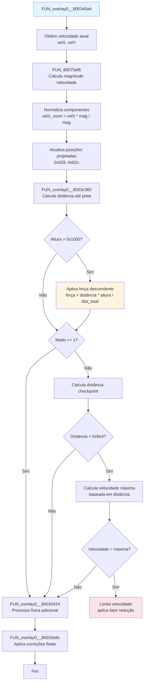
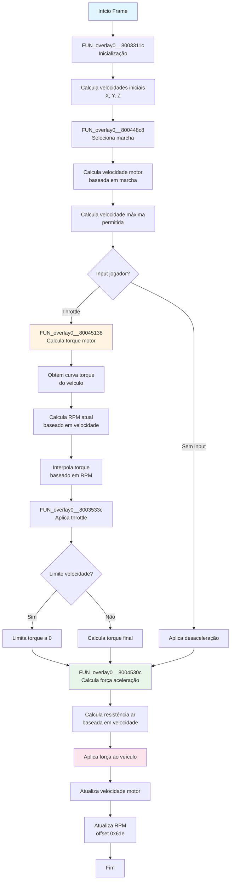
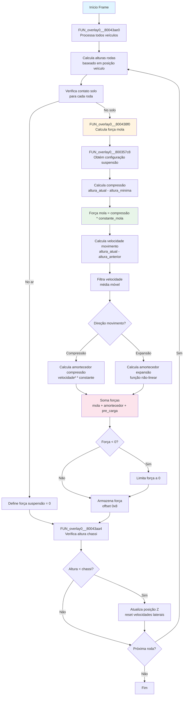

```mermaid
flowchart TD
    Start([Início do Frame]) --> MainLoop[FUN_overlay0__80034480]
    
    MainLoop --> ResetLoop[Loop: Reset Flags]
    ResetLoop --> ResetFlags[FUN_overlay0__8003360c<br/>Reset contadores colisão]
    ResetFlags --> ResetNext{Próximo veículo?}
    ResetNext -->|Sim| ResetLoop
    ResetNext -->|Não| TrackCollision
    
    TrackCollision[FUN_overlay0__80034320<br/>Colisão com pista] --> TrackLoop[Loop por veículo]
    TrackLoop --> CheckCollision[FUN_overlay0__80033e6c<br/>Verifica colisão]
    CheckCollision --> CollisionResult{Colisão?}
    CollisionResult -->|Não| UpdateAngle[Atualiza ângulo rotação]
    CollisionResult -->|Sim| ApplyPhysics[FUN_overlay0__800340a4<br/>Aplica física colisão]
    UpdateAngle --> TrackNext{Próximo veículo?}
    ApplyPhysics --> TrackNext
    TrackNext -->|Sim| TrackLoop
    TrackNext -->|Não| CalcPositions
    
    CalcPositions[FUN_overlay0__800400cc<br/>Calcula posições relativas] --> PosLoop[Loop por par de veículos]
    PosLoop --> CalcCorners[Calcula 4 cantos cada veículo]
    CalcCorners --> ProjectCoords[Projeta coordenadas espaço local]
    ProjectCoords --> CalcMask[Calcula máscara colisão]
    CalcMask --> PosNext{Próximo par?}
    PosNext -->|Sim| PosLoop
    PosNext -->|Não| DetectCollisions
    
    DetectCollisions[FUN_overlay0__800407a0<br/>Detecta colisões] --> DetectLoop[Loop por par de veículos]
    DetectLoop --> CheckPair[FUN_overlay0__80040478<br/>Verifica colisão par]
    CheckPair --> StoreResult[Armazena distância e tipo]
    StoreResult --> DetectNext{Próximo par?}
    DetectNext -->|Sim| DetectLoop
    DetectNext -->|Não| ApplyForces
    
    ApplyForces[FUN_overlay0__80040924<br/>Aplica forças colisão] --> ForceLoop[Loop por veículos colidindo]
    ForceLoop --> CalcMomentum[Calcula momento total]
    CalcMomentum --> DistributeMomentum[Distribui momento proporcionalmente]
    DistributeMomentum --> ApplyForce[FUN_overlay0__80033e6c<br/>Aplica força]
    ApplyForce --> ForceNext{Próximo?}
    ForceNext -->|Sim| ForceLoop
    ForceNext -->|Não| UpdateBuffer
    
    UpdateBuffer[FUN_overlay0__80040f30<br/>Atualiza buffer colisão] --> UpdateLoop[Loop por veículos colididos]
    UpdateLoop --> UpdateCorners[FUN_overlay0__80041ae8<br/>Atualiza cantos]
    UpdateCorners --> RecalcMask[Recalcula máscaras]
    RecalcMask --> UpdateNext{Próximo?}
    UpdateNext -->|Sim| UpdateLoop
    UpdateNext -->|Não| WheelForces
    
    WheelForces[FUN_overlay0__800412d4<br/>Forças entre rodas] --> WheelLoop[Loop por veículo]
    WheelLoop --> ResetWheelForces[Reset forças rodas]
    ResetWheelForces --> WheelPairLoop[Loop por outro veículo]
    WheelPairLoop --> CheckWheelCollision[Verifica colisão rodas]
    CheckWheelCollision --> CalcWheelForce[Calcula força repulsão]
    CalcWheelForce --> ApplyWheelForce[Aplica força rodas]
    ApplyWheelForce --> WheelPairNext{Próximo outro veículo?}
    WheelPairNext -->|Sim| WheelPairLoop
    WheelPairNext -->|Não| WheelNext{Próximo veículo?}
    WheelNext -->|Sim| WheelLoop
    WheelNext -->|Não| ProcessWheels
    
    ProcessWheels[Loop: Colisão entre rodas] --> WheelCollision[FUN_overlay0__8003373c<br/>Processa colisão rodas]
    WheelCollision --> CalcRelativeVel[Calcula velocidades relativas]
    CalcRelativeVel --> ApplySeparation[Aplica forças separação]
    ApplySeparation --> WheelCollNext{Próximo par?}
    WheelCollNext -->|Sim| ProcessWheels
    WheelCollNext -->|Não| FinalProcessing
    
    FinalProcessing[Processamento Final] --> FinalLoop[Loop por veículo]
    FinalLoop --> CheckForce{Força colisão > 0?}
    CheckForce -->|Sim| LimitForce[Limita força máxima 0x1000]
    CheckForce -->|Não| FinalNext
    LimitForce --> CheckState[FUN_overlay0__800419e8<br/>Verifica estado]
    CheckState --> PlaySound{Reproduzir som?}
    PlaySound -->|Sim| Sound[Reproduz som colisão]
    PlaySound -->|Não| FinalNext
    Sound --> FinalNext{Próximo veículo?}
    FinalNext -->|Sim| FinalLoop
    FinalNext -->|Não| End([Fim do Frame])
    
    style MainLoop fill:#e1f5ff
    style TrackCollision fill:#fff4e1
    style CalcPositions fill:#e8f5e9
    style DetectCollisions fill:#fce4ec
    style ApplyForces fill:#f3e5f5
    style WheelForces fill:#e0f2f1
    style FinalProcessing fill:#fff9c4
```

# Sistema de Física de Carro - Gran Turismo 2

## Visão Geral

Este documento descreve em detalhes o sistema de física de carro do Gran Turismo 2, incluindo todas as funções envolvidas, seus cálculos específicos e o fluxo de execução completo.

## Índice

1. [Função Principal de Loop](#função-principal-de-loop)
2. [Funções de Processamento Sequencial](#funções-de-processamento-sequencial)
3. [Funções de Integração de Física](#funções-de-integração-de-física)
4. [Funções de Detecção e Cálculo](#funções-de-detecção-e-cálculo)
5. [Funções Auxiliares](#funções-auxiliares)
6. [Sistemas de Física do Veículo (Ordem de Execução)](#sistemas-de-física-do-veículo)
   - [Fase 1: Loop Principal e Coordenação](#fase-1-loop-principal-e-coordenação)
     - [Loop Principal de Física](#loop-principal-de-física)
     - [Sistema de Coordenação de Física](#sistema-de-coordenação-de-física)
     - [Sistema de Física Vertical](#sistema-de-física-vertical)
     - [Sistema de Aerodinâmica](#sistema-de-aerodinâmica)
     - [Sistema de Limitação de Tração](#sistema-de-limitação-de-tração)
     - [Sistema de Slip Angle](#sistema-de-slip-angle-ângulo-de-derrapagem)
     - [Sistema de Controle de Tração](#sistema-de-controle-de-tração-traction-control-system)
     - [Sistema de Tração Diferenciada](#sistema-de-tração-diferenciada)
   - [Fase 2: Colisões e Integração](#fase-2-colisões-e-integração)
     - [Função Principal de Loop](#função-principal-de-loop-1)
     - [Reset de Flags de Colisão](#reset-de-flags-de-colisão)
     - [Sistema de Colisão com Pista](#sistema-de-colisão-com-pista)
     - [Sistema de Colisão entre Veículos](#sistema-de-colisão-entre-veículos)
     - [Integração de Física](#integração-de-física)
   - [Fase 3: Rodas e Superfície](#fase-3-rodas-e-superfície)
     - [Sistema de Matrizes de Transformação](#sistema-de-matrizes-de-transformação)
     - [Sistema de Matrizes de Colisão](#sistema-de-matrizes-de-colisão)
     - [Sistema de Tração e Atrito](#sistema-de-tração-e-atrito)
   - [Fase 4: Direção e Movimento](#fase-4-direção-e-movimento)
     - [Sistema de Suspensão e Amortecedores](#sistema-de-suspensão-e-amortecedores)
     - [Sistema de Processamento de Direção](#sistema-de-processamento-de-direção)
     - [Sistema de Cálculo de Altura do Chassi](#sistema-de-cálculo-de-altura-do-chassi)
     - [Sistema de Transmissão de Força para Rodas](#sistema-de-transmissão-de-força-para-rodas)
   - [Fase 5: Motor e Controle](#fase-5-motor-e-controle)
     - [Sistema de Motor e Transmissão](#sistema-de-motor-e-transmissão)
     - [Sistema de Input e Controle](#sistema-de-input-e-controle)
     - [Sistema de Freio](#sistema-de-freio)
   - [Fase 6: Efeitos e Auxiliares](#fase-6-efeitos-e-auxiliares)
     - [Sistema de Slipstream](#sistema-de-slipstream)
7. [Fluxograma de Execução](#fluxograma-de-execução)
8. [Tabela de Referência Rápida](#tabela-de-referência-rápida)

---

## Função Principal de Loop

### FUN_overlay0__80034480

**Arquivo:** `scus_944.88_part_020.c:2429`  
**Tipo:** `void FUN_overlay0__80034480(int param_1, int param_2)`

**Descrição:**  
Função principal que orquestra todo o ciclo de física do jogo. Esta função é chamada uma vez por frame e coordena todas as etapas do processamento de física.

**Parâmetros:**
- `param_1`: Ponteiro para array de estruturas de veículos (cada veículo ocupa 0xb40 bytes)
- `param_2`: Número de veículos a processar

**Fluxo de Execução:**

1. **Reset de Flags (linhas 2438-2443):**
   - Para cada veículo, reseta flag de colisão (offset 0x669) para 0
   - Chama `FUN_overlay0__8003360c()` para resetar contadores de colisão

2. **Processamento de Colisão com Pista (linha 2445):**
   - Chama `FUN_overlay0__80034320(param_1, param_2)` para detectar e processar colisões com a pista

3. **Processamento de Colisão entre Veículos (linhas 2447-2451):**
   - `FUN_overlay0__800400cc`: Calcula posições relativas entre veículos
   - `FUN_overlay0__800407a0`: Detecta colisões entre pares de veículos
   - `FUN_overlay0__80040924`: Aplica forças de colisão usando conservação de momento
   - `FUN_overlay0__80040f30`: Atualiza buffer de colisão após colisões
   - `FUN_overlay0__800412d4`: Aplica forças de contato entre rodas

4. **Processamento de Colisão entre Rodas (linhas 2453-2464):**
   - Loop aninhado comparando cada veículo com todos os outros
   - Chama `FUN_overlay0__8003373c` para cada par de veículos processando colisões entre rodas

5. **Processamento Final (linhas 2466-2486):**
   - Verifica força de colisão acumulada (offset 0x76c)
   - Limita força máxima a 0x1000
   - Chama `FUN_overlay0__800419e8` para verificar estado do veículo
   - Reproduz som de colisão se necessário (offset 0x726)

---

## Funções de Processamento Sequencial

### FUN_overlay0__8003360c

**Arquivo:** `scus_944.88_part_020.c:1850`  
**Tipo:** `void FUN_overlay0__8003360c(int param_1)`

**Descrição:**  
Reseta todos os contadores e flags de colisão para um veículo específico.

**Operações Específicas:**
- Reseta contador de força de colisão lateral (offset 0x774) para 0
- Reseta contador de força de colisão longitudinal (offset 0x76a) para 0
- Reseta array de flags de colisão (offsets 0x76c-0x773, 8 bytes) para 0

**Utilidade:**  
Garante que flags de colisão de frames anteriores não interfiram no processamento atual, permitindo detecção limpa de novas colisões.

---

### FUN_overlay0__80034320

**Arquivo:** `scus_944.88_part_020.c:2378`  
**Tipo:** `void FUN_overlay0__80034320(int param_1, int param_2)`

**Descrição:**  
Processa detecção de colisão com a pista para cada veículo e aplica correções de física.

**Parâmetros:**
- `param_1`: Ponteiro para array de veículos
- `param_2`: Número de veículos

**Fluxo Detalhado:**

1. **Loop por Veículo (linha 2391):**
   - Para cada veículo, obtém ponteiro para estrutura de física (offset 0x2c)

2. **Verificação de Colisão (linha 2393):**
   - Chama `FUN_overlay0__80033e6c` com parâmetro de iteração (0xb4 incrementado em 0x10 por veículo)
   - Armazena resultado em flag de colisão (offset 0x7b1)

3. **Se Não Houve Colisão (linhas 2396-2405):**
   - Calcula novo ângulo de rotação: `angulo_atual - (DAT_801c856c * 0x555)`
   - Se resultado negativo, limita a 0
   - Reseta força de colisão (offset 0x76c) para 0

4. **Se Houve Colisão (linhas 2406-2420):**
   - Define flag de colisão (bit 0 de offset 0x669)
   - Chama `FUN_overlay0__800340a4` para aplicar física de colisão
   - Chama `FUN_overlay0__800419e8` para verificar estado do veículo
   - Se estado == 2 (no ar) e força de colisão > 0x155:
     - Calcula dano: `(forca - 0x155) >> 3 + dano_atual`
     - Limita dano máximo a 0xff
     - Armazena em offset 0x482 da roda colidida

**Utilidade:**  
Detecta quando veículos estão em contato com a pista e aplica forças de reação apropriadas, além de calcular danos por impacto.

---

### FUN_overlay0__800400cc

**Arquivo:** `scus_944.88_part_022.c:1769`  
**Tipo:** `void FUN_overlay0__800400cc(int param_1, int param_2)`

**Descrição:**  
Calcula posições relativas entre todos os pares de veículos e projeta os 4 cantos de cada veículo no espaço local do outro veículo.

**Parâmetros:**
- `param_1`: Ponteiro para array de veículos
- `param_2`: Número de veículos

**Cálculos Específicos:**

1. **Alternância de Buffer (linha 1803):**
   - Alterna buffer de colisão: `DAT_801c8608 = 1 - DAT_801c8608`
   - Usa double buffering para evitar race conditions

2. **Loop por Par de Veículos (linhas 1807-1910):**
   - Para cada veículo ativo (flag 0x48a == 0 e estado 0x7b5 != 4)
   - Para cada outro veículo diferente

3. **Cálculo de Posições Relativas (linhas 1829-1834):**
   - Copia posição central do veículo atual (offsets 0x197-0x199) para array local
   - Calcula diferença de altura Z: `altura_outro - altura_atual`

4. **Verificação de Proximidade (linha 1839):**
   - Se diferença de altura < 0x2000 (veículos próximos verticalmente):
     - Para cada um dos 4 cantos do outro veículo:
       - Calcula posição do canto no espaço local do veículo atual
       - Usa rotação baseada no ângulo do veículo atual (offset 0x674)

5. **Projeção de Coordenadas (linhas 1861-1875):**
   - Projeta coordenadas usando matriz de rotação:
     - `X_local = cos(angulo) * X_global + sin(angulo) * Z_global`
     - `Z_local = -sin(angulo) * X_global + cos(angulo) * Z_global`
   - Armazena coordenadas projetadas no buffer (offsets +4 e +0xc)

6. **Cálculo de Máscara de Colisão (linhas 1877-1892):**
   - Verifica em qual lado do retângulo do veículo o canto está:
     - Bit 3 (0x8): Canto está atrás do veículo (Z_local < -largura/2)
     - Bit 2 (0x4): Canto está na frente (Z_local > largura/2)
     - Bit 1 (0x2): Canto está à esquerda (X_local < -comprimento/2)
     - Bit 0 (0x1): Canto está à direita (X_local > comprimento/2)
   - Se canto está fora dos limites, marca como 0xf (sem colisão possível)

**Utilidade:**  
Prepara dados de colisão pré-calculados que serão usados pelas funções subsequentes para detectar colisões de forma eficiente sem recalcular transformações a cada frame.

---

### FUN_overlay0__800407a0

**Arquivo:** `scus_944.88_part_022.c:2037`  
**Tipo:** `void FUN_overlay0__800407a0(int param_1, int param_2)`

**Descrição:**  
Detecta colisões entre todos os pares de veículos usando os dados pré-calculados por `FUN_overlay0__800400cc`.

**Parâmetros:**
- `param_1`: Ponteiro para array de veículos
- `param_2`: Número de veículos

**Cálculos Específicos:**

1. **Loop por Veículo (linha 2062):**
   - Para cada veículo ativo

2. **Loop por Outro Veículo (linha 2069):**
   - Para cada outro veículo diferente

3. **Detecção de Colisão (linha 2075):**
   - Chama `FUN_overlay0__80040478` para detectar colisão entre o par
   - Passa índices de veículo, ponteiros para estruturas e buffers de resultado

4. **Armazenamento de Resultados (linhas 2077-2080):**
   - Armazena distância de colisão em `DAT_801c8610[offset]`
   - Armazena índice de roda colidida em `DAT_801c8650[offset]`
   - Armazena tipo de colisão em `DAT_801c8670[offset]`
   - Offset calculado como: `vehicle_index * 10 + other_vehicle_index`

**Utilidade:**  
Identifica quais veículos estão colidindo e armazena informações detalhadas sobre a colisão (distância, tipo, roda envolvida) para uso nas funções de aplicação de força.

---

### FUN_overlay0__80040924

**Arquivo:** `scus_944.88_part_022.c:2095`  
**Tipo:** `void FUN_overlay0__80040924(int param_1, int param_2)`

**Descrição:**  
Aplica forças de colisão entre veículos usando física de conservação de momento linear.

**Parâmetros:**
- `param_1`: Ponteiro para array de veículos
- `param_2`: Número de veículos

**Cálculos de Física:**

1. **Seleção de Par de Veículos Colidindo (linhas 2157-2174):**
   - Compara distâncias de colisão de ambos os lados
   - Seleciona veículo com menor distância como "veículo 1" (mais próximo da colisão)

2. **Cálculo de Velocidade Relativa (linhas 2180-2210):**
   - Obtém ângulo do veículo 1 (offset 0x674)
   - Calcula componentes de velocidade usando tabelas de seno/cosseno:
     - `velocidadeX = DAT_80093150[angulo]`
     - `velocidadeY = DAT_80093950[angulo]`
   - Ajusta direção baseado no tipo de colisão (0-3):
     - Tipo 0: Colisão frontal
     - Tipo 1: Colisão traseira
     - Tipo 2: Colisão lateral esquerda
     - Tipo 3: Colisão lateral direita

3. **Cálculo de Momento Total (linhas 2221-2235):**
   - Para cada componente X, Y, Z:
     - `momento1 = velocidade1 * massa1`
     - `momento2 = velocidade2 * massa2`
     - `momento_total = momento1 + momento2`
   - Usa multiplicação fixed-point (`FUN_80075a5c`)

4. **Distribuição de Momento (linhas 2246-2260):**
   - Calcula velocidade final compartilhada:
     - `velocidade_final = momento_total / (massa1 + massa2)`
   - Usa divisão de 64 bits para precisão (`FUN_80086084`)
   - Calcula força aplicada:
     - `forca = velocidade_final - velocidade_atual`
     - Multiplicada por fator de escala (0xa4 >> 12)

5. **Aplicação de Forças (linhas 2273-2290):**
   - Para cada componente:
     - `forca_aplicada = forca * fator_escala`
     - Subtrai força do veículo 1: `posicao1 -= forca_aplicada`
     - Adiciona força ao veículo 2: `posicao2 += forca_aplicada`

6. **Cálculo de Rotação (linhas 2297-2308):**
   - Calcula torque baseado na diferença de velocidades angulares
   - Aplica rotação usando `FUN_8007598c` (multiplicação com constante)

7. **Integração de Física (linhas 2325-2357):**
   - Chama `FUN_overlay0__80033e6c` para ambos os veículos
   - Se um veículo não colidiu com pista, aplica correção de posição no outro

**Utilidade:**  
Simula colisões realistas entre veículos usando física de momento, garantindo que a energia seja conservada e distribuída proporcionalmente às massas dos veículos.

---

### FUN_overlay0__80040f30

**Arquivo:** `scus_944.88_part_022.c:2371`  
**Tipo:** `void FUN_overlay0__80040f30(int param_1, int param_2)`

**Descrição:**  
Atualiza o buffer de colisão para veículos que colidiram, recalculando posições relativas após a aplicação de forças.

**Parâmetros:**
- `param_1`: Ponteiro para array de veículos
- `param_2`: Número de veículos

**Operações:**

1. **Verificação de Colisão (linha 2404):**
   - Verifica se veículo teve colisão (bit 2 de offset 0x669)
   - Se sim, chama `FUN_overlay0__80041ae8` para atualizar posições dos cantos

2. **Recálculo de Posições (linhas 2409-2491):**
   - Similar a `FUN_overlay0__800400cc`, mas apenas para veículos que colidiram
   - Recalcula projeções de coordenadas usando posições atualizadas
   - Atualiza máscaras de colisão no buffer alternado

**Utilidade:**  
Mantém dados de colisão atualizados após aplicação de forças, garantindo que detecções subsequentes usem posições corretas.

---

### FUN_overlay0__800412d4

**Arquivo:** `scus_944.88_part_022.c:2504`  
**Tipo:** `void FUN_overlay0__800412d4(int param_1, int param_2)`

**Descrição:**  
Aplica forças de contato entre rodas de veículos diferentes quando estão muito próximas, simulando atrito e repulsão.

**Parâmetros:**
- `param_1`: Ponteiro para array de veículos
- `param_2`: Número de veículos

**Cálculos Detalhados:**

1. **Reset de Forças (linhas 2540-2548):**
   - Para cada veículo, reseta forças acumuladas nas rodas (offset 0x778, 4 componentes)

2. **Cálculo de Dimensões (linhas 2561-2577):**
   - Calcula metade da largura do veículo: `(largura * 15 + 15) >> 4`
   - Calcula metade do comprimento: `(comprimento * 15 + 15) >> 4`
   - Usa arredondamento para cima em caso de valores negativos

3. **Verificação de Colisão por Roda (linhas 2597-2621):**
   - Para cada uma das 4 rodas do outro veículo:
     - Verifica se há colisão usando buffer de colisão
     - Verifica se coordenadas projetadas estão dentro dos limites:
       - `|X_projetado| < metade_largura`
       - `-metade_comprimento < Z_projetado < metade_comprimento`

4. **Cálculo de Direção de Colisão (linhas 2625-2635):**
   - Calcula diferença de posição entre rodas
   - Projeta no espaço local da roda atual usando ângulo de rotação (offset 0x648)
   - Calcula componentes X e Z da diferença projetada

5. **Determinação de Direção Principal (linhas 2652-2700):**
   - Compara razão entre componentes para determinar direção principal:
     - Se `|Z|/largura < |X|/comprimento`: Colisão lateral
     - Senão: Colisão frontal/traseira
   - Seleciona melhor ponto de contato baseado em intensidade de colisão

6. **Cálculo de Força (linhas 2702-2732):**
   - Calcula vetor de direção da força baseado na direção de colisão:
     - Direção 0: Esquerda (`-sin, cos`)
     - Direção 1: Direita (`sin, -cos`)
     - Direção 2: Traseira (`-cos, -sin`)
     - Direção 3: Frontal (`cos, sin`)
   - Calcula intensidade: `(intensidade + 0x800) * 0x4c901 / 0x1000`
   - Limita intensidade máxima a 0x1000

7. **Aplicação de Força (linhas 2738-2749):**
   - Para cada componente X, Z:
     - `forca_componente = direcao_componente * intensidade`
     - Adiciona força ao outro veículo: `forca_outro += forca_componente`
     - Subtrai força do veículo atual: `forca_atual -= forca_componente`

**Utilidade:**  
Simula contato físico entre rodas de veículos diferentes, criando forças de repulsão que impedem que veículos se atravessem e adicionam realismo ao comportamento de colisão.

---

### FUN_overlay0__8003373c

**Arquivo:** `scus_944.88_part_020.c:1933`  
**Tipo:** `undefined4 FUN_overlay0__8003373c(int *param_1, int *param_2)`

**Descrição:**  
Processa colisão entre dois veículos específicos, calculando velocidades relativas e aplicando forças de separação.

**Parâmetros:**
- `param_1`: Ponteiro para estrutura do primeiro veículo
- `param_2`: Ponteiro para estrutura do segundo veículo

**Cálculos:**

1. **Verificações Iniciais (linhas 1966-1969):**
   - Verifica se ambos os veículos estão ativos
   - Verifica se estão no mesmo estado (bit 0x10 de offset 0x78d)

2. **Cálculo de Distância (linhas 1972-1974):**
   - Calcula distância 3D entre veículos usando `FUN_overlay0__8003c398`
   - Se distância < 0x64001 (aproximadamente 400 unidades):

3. **Cálculo de Velocidades Relativas (linhas 2006-2022):**
   - Para cada componente X, Y, Z:
     - Calcula velocidade relativa projetada na direção entre veículos
     - Usa multiplicação fixed-point com direções dos veículos (offsets 0x19a-0x19c)

4. **Aplicação de Forças de Separação (linhas 2031-2052):**
   - Se distância < 0x14001 (muito próximos):
     - Chama `FUN_overlay0__80033634` para ambos os veículos
     - Calcula soma de dimensões para determinar direção de separação
     - Aplica forças opostas para separar veículos

**Utilidade:**  
Garante que veículos não se atravessem completamente, aplicando forças de separação quando estão muito próximos.

---

## Funções de Integração de Física

### FUN_overlay0__80033e6c

**Arquivo:** `scus_944.88_part_020.c:2195`  
**Tipo:** `int FUN_overlay0__80033e6c(int param_1, int *param_2, int *param_3, int param_4)`

**Descrição:**  
Integra forças aplicadas à posição do veículo usando método de Euler, detecta colisões com a pista e aplica correções.

**Parâmetros:**
- `param_1`: Ponteiro para estrutura de física do veículo (offset 0x2c)
- `param_2`: Array de 4 inteiros contendo forças a aplicar (X, Y, Z, rotação)
- `param_3`: Ponteiro para armazenar fator de penetração (0-0x1000)
- `param_4`: Modo de integração (0=normal, 1=alternado, 2=colisão)

**Integração de Posição (linhas 2213-2219):**
- Adiciona forças às posições atuais:
  - `posicao_X += forca_X` (offset 0x65c)
  - `posicao_Y += forca_Y` (offset 0x660)
  - `posicao_Z += forca_Z` (offset 0x664)

**Integração de Rotação (linhas 2221-2228):**
- Adiciona rotação ao ângulo atual (offset 0x648)
- Aplica wraparound: se ângulo > 0xfff, subtrai 0x1000; se < -0xfff, adiciona 0x1000

**Alternância de Estado (linhas 2230-2232):**
- Se modo != 1, alterna estado do veículo (offset 0x6b3): `estado = 1 - estado`
- Usado para double buffering de cálculos

**Atualização de Posições dos Cantos (linha 2234):**
- Chama `FUN_overlay0__80041ae8` para atualizar posições dos 4 cantos do veículo

**Detecção de Colisão com Pista (linha 2241):**
- Chama `FUN_overlay0__80041ccc` para detectar colisão entre rodas e pista
- Retorna ponteiro para roda colidida ou 0 se não houve colisão

**Correção de Penetração (linhas 2255-2279):**
- Se colisão detectada:
  - Calcula fator de penetração: `penetracao = 0x1000 - altura_colisao`
  - Para cada componente de força:
    - `forca_corrigida = forca * penetracao / 0x1000`
    - Subtrai força corrigida da posição: `posicao -= forca_corrigida`
  - Corrige rotação proporcionalmente
  - Aplica correção de posição baseada em velocidade:
    - `posicao_X -= velocidade_Y >> 4`
    - `posicao_Z += velocidade_X >> 4`
    - Simula efeito de rotação do veículo

**Utilidade:**  
Esta é a função central de física que integra todas as forças aplicadas ao veículo e garante que ele não penetre na pista, aplicando correções físicas realistas.

---

### FUN_overlay0__800340a4

**Arquivo:** `scus_944.88_part_020.c:2293`  
**Tipo:** `void FUN_overlay0__800340a4(int param_1, undefined4 param_2, undefined4 param_3, int param_4)`

**Descrição:**  
Processa física de colisão com a pista, calcula velocidade projetada, aplica forças descendentes e limita velocidade próxima a checkpoints.

**Parâmetros:**
- `param_1`: Ponteiro para estrutura de física do veículo
- `param_2`: Array de parâmetros de física
- `param_3`: Valor adicional
- `param_4`: Flag de modo (0=normal, 1=skip algumas verificações)

**Cálculo de Velocidade Projetada (linhas 2309-2318):**
- Obtém posição atual (offsets 0x628, 0x62c) e velocidade (offsets 0x654, 0x656)
- Calcula magnitude da velocidade usando `FUN_80075ef8`: `sqrt(velX² + velY²)`
- Normaliza componentes de velocidade:
  - `velX_normalizada = velX * magnitude / magnitude`
  - `velY_normalizada = velY * magnitude / magnitude`
- Atualiza posições projetadas (offsets 0x628, 0x62c)

**Cálculo de Distância até Pista (linha 2320):**
- Chama `FUN_overlay0__8003c360` para calcular distância até pista
- Usa posição projetada como referência

**Aplicação de Força Descendente (linhas 2322-2325):**
- Se altura do veículo > 0x1000 (acima da pista):
  - Calcula força proporcional à distância: `forca = distancia * altura / distancia_total`
  - Aplica força descendente (offset 0x630)

**Limitação de Velocidade Próximo a Checkpoints (linhas 2328-2369):**
- Se modo != 1:
  - Calcula distância até próximo checkpoint
  - Se distância < 0x8e4:
    - Calcula velocidade máxima permitida baseada na distância
    - Usa diferentes constantes dependendo do modo do jogo (0x29 ou 0x1b)
    - Se velocidade atual > velocidade máxima:
      - Limita velocidade
      - Aplica fator de redução: `(100 - fator_reducao) / 100`
      - Reduz componentes de velocidade proporcionalmente

**Processamento Adicional (linhas 2371-2372):**
- Chama `FUN_overlay0__80030424` para processar física adicional
- Chama `FUN_overlay0__80033e6c` para aplicar correções finais

**Utilidade:**  
Garante que veículos permaneçam em contato com a pista, aplica gravidade quando estão no ar e limita velocidade em áreas críticas da pista para melhor controle do jogo.

---

### FUN_overlay0__80030424

**Arquivo:** `scus_944.88_part_020.c:55`  
**Tipo:** `void FUN_overlay0__80030424(int param_1, undefined4 *param_2, undefined4 param_3)`

**Descrição:**  
Aplica transformações adicionais às velocidades do veículo usando fatores de escala.

**Parâmetros:**
- `param_1`: Ponteiro para estrutura de física
- `param_2`: Array de saída para velocidades transformadas
- `param_3`: Fator de escala (0-0x1000)

**Cálculos (linhas 68-82):**
- Para cada componente X, Y, Z:
  - `velocidade_transformada = velocidade_atual * fator_escala`
  - Aplica multiplicação adicional com `DAT_1f800000` (fator global)
  - Armazena resultado no array de saída
- Para componente de rotação (offset 0x64c):
  - `rotacao_transformada = rotacao * fator_escala / DAT_1f800000 * 128`

**Utilidade:**  
Permite aplicar fatores de escala globais às velocidades, útil para efeitos como slow-motion ou ajustes de física.

---

## Funções de Detecção e Cálculo

### FUN_overlay0__80041ae8

**Arquivo:** `scus_944.88_part_022.c:2855`  
**Tipo:** `void FUN_overlay0__80041ae8(undefined4 *param_1)`

**Descrição:**  
Atualiza as posições dos 4 cantos do veículo no espaço local, baseado na posição central, velocidade e dimensões.

**Parâmetros:**
- `param_1`: Ponteiro para estrutura de física do veículo

**Cálculos Detalhados:**

1. **Obtenção de Dados (linhas 2866-2868):**
   - Obtém estado atual do veículo (offset 0x6b3, alterna entre 0 e 1)
   - Obtém ângulo do veículo (offset 0x192, máscara 0xfff)
   - Calcula componentes de direção usando tabelas:
     - `velocidadeX_dir = DAT_80093150[angulo]` (seno)
     - `velocidadeY_dir = DAT_80093950[angulo]` (cosseno)

2. **Cálculo de Velocidades dos Cantos (linhas 2870-2873):**
   - Para cada canto, projeta velocidade na direção do movimento:
     - `velX_canto = posicao_X * velocidadeX_dir`
     - `velY_canto = posicao_Y * velocidadeY_dir`
   - Usa multiplicação fixed-point (`FUN_8007596c`)

3. **Cálculo de Offset por Dimensões (linhas 2875-2876):**
   - Obtém largura do veículo (offset 2, short)
   - Calcula offsets dos cantos:
     - `offset_X = largura * velocidadeX_dir`
     - `offset_Y = largura * velocidadeY_dir`
   - Usa multiplicação com arredondamento (`FUN_800759cc`)

4. **Armazenamento de Posições (linhas 2878-2885):**
   - Calcula posições dos 4 cantos:
     - Canto 0: `(centro_X - offset_Y) - velX1, (centro_Y - offset_X) + velY1`
     - Canto 1: `(centro_X - offset_Y) + velX2, (centro_Y - offset_X) - velY2`
     - Canto 2: `(centro_X + offset_Y) - velX1, (centro_Y + offset_X) + velY1`
     - Canto 3: `(centro_X + offset_Y) + velX2, (centro_Y + offset_X) - velY2`
   - Armazena em offsets alternados baseados no estado (0x1ad-0x1b4)

**Utilidade:**  
Mantém posições dos cantos do veículo atualizadas para detecção precisa de colisões, usando double buffering para evitar inconsistências durante cálculos.

---

### FUN_overlay0__80041ccc

**Arquivo:** `scus_944.88_part_022.c:2912`  
**Tipo:** `uint FUN_overlay0__80041ccc(int param_1, int *param_2, uint *param_3)`

**Descrição:**  
Detecta colisão entre as rodas do veículo e a geometria da pista, retornando informações sobre a colisão mais próxima.

**Parâmetros:**
- `param_1`: Ponteiro para estrutura de física
- `param_2`: Ponteiro para armazenar altura de colisão (0-0x1000)
- `param_3`: Ponteiro para armazenar índice da roda colidida (0-3)

**Processamento:**

1. **Preparação de Dados (linhas 2927-2944):**
   - Obtém offset de dados de derrapagem baseado no estado (0x6b3)
   - Para cada uma das 4 rodas:
     - Converte posição da roda para espaço de colisão (multiplica por 16)
     - Prepara dados para teste de colisão:
       - Posição X da roda (offset 0x6b4) << 4
       - Posição Y da roda (offset 0x6b8) << 4
       - Altura inicial = 0

2. **Teste de Colisão (linha 2946):**
   - Chama `FUN_overlay0__80028968` para testar colisão com geometria da pista
   - Passa ponteiro para estrutura de colisão, ID da pista e array de posições

3. **Processamento de Resultados (linhas 2948-2977):**
   - Para cada roda, verifica altura de colisão (offset +6 no array de resultados)
   - Encontra roda com menor altura de colisão (mais próxima da pista)
   - Se altura != 0x1000 (houve colisão):
     - Armazena altura em `*param_2`
     - Armazena índice da roda em `*param_3`
     - Atualiza velocidades laterais do veículo:
       - `velocidade_lateral_X = resultado[roda].velocidade_X` (offset 0x654)
       - `velocidade_lateral_Y = resultado[roda].velocidade_Y` (offset 0x656)
     - Retorna flag indicando colisão (bits setados para rodas colidindo)

**Utilidade:**  
Detecta quando rodas estão em contato com a pista e atualiza velocidades laterais baseadas na geometria da pista, essencial para simulação de tração e derrapagem.

---

### FUN_overlay0__80033d34

**Arquivo:** `scus_944.88_part_020.c:2143`  
**Tipo:** `void FUN_overlay0__80033d34(int param_1)`

**Descrição:**  
Calcula a diferença de ângulo de derrapagem entre as rodas dianteiras e traseiras, usado para detectar sobresterço e subesterço.

**Parâmetros:**
- `param_1`: Ponteiro para estrutura de física

**Cálculos:**

1. **Obtenção de Dados (linhas 2153-2158):**
   - Obtém velocidades laterais:
     - `velocidade_lateral_Y = offset 0x656` (frente)
     - `velocidade_lateral_X = offset 0x654` (traseira)
   - Calcula offsets para dados de derrapagem alternados:
     - `offset_frente = estado * 8 + (1 - estado) * 0x20`
     - `offset_tras = estado * 8 + estado * 0x20`

2. **Cálculo de Diferença (linhas 2160-2161):**
   - `diferenca_X = derrapagem_frente_X - derrapagem_tras_X`
   - `diferenca_Y = derrapagem_frente_Y - derrapagem_tras_Y`

3. **Projeção da Diferença (linha 2163):**
   - Projeta diferença na direção perpendicular ao movimento:
     - `projecao = -velY_frente * diffX + velX_tras * diffY`
   - Usa produto escalar para obter componente perpendicular

4. **Ajuste de Sinal (linhas 2165-2168):**
   - Se projeção < 0:
     - Inverte cálculo: `projecao = velX_tras * diffX + velY_frente * diffY`
     - Aplica multiplicador baseado em velocidade do jogo: `projecao *= DAT_801c8570`

5. **Normalização e Limitação (linhas 2169-2189):**
   - Divide por 2048 (>> 11) para normalizar
   - Limita resultado entre -0x40 e 0x40
   - Se diferença absoluta > threshold (0x1000 / DAT_801c8570):
     - Armazena resultado em offset 0x63e
   - Senão, armazena 0

**Utilidade:**  
Detecta comportamento de derrapagem do veículo, permitindo que o sistema de física ajuste forças de tração e estabilidade baseado em sobresterço/subesterço.

---

### FUN_overlay0__8003c360

**Arquivo:** `scus_944.88_part_021.c:3420`  
**Tipo:** `int FUN_overlay0__8003c360(int param_1, int param_2)`

**Descrição:**  
Calcula distância aproximada usando método de "taxicab distance" otimizado (Manhattan distance com correção).

**Parâmetros:**
- `param_1`: Componente X da distância
- `param_2`: Componente Y da distância

**Cálculo (linhas 3425-3437):**
- Calcula valores absolutos de ambos os componentes
- Encontra menor valor: `min = min(|X|, |Y|)`
- Retorna: `(|X| + |Y|) - (min >> 1)`

**Utilidade:**  
Aproximação rápida de distância euclidiana sem necessidade de raiz quadrada, útil para cálculos de performance onde precisão absoluta não é crítica. O resultado é sempre >= distância real e <= 1.5x distância real.

---

### FUN_overlay0__80040478

**Arquivo:** `scus_944.88_part_022.c:1928`  
**Tipo:** `int FUN_overlay0__80040478(int param_1, int param_2, int *param_3, int *param_4, undefined4 *param_5)`

**Descrição:**  
Detecta colisão entre dois veículos específicos analisando máscaras de colisão pré-calculadas e calculando distâncias de penetração.

**Parâmetros:**
- `param_1`: Índice do primeiro veículo
- `param_2`: Índice do segundo veículo
- `param_3`: Ponteiro para estrutura do primeiro veículo
- `param_4`: Buffer para armazenar índice de colisão
- `param_5`: Buffer para armazenar tipo de colisão

**Processamento:**

1. **Obtenção de Máscaras (linhas 1951-1968):**
   - Obtém máscaras de colisão dos dois buffers (atual e anterior)
   - Compara máscaras para detectar mudanças
   - Calcula diferença: `diferenca = mascara1 XOR mascara2`
   - Verifica se há sobreposição: `(mascara1 AND mascara2) == 0`

2. **Detecção por Lado (linhas 1983-2025):**
   - Para cada bit da diferença (4 lados):
     - **Bit 3 (0x8) - Traseira:**
       - Calcula distância de penetração usando projeção de segmento
       - Verifica se penetração está dentro dos limites do veículo
     - **Bit 2 (0x4) - Dianteira:**
       - Similar ao anterior, mas para frente
     - **Bit 1 (0x2) - Esquerda:**
       - Calcula penetração lateral
     - **Bit 0 (0x1) - Direita:**
       - Calcula penetração lateral oposta

3. **Seleção de Melhor Colisão (linhas 1952-2034):**
   - Mantém registro da menor distância de colisão encontrada
   - Armazena tipo e índice da melhor colisão
   - Retorna distância mínima

**Utilidade:**  
Identifica precisamente qual lado dos veículos está colidindo e calcula a profundidade da penetração, essencial para aplicar forças de colisão na direção correta.

---

### FUN_overlay0__80044ea4

**Arquivo:** `scus_944.88_part_023.c:280`  
**Tipo:** `void FUN_overlay0__80044ea4(undefined2 *param_1, undefined2 *param_2, undefined2 *param_3, uint param_4, uint param_5, uint param_6)`

**Descrição:**  
Calcula matriz de rotação 3x3 composta a partir de três ângulos de rotação (Euler angles).

**Parâmetros:**
- `param_1`: Array de saída para primeira linha da matriz (3 shorts)
- `param_2`: Array de saída para segunda linha da matriz (3 shorts)
- `param_3`: Array de saída para terceira linha da matriz (3 shorts)
- `param_4`: Ângulo de rotação X (0-0xfff)
- `param_5`: Ângulo de rotação Y (0-0xfff)
- `param_6`: Ângulo de rotação Z (0-0xfff)

**Cálculo da Matriz:**

1. **Obtenção de Senos e Cossenos (linhas 296-301):**
   - Para cada ângulo, obtém valores das tabelas:
     - `sin_X = DAT_80093150[angulo_X & 0xfff]`
     - `cos_X = DAT_80093950[angulo_X & 0xfff]`
     - Similar para Y e Z

2. **Multiplicação de Matrizes (linhas 303-340):**
   - Multiplica três matrizes de rotação: Rz * Ry * Rx
   - Calcula cada elemento da matriz resultante:
     - `matriz[0][0] = cos_Z * cos_Y`
     - `matriz[0][1] = sin_Z * cos_Y`
     - `matriz[0][2] = -sin_Y`
     - `matriz[1][0] = cos_Z * sin_Y * sin_X - sin_Z * cos_X`
     - `matriz[1][1] = sin_Z * sin_Y * sin_X + cos_Z * cos_X`
     - `matriz[1][2] = cos_Y * sin_X`
     - `matriz[2][0] = cos_Z * sin_Y * cos_X + sin_Z * sin_X`
     - `matriz[2][1] = sin_Z * sin_Y * cos_X - cos_Z * sin_X`
     - `matriz[2][2] = cos_Y * cos_X`
   - Usa multiplicação fixed-point com arredondamento (>> 12)

**Utilidade:**  
Cria matrizes de transformação para rotacionar coordenadas 3D, usada extensivamente para projetar posições de veículos entre diferentes sistemas de coordenadas.

---

### FUN_overlay0__800431a0

**Arquivo:** `scus_944.88_part_022.c:3802`  
**Tipo:** `void FUN_overlay0__800431a0(int param_1)`

**Descrição:**  
Atualiza os ângulos de direção das rodas dianteiras baseado no ângulo de rotação do veículo e ângulo de direção do volante.

**Parâmetros:**
- `param_1`: Ponteiro para estrutura de física do veículo

**Cálculos:**

1. **Cálculo de Componentes de Rotação (linhas 3811-3815):**
   - Obtém ângulo de rotação do veículo (offset 0x66c)
   - Obtém ângulo de direção do volante (offset 0x674)
   - Obtém largura do veículo (offsets 0xc, 0xe)
   - Calcula componentes usando rotação:
     - `comp1 = rotacao_veiculo * largura_X`
     - `comp2 = rotacao_veiculo * largura_Y`
     - `comp3 = direcao_volante * largura_X`
     - `comp4 = direcao_volante * largura_Y`

2. **Cálculo de Ângulos das Rodas (linhas 3817-3820):**
   - Roda dianteira esquerda (offset 0x488): `comp1 - comp3`
   - Roda dianteira direita (offset 0x4f0): `comp3 + comp1`
   - Roda traseira esquerda (offset 0x558): `-comp2 - comp4`
   - Roda traseira direita (offset 0x5c0): `comp4 - comp2`

**Utilidade:**  
Simula direção realista das rodas, onde rodas dianteiras giram mais que traseiras e rodas externas em curvas giram mais que internas (Ackermann geometry).

---

### FUN_overlay0__8004323c

**Arquivo:** `scus_944.88_part_022.c:3825`  
**Tipo:** `void FUN_overlay0__8004323c(int param_1)`

**Descrição:**  
Atualiza ângulos de todas as 4 rodas considerando velocidades laterais e longitudinais para simular derrapagem.

**Parâmetros:**
- `param_1`: Ponteiro para estrutura de física

**Cálculos:**

1. **Obtenção de Velocidades (linhas 3838-3846):**
   - Obtém velocidades laterais (offsets 0x668, 0x66a)
   - Obtém velocidades longitudinais (offsets 0x670, 0x672)
   - Obtém dimensões do veículo (offsets 0xc, 0xe, 0x18, 0x1a)

2. **Cálculo de Componentes (linhas 3838-3846):**
   - Para cada combinação de velocidade e dimensão:
     - `componente = velocidade * dimensao`
     - Usa multiplicação fixed-point

3. **Cálculo de Ângulos Finais (linhas 3848-3855):**
   - Roda dianteira esquerda: `vel_lat_X * dim_X - vel_long_X * dim_X`
   - Roda dianteira direita: `vel_long_X * dim_X + vel_lat_X * dim_X`
   - Roda traseira esquerda: `-vel_lat_Y * dim_Y - vel_long_Y * dim_Y`
   - Roda traseira direita: `vel_long_Y * dim_Y - vel_lat_Y * dim_Y`
   - Similar para outras combinações

**Utilidade:**  
Simula comportamento realista de rodas durante derrapagem, onde rodas não apontam na direção do movimento mas sim na direção da velocidade resultante.

---

### FUN_overlay0__80035714

**Arquivo:** `scus_944.88_part_020.c:3135`  
**Tipo:** `bool FUN_overlay0__80035714(int param_1)`

**Descrição:**  
Verifica se um veículo está dentro dos limites válidos da pista.

**Parâmetros:**
- `param_1`: Ponteiro para estrutura do veículo

**Verificações:**

1. **Verificação de Flag (linha 3143):**
   - Se `DAT_801d586b == 0` ou flag 0x78d bit 2 está setado:
     - Retorna false (fora da pista)

2. **Verificação de Estado (linha 3149):**
   - Chama `FUN_overlay0__8003d138()` para verificar estado do jogo
   - Se estado == 0:
     - Obtém número máximo de voltas permitidas
     - Se posição na pista (offset 0x604) < metade do comprimento:
       - Incrementa contador de voltas
     - Compara voltas completadas (offset 0x608) com máximo
     - Retorna true se dentro do limite

**Utilidade:**  
Garante que veículos não possam completar mais voltas que o permitido e detecta quando estão fora dos limites da pista.

---

### FUN_overlay0__800419e8

**Arquivo:** `scus_944.88_part_022.c:2813`  
**Tipo:** `undefined4 FUN_overlay0__800419e8(int param_1)`

**Descrição:**  
Verifica o estado atual do veículo (no chão, no ar, etc.).

**Parâmetros:**
- `param_1`: Ponteiro para estrutura de física

**Verificações (linhas 2820-2823):**
- Se veículo está ativo (offset 0x45d == 0) e estado normal (offset 0x786 == 0):
  - Chama `FUN_overlay0__800418e8()` para verificar estado do jogo
  - Retorna resultado
- Senão, retorna 0

**Valores de Retorno:**
- 0: Veículo inativo ou estado inválido
- 1: Veículo no chão
- 2: Veículo no ar
- 3: Outro estado especial

**Utilidade:**  
Fornece informação sobre o estado físico do veículo para outras funções tomarem decisões apropriadas.

---

## Funções Auxiliares

### FUN_8007596c
**Tipo:** `int FUN_8007596c(int a, int b)`  
**Descrição:** Multiplicação de inteiros com escala fixa (fixed-point arithmetic).  
**Cálculo:** `resultado = (a * b) >> 12`  
**Utilidade:** Realiza multiplicações mantendo precisão decimal sem usar ponto flutuante.

### FUN_80075a5c
**Tipo:** `int FUN_80075a5c(int a, int b)`  
**Descrição:** Divisão de inteiros com escala fixa.  
**Cálculo:** `resultado = (a << 12) / b`  
**Utilidade:** Realiza divisões mantendo precisão decimal.

### FUN_80075ef8
**Tipo:** `int FUN_80075ef8(int x1, int y1, int x2, int y2, int param_5)`  
**Descrição:** Calcula magnitude de vetor 2D (distância euclidiana).  
**Cálculo:** `resultado = sqrt((x1-x2)² + (y1-y2)²)`  
**Utilidade:** Calcula distâncias e magnitudes de vetores.

### FUN_80075bf4
**Tipo:** `int FUN_80075bf4(int a, int b)`  
**Descrição:** Multiplicação de inteiros simples.  
**Cálculo:** `resultado = a * b`  
**Utilidade:** Multiplicação básica de inteiros.

### FUN_800759cc
**Tipo:** `int FUN_800759cc(int a, int b, int c)`  
**Descrição:** Multiplicação com arredondamento.  
**Cálculo:** `resultado = (a * b + c/2) / c`  
**Utilidade:** Multiplicação com arredondamento para cima.

### FUN_80075e90
**Tipo:** `int FUN_80075e90(int a, int b, int c)`  
**Descrição:** Divisão com arredondamento.  
**Cálculo:** `resultado = (a + b/2) / b`  
**Utilidade:** Divisão com arredondamento para o valor mais próximo.

### FUN_overlay0__800450a0
**Arquivo:** `scus_944.88_part_023.c:345`  
**Tipo:** `int FUN_overlay0__800450a0(int param_1)`  
**Descrição:** Normaliza um ângulo para o range válido de -0x800 a 0x800 (equivalente a -180° a +180° em unidades de 0x1000 = 360°).  
**Cálculo:**
- Se `param_1 < -0x800`: Adiciona 0x1000 repetidamente até estar no range válido
- Se `param_1 >= 0x800`: Subtrai 0x1000 repetidamente até estar no range válido
- Retorna o valor normalizado no range -0x800 a 0x800  
**Utilidade:** Garante que ângulos estejam sempre no range válido para cálculos de direção e rotação, evitando overflow e mantendo consistência em cálculos de diferença angular.

### FUN_overlay0__800450e0
**Arquivo:** `scus_944.88_part_023.c:371`  
**Tipo:** `int FUN_overlay0__800450e0(int param_1, int param_2)`  
**Descrição:** Calcula a diferença entre dois ângulos normalizados, retornando o menor caminho angular entre eles.  
**Cálculo:**
1. Normaliza ambos os ângulos usando `FUN_overlay0__800450a0`
2. Calcula diferença: `diferença = param_1 - param_2`
3. Se diferença < -0x800: Adiciona 0x1000 (pega caminho pelo outro lado)
4. Se diferença >= 0x800: Subtrai 0x1000 (pega caminho pelo outro lado)
5. Retorna diferença no range -0x800 a 0x800  
**Utilidade:** Calcula a menor diferença angular entre dois ângulos, essencial para cálculos de direção onde se precisa saber qual é o menor caminho para girar de um ângulo para outro, usado extensivamente no sistema de processamento de direção.

### FUN_overlay0__8003dfdc
**Arquivo:** `scus_944.88_part_022.c:335`  
**Tipo:** `int FUN_overlay0__8003dfdc(int param_1, int param_2, int param_3)`  
**Descrição:** Calcula fator de redução baseado na diferença entre um valor atual e um valor de referência, usado para aplicar reduções progressivas em sistemas de física.  
**Cálculo:**
1. Calcula valor absoluto de `param_1`: `|param_1|`
2. Se `|param_1| - param_3 < 0`: Retorna 0x1000 (sem redução, valor está abaixo do threshold)
3. Senão:
   - Calcula redução: `redução = (|param_1| - param_3) * param_2 >> 12`
   - Se redução < 0x1001: Retorna `0x1000 - redução` (fator de redução)
   - Senão: Retorna 0 (redução máxima)  
**Utilidade:** Usado no sistema de coordenação de física para calcular fatores de redução progressivos baseados em diferenças de valores, permitindo aplicação suave de limitações e ajustes em sistemas como controle de tração e limitação de velocidade.

### FUN_overlay0__8003e020
**Arquivo:** `scus_944.88_part_022.c:356`  
**Tipo:** `void FUN_overlay0__8003e020(int param_1, ushort *param_2)`  
**Descrição:** Processa configurações do veículo baseado em flags e valores de configuração, atualizando parâmetros específicos do veículo.  
**Processamento:**
1. **Processamento de Flag 1 (bit 0 de param_2[0]):**
   - Se flag não está setada:
     - Se `param_2[1] == 0`: Define offset 0x768 como 0
     - Senão: Calcula valor baseado em `param_2[1]`:
       - Se `param_2[1] < 1`: valor = 0x9c (156)
       - Senão: valor = 100
   - Se flag está setada: Calcula valor como `param_2[1] * 0x19 >> 10`
   - Armazena em offset 0x768
2. **Processamento de Flag 2 (bit 1 de param_2[0]):**
   - Similar ao anterior, mas processa offset 0x6fd baseado em `param_2[3]`  
**Utilidade:** Aplica configurações específicas do veículo baseadas em flags e valores de configuração, permitindo ajustes dinâmicos de parâmetros durante o processamento de física, usado no sistema de coordenação de física para configurar veículos individualmente.

### FUN_overlay0__8003c250
**Arquivo:** `scus_944.88_part_021.c:3387`  
**Tipo:** `void FUN_overlay0__8003c250(uint *param_1, int param_2)`  
**Descrição:** Prepara configurações do veículo baseado no estado atual, inicializando buffer de configuração e chamando funções específicas dependendo do estado do veículo.  
**Processamento:**
1. **Inicialização (linha 3394):**
   - Limpa buffer de configuração: `FUN_8008ce30(param_1, 0, 0xc)` (12 bytes)
2. **Verificação de Estado (linha 3395):**
   - Obtém estado do veículo (offset 0x18)
   - **Estado 2:** Chama `FUN_overlay0__80013ef0` para processar configuração específica
   - **Estado 1:** 
     - Verifica condições do jogo usando `FUN_overlay0__80012360`
     - Se condições satisfeitas: Chama `FUN_overlay0__80014074` para processar configuração
     - Senão: Limpa buffer novamente
   - **Estado 3:** Chama `FUN_overlay0__80014030` para processar configuração específica  
**Utilidade:** Prepara configurações do veículo antes do processamento de física, garantindo que cada veículo tenha suas configurações apropriadas baseadas em seu estado atual, usado no sistema de coordenação de física para inicializar processamento por veículo.

### FUN_overlay0__8004335c
**Arquivo:** `scus_944.88_part_022.c:3860`  
**Tipo:** `void FUN_overlay0__8004335c(int param_1)`  
**Descrição:** Wrapper que atualiza ângulos de todas as rodas do veículo, chamando sequencialmente as funções de atualização de ângulos dianteiros e todas as rodas.  
**Processamento:**
1. Chama `FUN_overlay0__800431a0()` para atualizar ângulos das rodas dianteiras
2. Chama `FUN_overlay0__8004323c(param_1)` para atualizar ângulos de todas as rodas considerando derrapagem  
**Utilidade:** Simplifica o processo de atualização de ângulos das rodas, garantindo que tanto os ângulos de direção quanto os ajustes por derrapagem sejam aplicados corretamente, usado no sistema de processamento de direção para manter sincronização entre direção e derrapagem.

---

## Fluxograma de Execução

---

## Detalhamento das Funções de Integração

### FUN_overlay0__80033e6c - Fluxo Detalhado

### FUN_overlay0__800340a4 - Fluxo Detalhado

---

## Tabela de Referência Rápida

| Função | Arquivo | Linha | Descrição Principal |
|--------|---------|-------|---------------------|
| `FUN_overlay0__80034480` | part_020.c | 2429 | Loop principal de física |
| `FUN_overlay0__8003360c` | part_020.c | 1850 | Reset de flags de colisão |
| `FUN_overlay0__80034320` | part_020.c | 2378 | Processa colisão com pista |
| `FUN_overlay0__800400cc` | part_022.c | 1769 | Calcula posições relativas entre veículos |
| `FUN_overlay0__800407a0` | part_022.c | 2037 | Detecta colisões entre veículos |
| `FUN_overlay0__80040924` | part_022.c | 2095 | Aplica forças de colisão (momento) |
| `FUN_overlay0__80040f30` | part_022.c | 2371 | Atualiza buffer de colisão |
| `FUN_overlay0__800412d4` | part_022.c | 2504 | Aplica forças entre rodas |
| `FUN_overlay0__8003373c` | part_020.c | 1933 | Processa colisão entre dois veículos |
| `FUN_overlay0__80033e6c` | part_020.c | 2195 | Integra forças e detecta colisão pista |
| `FUN_overlay0__800340a4` | part_020.c | 2293 | Processa física de colisão com pista |
| `FUN_overlay0__80030424` | part_020.c | 55 | Aplica transformações de velocidade |
| `FUN_overlay0__80041ae8` | part_022.c | 2855 | Atualiza posições dos cantos |
| `FUN_overlay0__80041ccc` | part_022.c | 2912 | Detecta colisão rodas-pista |
| `FUN_overlay0__80033d34` | part_020.c | 2143 | Calcula diferença de derrapagem |
| `FUN_overlay0__8003c360` | part_021.c | 3420 | Calcula distância aproximada |
| `FUN_overlay0__80040478` | part_022.c | 1928 | Detecta colisão entre dois veículos |
| `FUN_overlay0__80044ea4` | part_023.c | 280 | Calcula matriz de rotação 3x3 |
| `FUN_overlay0__800431a0` | part_022.c | 3802 | Atualiza ângulos rodas dianteiras |
| `FUN_overlay0__8004323c` | part_022.c | 3825 | Atualiza ângulos todas as rodas |
| `FUN_overlay0__80035714` | part_020.c | 3135 | Verifica limites da pista |
| `FUN_overlay0__800419e8` | part_022.c | 2813 | Verifica estado do veículo |
| `FUN_overlay0__8003311c` | part_020.c | 1645 | Inicializa sistema de física do veículo |
| `FUN_overlay0__800448c8` | part_023.c | 2 | Seleciona marcha baseada em velocidade |
| `FUN_overlay0__80045138` | part_023.c | 396 | Calcula torque e RPM do motor |
| `FUN_overlay0__8003533c` | part_020.c | 2983 | Calcula torque final aplicado |
| `FUN_overlay0__800304dc` | part_020.c | 87 | Processa velocidade e aceleração |
| `FUN_overlay0__8004530c` | part_023.c | 475 | Calcula força de aceleração |
| `FUN_overlay0__800438f0` | part_022.c | 4091 | Calcula força de suspensão e amortecedor |
| `FUN_overlay0__80043aa4` | part_022.c | 4163 | Verifica altura de suspensão |
| `FUN_overlay0__80043ae0` | part_022.c | 4185 | Processa suspensão para todas as rodas |
| `FUN_overlay0__800357c8` | part_020.c | 3164 | Calcula configuração de suspensão |
| `FUN_overlay0__80043578` | part_022.c | 3950 | Processa atrito e superfície |
| `FUN_overlay0__80043388` | part_022.c | 3871 | Calcula matrizes de transformação para rodas |
| `FUN_overlay0__800434dc` | part_022.c | 3924 | Processa matrizes de colisão |
| `FUN_overlay0__80043108` | part_022.c | 3751 | Processa input de direção |
| `FUN_overlay0__8003daa8` | part_022.c | 111 | Calcula arrasto aerodinâmico |
| `FUN_overlay0__800306c0` | part_020.c | 179 | Aplica torque às rodas individuais |
| `FUN_overlay0__8003e7ec` | part_022.c | 684 | Calcula altura do chassi, rola e arfagem |
| `FUN_overlay0__8003dbe8` | part_022.c | 175 | Aplica tração diferenciada (FWD/RWD/AWD) |
| `FUN_overlay0__80039de8` | part_021.c | 2110 | Calcula ângulo de derrapagem das rodas |
| `FUN_overlay0__80039a4c` | part_021.c | 1966 | Limita tração baseado em velocidade das rodas |
| `FUN_overlay0__8004232c` | part_022.c | 3184 | Calcula velocidade vertical do veículo |
| `FUN_overlay0__800420ac` | part_022.c | 3068 | Aplica boost de slipstream |
| `FUN_overlay0__80042174` | part_022.c | 3104 | Aplica penalidade aerodinâmica |
| `FUN_overlay0__8003e8e4` | part_022.c | 718 | Coordena processamento de direção |
| `FUN_overlay0__8003de68` | part_022.c | 270 | Ajusta throttle baseado em controle de tração |
| `FUN_overlay0__8003e0c4` | part_022.c | 393 | Coordena múltiplos sistemas de física |
| `FUN_overlay0__8003ebf0` | part_022.c | 825 | Loop principal de física |
| `FUN_overlay0__800450a0` | part_023.c | 345 | Normaliza ângulo para range válido |
| `FUN_overlay0__800450e0` | part_023.c | 371 | Calcula diferença entre dois ângulos |
| `FUN_overlay0__8003dfdc` | part_022.c | 335 | Calcula fator de redução progressivo |
| `FUN_overlay0__8003e020` | part_022.c | 356 | Processa configurações do veículo |
| `FUN_overlay0__8003c250` | part_021.c | 3387 | Prepara configurações baseado em estado |
| `FUN_overlay0__8004335c` | part_022.c | 3860 | Wrapper para atualizar ângulos das rodas |

---

## Offsets de Memória Importantes

### Estrutura do Veículo (base + 0x2c para física)

| Offset | Tamanho | Descrição |
|--------|---------|-----------|
| 0x628 | int | Posição X projetada |
| 0x62c | int | Posição Y projetada |
| 0x630 | int | Altura/força descendente |
| 0x634 | int | Velocidade projetada X |
| 0x638 | int | Velocidade projetada Y |
| 0x63c | int | Velocidade projetada Z |
| 0x640 | short | Velocidade máxima permitida |
| 0x648 | short | Ângulo de rotação da roda |
| 0x654 | short | Velocidade lateral X |
| 0x656 | short | Velocidade lateral Y |
| 0x65c | int | Posição X |
| 0x660 | int | Posição Y |
| 0x664 | int | Posição Z |
| 0x668 | short | Velocidade lateral frente |
| 0x66a | short | Velocidade lateral trás |
| 0x66c | short | Ângulo de rotação do veículo |
| 0x670 | short | Velocidade longitudinal frente |
| 0x672 | short | Velocidade longitudinal trás |
| 0x674 | short | Ângulo de direção do volante |
| 0x6b3 | byte | Estado alternado (0 ou 1) |
| 0x6b4 | int | Posição X roda (array) |
| 0x6b8 | int | Posição Y roda (array) |
| 0x778 | int | Força acumulada roda (array) |
| 0x618 | byte | Marcha atual |
| 0x61e | short | RPM do motor |
| 0x624 | int | Velocidade do motor |
| 0x6ac | short | Velocidade máxima permitida (km/h) |
| 0x6ae | ushort | Velocidade atual (km/h) |
| 0x6f8 | ushort | Velocidade máxima alcançada (km/h) |
| 0x708 | short | Throttle (acelerador, 0-0x1000) |
| 0x610 | short | Input de direção X |
| 0x612 | short | Input de direção Y |
| 0x60a | short | Força de freio aplicada (0-0x1000) |
| 0x60c | short | Taxa de aplicação de freio |
| 0x60e | short | Valor adicional de freio |
| 0x61c | byte | Contador de mudança de marcha |
| 0x61d | byte | Flag de limite de velocidade |
| 0x642 | byte | Flag de transmissão manual |
| 0x64c | int | Rotação do veículo |
| 0x704 | int | Velocidade vertical do veículo |
| 0x710 | int | Torque máximo do motor |
| 0x714 | int | Torque mínimo do motor |
| 0x758 | byte | Pitch do som do motor |
| 0x759 | byte | Modulação do som do motor |
| 0x71a | short | Força de arrasto aerodinâmico longitudinal |
| 0x71c | int | Força de arrasto aerodinâmico lateral (Y e Z) |
| 0x766 | short | Fator de performance (slipstream) |
| 0x774 | short | Fator de arrasto atual |
| 0x776 | short | Acumulador de arrasto |
| 0x77e | short | Ângulo de direção suavizado |
| 0x6f4 | short | Ângulo de rola (roll) do chassi |
| 0x6f6 | short | Ângulo de arfagem (pitch) do chassi |
| 0x688 | int | Altura do chassi |
| 0x680 | int | Posição X anterior do chassi |
| 0x684 | int | Posição Y anterior do chassi |
| 0x72a | short | Fator de escala para processamento |

### Estrutura da Roda (offset base + 0x460 para primeira roda, +0x68 por roda)

| Offset | Tamanho | Descrição |
|--------|---------|-----------|
| 0x8 | int | Força total de suspensão |
| 0x10 | short | Altura atual da suspensão |
| 0x12 | short | Velocidade de compressão/expansão |
| 0x18 | int | Velocidade projetada X |
| 0x2a | short | Fator de atrito da roda |
| 0x2c | int | Velocidade projetada X (alternativa) |
| 0x30 | int | Velocidade projetada Y (alternativa) |
| 0x40 | short | Velocidade da roda |
| 0x42 | short | Coeficiente de atrito da superfície |
| 0x48 | int | Força de mola (suspensão) |
| 0x4c | int | Força de amortecedor |
| 0x5 | byte | Tipo de superfície (0=ar, 1-6=diferentes superfícies) |
| 0x34 | int | Força de tração aplicada à roda |
| 0x38 | short | Fator de limitação de tração |
| 0x50 | short | Direção do slip angle |
| 0x52 | short | Magnitude do slip angle (0-0x1000) |
| 0x60 | short | Força de tração da roda (0-0x1000) |
| 0x63 | byte | Flag de roda ativa |

### Estrutura Principal do Veículo

| Offset | Tamanho | Descrição |
|--------|---------|-----------|
| 0x2c | - | Ponteiro para estrutura de física |
| 0x669 | byte | Flags de colisão (bit 0=colisão pista, bit 1=colisão veículo, bit 2=colisão ativa) |
| 0x674 | short | Ângulo do veículo (0-0xfff) |
| 0x690 | int | Altura do veículo |
| 0x76a | short | Força de colisão longitudinal |
| 0x76c | short | Força de colisão acumulada |
| 0x774 | short | Força de colisão lateral |
| 0x786 | byte | Estado do veículo (0=normal, 2=no ar, 3=especial) |
| 0x789 | byte | Estado adicional |
| 0x78d | byte | Flags de estado (bit 2=fora pista, bit 4=estado especial) |
| 0x7b1 | byte | Flag de colisão com pista |
| 0x7b5 | byte | Estado de atividade (4=inativo) |
| 0x48a | byte | Flag de veículo ativo |

---

---

## Sistemas de Física do Veículo

Esta seção documenta os sistemas internos de física de cada veículo na ordem exata em que são executados em tempo de execução, facilitando o entendimento do fluxo de processamento completo.

---

## Fase 1: Loop Principal e Coordenação

### Loop Principal de Física

### FUN_overlay0__8003ebf0

**Arquivo:** `scus_944.88_part_022.c:825`  
**Tipo:** `void FUN_overlay0__8003ebf0(void)`

**Descrição:**  
Loop principal que coordena todos os sistemas de física na ordem correta de execução, sendo o ponto de entrada principal para processamento de física de todos os veículos no jogo.

**Processamento:**

1. **Inicialização (linhas 835-836):**
   - Obtém ponteiro para array de veículos (DAT_800a9688)
   - Obtém número de veículos (DAT_800af231)

2. **Coordenação de Física (linha 838):**
   - Chama `FUN_overlay0__8003e0c4` para processar flags, física vertical, aerodinâmica, limitação de tração e slip angle

3. **Loop Principal de Física (linhas 840-842):**
   - Se modo especial desabilitado (DAT_800a9520 == 0):
     - Chama `FUN_overlay0__80034480` para processar loop principal completo de física (colisões, integração, etc.)

4. **Processamento de Matrizes e Colisão (linhas 844-846):**
   - Chama `FUN_overlay0__80043388` para calcular matrizes de transformação para rodas
   - Chama `FUN_overlay0__800434dc` para processar matrizes de colisão
   - Chama `FUN_overlay0__80043578` para processar atrito e superfície

5. **Processamento de Direção (linha 847):**
   - Chama `FUN_overlay0__8003e8e4` para coordenar processamento de direção completo

6. **Processamento de Performance (linha 848):**
   - Chama `FUN_overlay0__8003cf94` para processar dados de performance e ranking

7. **Atualização de Tempo (linha 849):**
   - Chama `FUN_overlay0__8003d168` para atualizar contadores de tempo

8. **Processamento Especial (linhas 851-859):**
   - Se modo especial == 3:
     - Para cada veículo:
       - Chama `FUN_overlay0__8003d5f8` para processamento adicional específico

9. **Processamento Final (linhas 861-872):**
   - Verifica estado do jogo
   - Se estado == 0:
     - Para cada veículo:
       - Chama `FUN_overlay0__800133f0` para processamento final de renderização/atualização

**Ordem de Execução Completa:**
1. Coordenação de Física (`FUN_overlay0__8003e0c4`)
2. Loop Principal (`FUN_overlay0__80034480`) - se não em modo especial
3. Matrizes de Transformação (`FUN_overlay0__80043388`)
4. Matrizes de Colisão (`FUN_overlay0__800434dc`)
5. Atrito e Superfície (`FUN_overlay0__80043578`)
6. Processamento de Direção (`FUN_overlay0__8003e8e4`)
7. Performance e Ranking (`FUN_overlay0__8003cf94`)
8. Atualização de Tempo (`FUN_overlay0__8003d168`)
9. Processamento Especial (se aplicável)
10. Processamento Final (se aplicável)

**Utilidade:**  
Serve como ponto de entrada centralizado para todo o processamento de física, garantindo que todos os sistemas sejam executados na ordem correta e que dependências entre sistemas sejam respeitadas, criando simulação física consistente e previsível.

---

### Sistema de Coordenação de Física

### FUN_overlay0__8003e0c4

**Arquivo:** `scus_944.88_part_022.c:393`  
**Tipo:** `void FUN_overlay0__8003e0c4(int param_1, int param_2)`

**Descrição:**  
Coordena múltiplos sistemas de física em uma única passagem, processando flags de estado, física vertical, aerodinâmica, limitação de tração e slip angle para todos os veículos de forma eficiente.

**Parâmetros:**
- `param_1`: Ponteiro para array de veículos
- `param_2`: Número de veículos

**Processamento:**

1. **Processamento de Flags e Estados (linhas 420-443):**
   - Para cada veículo:
     - Define flag de modo especial (offset 0x744) baseado em estado do jogo
     - Verifica condições especiais e atualiza flags apropriadas
     - Decrementa contadores de temporizadores:
       - Contador de colisão (offset 0x76a)
       - Contador adicional (offset 0x7ba)
       - Contador de estado (offset 0x791)
     - Chama `FUN_overlay0__8004232c` para calcular física vertical

2. **Processamento de Aerodinâmica (linhas 445-454):**
   - Para cada veículo:
     - Define fator de escala (offset 0x72a)
     - Chama `FUN_overlay0__8003daa8` para calcular arrasto aerodinâmico

3. **Cálculo de Transformações (linhas 456-465):**
   - Para cada veículo:
     - Calcula transformação usando arctan: `transformação = arctan(offset_0xa8, velocidade_lateral_X)`
     - Armazena em offset 0x73c
     - Calcula multiplicação: `valor = velocidade_Y * velocidade_lateral_X >> 12`
     - Armazena em offset 0x740

4. **Processamento de Tração e Slip Angle (linhas 467-468):**
   - Chama `FUN_overlay0__80039a4c` para processar limitação de tração de todos os veículos
   - Chama `FUN_overlay0__80039de8` para calcular slip angle de todas as rodas

5. **Processamento Adicional por Veículo (linhas 470-679):**
   - Para cada veículo:
     - Prepara dados de configuração (buffer local)
     - Define fator de escala
     - Marca veículo como processado (offset 0x729 = 1)
     - Se veículo não está em modo especial:
       - Chama `FUN_overlay0__8003e020` para processar configurações
       - Calcula fatores de redução usando `FUN_overlay0__8003dfdc`
       - Chama `FUN_overlay0__8003de68` para aplicar controle de tração
       - Chama `FUN_overlay0__8003dbe8` para aplicar tração diferenciada

**Utilidade:**  
Otimiza processamento de física agrupando múltiplos sistemas em uma única passagem, reduzindo overhead de loops e garantindo que todos os sistemas sejam atualizados de forma consistente antes do processamento principal de física.

---

### Sistema de Física Vertical

### FUN_overlay0__8004232c

**Arquivo:** `scus_944.88_part_022.c:3184`  
**Tipo:** `void FUN_overlay0__8004232c(int param_1)`

**Descrição:**  
Calcula velocidade vertical do veículo baseada em fator de performance (slipstream), ajustando altura e velocidade vertical para simular efeitos aerodinâmicos.

**Parâmetros:**
- `param_1`: Ponteiro para estrutura de física

**Cálculos:**

1. **Verificação de Fator Máximo (linhas 3189-3195):**
   - Se fator de performance (offset 0x766) == 0x1000 (máximo):
     - Define velocidade vertical padrão: `velocidade_vertical = DAT_801c8570 << 12`
     - Define altura padrão: `altura = DAT_801c856c`
     - Armazena em offsets 0x704 e 0x6fe

2. **Cálculo com Fator Reduzido (linhas 3198-3201):**
   - Se fator < 0x1000:
     - Calcula altura ajustada: `altura = DAT_801c856c * fator_performance >> 12`
     - Calcula velocidade vertical: `velocidade_vertical = (DAT_801c8570 << 24) / fator_performance`
     - Armazena em offsets 0x6fe e 0x704

**Utilidade:**  
Ajusta física vertical do veículo baseado em fatores externos como slipstream, onde veículos atrás de outros têm velocidade vertical reduzida (menos downforce), simulando efeitos aerodinâmicos realistas.

---

### Sistema de Aerodinâmica

### FUN_overlay0__8003daa8

**Arquivo:** `scus_944.88_part_022.c:111`  
**Tipo:** `void FUN_overlay0__8003daa8(int param_1)`

**Descrição:**  
Calcula e aplica forças de arrasto aerodinâmico baseadas na velocidade do veículo, simulando resistência do ar que aumenta com o quadrado da velocidade.

**Parâmetros:**
- `param_1`: Ponteiro para estrutura de física do veículo

**Cálculos Detalhados:**

1. **Cálculo de Velocidade Absoluta (linhas 121-124):**
   - Obtém velocidade X do veículo (offset 0x6a4)
   - Se velocidade < 0: inverte para valor absoluto
   - `velocidade_absoluta = |velocidade_X|`

2. **Atualização de Acumulador de Arrasto (linhas 126-149):**
   - Se fator de arrasto (offset 0x774) == 0:
     - Decrementa acumulador: `acumulador = acumulador - (DAT_1f800000 >> 6)`
     - Limita acumulador mínimo a 0
   - Senão:
     - Incrementa acumulador: `acumulador = acumulador + (fator_arrasto * DAT_1f800000 >> 16)`
     - Limita acumulador máximo a 0x1000

3. **Cálculo de Fator de Arrasto Baseado em Velocidade (linhas 151-153):**
   - Calcula fator baseado em velocidade ao quadrado:
     - `fator_base = DAT_overlay0__80046ef4 + ((0x1000 - DAT_overlay0__80046ef4) * (0x1000 - acumulador) >> 12)`
     - `velocidade_quadrado = (velocidade_absoluta >> 5) * (velocidade_absoluta >> 5) >> 12`
     - `fator_arrasto_final = fator_base * velocidade_quadrado >> 12`

4. **Aplicação de Força Longitudinal (linhas 155-161):**
   - Obtém coeficiente de arrasto longitudinal (offset 0x43c)
   - Calcula força: `forca_longitudinal = coeficiente_arrasto * fator_arrasto_final >> 12`
   - Se velocidade_X >= 0: inverte força (arrasto opõe movimento)
   - Armazena em offset 0x71a

5. **Aplicação de Forças Laterais (linhas 163-171):**
   - Para componentes Y e Z (loop de 2 iterações):
     - Obtém coeficiente de arrasto lateral (offsets 0x440, 0x444)
     - Calcula força: `forca_lateral = coeficiente_arrasto * fator_arrasto_final >> 12`
     - Armazena em offset 0x71c (incrementa ponteiro para próximo componente)

**Utilidade:**  
Simula arrasto aerodinâmico realista onde a resistência aumenta proporcionalmente ao quadrado da velocidade, criando comportamento onde veículos em alta velocidade encontram maior resistência, limitando velocidades máximas de forma realista.

---

### Sistema de Limitação de Tração

### FUN_overlay0__80039a4c

**Arquivo:** `scus_944.88_part_021.c:1966`  
**Tipo:** `void FUN_overlay0__80039a4c(int param_1, int param_2)`

**Descrição:**  
Limita tração das rodas baseado em velocidade de rotação e condições de superfície, aplicando fatores de redução quando rodas estão girando muito rápido ou em condições adversas.

**Parâmetros:**
- `param_1`: Ponteiro para array de veículos
- `param_2`: Número de veículos

**Processamento:**

1. **Verificação de Sistema Ativo (linhas 1997-1999):**
   - Se sistema de limitação está habilitado (DAT_overlay0__80046f48 != 0):
     - Verifica se veículo não está em modo especial (flag 0x7b9 bit 4 == 0)

2. **Processamento por Roda (linhas 2005-2073):**
   - Para cada uma das 4 rodas:
     - Obtém velocidade da roda (offset +100)
     - Se velocidade < limite_máximo (DAT_overlay0__80046f48):
       - Calcula diferença: `diferença = velocidade - limite_mínimo`
       - Se velocidade < limite_mínimo (DAT_overlay0__80046f5c):
         - Se velocidade < 0:
           - Calcula fator de redução baseado em velocidade negativa
           - `fator_redução = DAT_overlay0__80046f58 * interpolação >> 12`
           - `tracao_limitada = 0x1000 - fator_redução`
         - Senão:
           - Calcula fator de redução baseado em velocidade positiva
           - `fator_redução = DAT_overlay0__80046f60 * interpolação >> 12`
           - `tracao_limitada = 0x1000 - fator_redução`
       - Senão:
         - Calcula fator de redução progressivo:
           - `fator_redução = interpolação * (DAT_overlay0__80046f4c - DAT_overlay0__80046f60) >> 12`
           - `tracao_limitada = (0x1000 - fator_redução) - DAT_overlay0__80046f60`
       - Armazena fator em offset +0x38
     - Senão:
       - Define velocidade como limite máximo
       - `tracao_limitada = 0x1000 - DAT_overlay0__80046f4c` (redução máxima)

3. **Aplicação de Limitação às Forças (linhas 2076-2103):**
   - Calcula diferença de velocidades entre eixos:
     - `diferença_eixo = velocidade_longitudinal_traseira - velocidade_longitudinal_dianteira`
   - Para cada roda:
     - Obtém força de suspensão (offset +0x8)
     - Se limitação ativa:
       - Aplica fator: `forca_limitada = forca_suspensao * fator_reducao >> 12`
     - Calcula força final considerando diferença de eixo e velocidade lateral
     - `forca_final = velocidade_lateral_eixo * (fator_curva * forca_limitada >> 12) >> 8`
     - Armazena em offset +0x34

**Utilidade:**  
Previne que rodas girem excessivamente rápido (wheelspin), simulando sistema de controle de tração que reduz força aplicada quando detecta deslizamento excessivo, melhorando estabilidade e aceleração em condições de baixa aderência.

---

### Sistema de Slip Angle (Ângulo de Derrapagem)

### FUN_overlay0__80039de8

**Arquivo:** `scus_944.88_part_021.c:2110`  
**Tipo:** `void FUN_overlay0__80039de8(int param_1, int param_2)`

**Descrição:**  
Calcula ângulo de derrapagem (slip angle) de cada roda baseado em velocidades laterais e longitudinais, determinando quando as rodas estão deslizando em relação à direção de movimento.

**Parâmetros:**
- `param_1`: Ponteiro para array de veículos
- `param_2`: Número de veículos

**Cálculos:**

1. **Loop por Veículo e Roda (linhas 2125-2173):**
   - Para cada veículo:
     - Para cada uma das 4 rodas:

2. **Obtenção de Velocidades (linhas 2133-2134):**
   - Obtém velocidade X da roda (offset +0x2c)
   - Obtém velocidade Y da roda (offset +0x30)

3. **Verificação de Limites de Velocidade (linhas 2136-2156):**
   - Se velocidades estão dentro de limites válidos:
     - `vel_X + 0x2c74 < 0x58e9` e `vel_Y < 0x2c75`
     - Se `vel_Y >= -0x2c75`:
       - Calcula magnitude: `magnitude = sqrt((vel_Y² >> 12) + (vel_X² >> 12))`
       - Se magnitude < 0x2c73:
         - Se magnitude < 0x472:
           - `fator_slip = 0` (sem derrapagem)
         - Senão:
           - `fator_slip = (magnitude - 0x472) * 0x666 >> 12` (derrapagem proporcional)
       - Senão:
         - `fator_slip = 0x1000` (derrapagem máxima)
     - Senão:
       - `fator_slip = 0x1000` (fora dos limites, derrapagem máxima)

4. **Cálculo de Direção do Slip Angle (linhas 2160-2167):**
   - Se fator_slip == 0:
     - `direção = 0` (sem derrapagem)
   - Senão:
     - Calcula direção usando arctan: `direção = arctan(-vel_Y, vel_X)`
   - Armazena fator em offset +0x52
   - Armazena direção em offset +0x50

**Utilidade:**  
Detecta quando rodas estão deslizando em relação à direção de movimento, permitindo que o sistema de física ajuste comportamento de tração e estabilidade baseado no nível de derrapagem, criando comportamento realista onde derrapagem excessiva reduz tração.

---

### Sistema de Controle de Tração (Traction Control System)

### FUN_overlay0__8003de68

**Arquivo:** `scus_944.88_part_022.c:270`  
**Tipo:** `void FUN_overlay0__8003de68(int param_1, int param_2, int param_3, int param_4)`

**Descrição:**  
Sistema de controle de tração que ajusta o throttle do veículo baseado em condições das rodas, reduzindo potência quando detecta deslizamento excessivo (wheelspin) para melhorar estabilidade e aceleração.

**Parâmetros:**
- `param_1`: Ponteiro para estrutura de física do veículo
- `param_2`: Fator de sensibilidade do controle de tração
- `param_3`: Valor de referência para comparação
- `param_4`: Fator adicional de ajuste

**Cálculos Detalhados:**

1. **Verificação de Condições Iniciais (linhas 282-283):**
   - Verifica se controle de tração está habilitado (offset 0x619 == 1)
   - Verifica se torque máximo disponível > 0 (offset 0x710)
   - Verifica se throttle atual != 0 (offset 0x708)
   - Se alguma condição falhar, função retorna sem modificar throttle

2. **Determinação de Tipo de Tração (linhas 287-318):**
   - Obtém tipo de tração do veículo (offset 0x370):
     - Tipo 0: Tração dianteira (FWD)
     - Tipo 1: Tração traseira (RWD)
     - Tipo 5: Tração nas quatro rodas (AWD)
   - Para cada eixo (dianteiro e traseiro):
     - Se tipo de tração requer processamento do eixo:
       - Para cada roda do eixo (esquerda e direita):
         - Obtém velocidade da roda (offset +0x4a4)
         - Verifica se roda tem tração aplicada (offset +0x468 != 0)
         - Encontra roda com menor velocidade (maior deslizamento)
         - Armazena velocidade mínima e valor de referência correspondente

3. **Cálculo de Fator de Redução (linha 320):**
   - Calcula diferença: `diferença = velocidade_mínima - (valor_referência * param_3 >> 12)`
   - Calcula fator de redução: `fator_redução = diferença * param_2 * (0x1000 - param_4) >> 12`
   - Adiciona offset: `fator_final = fator_redução + 0x1000`

4. **Limitação e Aplicação (linhas 323-330):**
   - Limita fator entre 0 e 0x1000
   - Aplica ao throttle atual: `throttle_novo = throttle_atual * fator_final >> 12`
   - Armazena em offset 0x708

**Utilidade:**  
Simula sistema de controle de tração realista onde o veículo detecta quando rodas estão deslizando excessivamente e reduz automaticamente a potência do motor para restaurar tração, melhorando aceleração em superfícies escorregadias e estabilidade geral do veículo.

---

### Sistema de Tração Diferenciada

### FUN_overlay0__8003dbe8

**Arquivo:** `scus_944.88_part_022.c:175`  
**Tipo:** `void FUN_overlay0__8003dbe8(int param_1, int param_2, int param_3)`

**Descrição:**  
Aplica forças de tração diferentes para rodas dianteiras e traseiras baseado no tipo de tração do veículo (FWD, RWD, AWD), considerando também condições de superfície e velocidade das rodas.

**Parâmetros:**
- `param_1`: Ponteiro para estrutura de física
- `param_2`: Parâmetro de controle de tração
- `param_3`: Valor de referência para comparação

**Cálculos:**

1. **Inicialização de Forças Base (linhas 186-191):**
   - Obtém forças base das rodas:
     - Roda dianteira esquerda (offset 0x1fe)
     - Roda dianteira direita (offset 0x1fe)
     - Roda traseira esquerda (offset 0x2d6)
     - Roda traseira direita (offset 0x2d6)

2. **Aplicação de Multiplicador por Tipo de Tração (linhas 193-220):**
   - Obtém tipo de tração do veículo (offset 0x45c)
   - Se tipo tem multiplicador configurado:
     - Calcula multiplicador: `multiplicador = 0x1000 - (valor_tabela * 100) / 100`
     - Limita multiplicador mínimo a 0
     - Aplica multiplicador às rodas baseado em tipo:
       - Se tração dianteira (offset 0x64c < 1):
         - `forca_dianteira = forca_base * multiplicador >> 12`
         - `forca_traseira = forca_base * multiplicador >> 12`
       - Se tração traseira:
         - `forca_dianteira = forca_base * multiplicador >> 12`
         - `forca_traseira = forca_base` (mantém original)
     - Limita todas as forças máximo a 0x1000

3. **Ajuste de Tração Baseado em Condições (linhas 222-237):**
   - Se parâmetro de controle != 0 e condição satisfeita:
     - Determina eixo afetado baseado em tipo de tração
     - Calcula ajuste: `ajuste = controle * (valor_tabela - referencia) >> 9`
     - Adiciona ao valor atual da roda (offset +0x60)
     - Limita máximo a 0x1000

4. **Aplicação Final de Forças (linhas 239-266):**
   - Para cada uma das 4 rodas:
     - Se roda tem tração (offset +0x60 != 0):
       - Calcula fator baseado em velocidade lateral e atrito:
         - `fator = (forca_suspensao * velocidade_lateral >> 12) * (0x1000 - ((altura_roda - altura_referencia) * atrito_roda * multiplicador_atrito >> 12) >> 12) >> 12`
       - Limita fator entre 0 e 0x1000
       - Aplica fator à tração: `tracao_final = fator * tracao_atual >> 12`
       - Se tração == 0 após cálculo: define como 1 (mínimo)

**Utilidade:**  
Simula diferentes tipos de tração (FWD, RWD, AWD) aplicando forças diferenciadas às rodas, criando comportamento realista onde veículos com tração dianteira têm comportamento diferente de tração traseira em curvas e aceleração.

---

## Fase 2: Colisões e Integração

Esta fase processa todas as colisões e integra as forças aplicadas ao veículo.

### Função Principal de Loop

### FUN_overlay0__80034480

**Arquivo:** `scus_944.88_part_020.c:2429`  
**Tipo:** `void FUN_overlay0__80034480(int param_1, int param_2)`

**Descrição:**  
Função principal que orquestra todo o ciclo de física do jogo. Esta função é chamada uma vez por frame e coordena todas as etapas do processamento de física.

**Parâmetros:**
- `param_1`: Ponteiro para array de estruturas de veículos (cada veículo ocupa 0xb40 bytes)
- `param_2`: Número de veículos a processar

**Fluxo de Execução:**

1. **Reset de Flags (linhas 2438-2443):**
   - Para cada veículo, reseta flag de colisão (offset 0x669) para 0
   - Chama `FUN_overlay0__8003360c()` para resetar contadores de colisão

2. **Processamento de Colisão com Pista (linha 2445):**
   - Chama `FUN_overlay0__80034320(param_1, param_2)` para detectar e processar colisões com a pista

3. **Processamento de Colisão entre Veículos (linhas 2447-2451):**
   - `FUN_overlay0__800400cc`: Calcula posições relativas entre veículos
   - `FUN_overlay0__800407a0`: Detecta colisões entre pares de veículos
   - `FUN_overlay0__80040924`: Aplica forças de colisão usando conservação de momento
   - `FUN_overlay0__80040f30`: Atualiza buffer de colisão após colisões
   - `FUN_overlay0__800412d4`: Aplica forças de contato entre rodas

4. **Processamento de Colisão entre Rodas (linhas 2453-2464):**
   - Loop aninhado comparando cada veículo com todos os outros
   - Chama `FUN_overlay0__8003373c` para cada par de veículos processando colisões entre rodas

5. **Processamento Final (linhas 2466-2486):**
   - Verifica força de colisão acumulada (offset 0x76c)
   - Limita força máxima a 0x1000
   - Chama `FUN_overlay0__800419e8` para verificar estado do veículo
   - Reproduz som de colisão se necessário (offset 0x726)

---

### Reset de Flags de Colisão

### FUN_overlay0__8003360c

**Arquivo:** `scus_944.88_part_020.c:1850`  
**Tipo:** `void FUN_overlay0__8003360c(int param_1)`

**Descrição:**  
Reseta todos os contadores e flags de colisão para um veículo específico.

**Operações Específicas:**
- Reseta contador de força de colisão lateral (offset 0x774) para 0
- Reseta contador de força de colisão longitudinal (offset 0x76a) para 0
- Reseta array de flags de colisão (offsets 0x76c-0x773, 8 bytes) para 0

**Utilidade:**  
Garante que flags de colisão de frames anteriores não interfiram no processamento atual, permitindo detecção limpa de novas colisões.

---

### Sistema de Colisão com Pista

### FUN_overlay0__80034320

**Arquivo:** `scus_944.88_part_020.c:2378`  
**Tipo:** `void FUN_overlay0__80034320(int param_1, int param_2)`

**Descrição:**  
Processa detecção de colisão com a pista para cada veículo e aplica correções de física.

**Parâmetros:**
- `param_1`: Ponteiro para array de veículos
- `param_2`: Número de veículos

**Fluxo Detalhado:**

1. **Loop por Veículo (linha 2391):**
   - Para cada veículo, obtém ponteiro para estrutura de física (offset 0x2c)

2. **Verificação de Colisão (linha 2393):**
   - Chama `FUN_overlay0__80033e6c` com parâmetro de iteração (0xb4 incrementado em 0x10 por veículo)
   - Esta função integra forças aplicadas e detecta colisão com a pista

3. **Processamento de Colisão Detectada (linhas 2395-2402):**
   - Se colisão foi detectada (flag 0x669 bit 0 setado):
     - Chama `FUN_overlay0__800340a4` para processar física da colisão
     - Esta função calcula velocidade projetada, normaliza velocidade, calcula distância à pista e aplica forças

4. **Atualização de Rotação (linhas 2404-2408):**
   - Se veículo colidiu com pista:
     - Obtém ângulo de rotação do veículo (offset 0x674)
     - Chama função de atualização de rotação baseada na colisão

**Utilidade:**  
Coordena detecção e processamento de colisões com a pista, garantindo que veículos não atravessem o terreno e que colisões sejam processadas corretamente.

---

### Sistema de Colisão entre Veículos

As funções de colisão entre veículos são documentadas na seção "Funções de Processamento Sequencial" e "Funções de Detecção e Cálculo" acima. Elas incluem:

- `FUN_overlay0__800400cc`: Calcula posições relativas entre veículos
- `FUN_overlay0__800407a0`: Detecta colisões entre pares de veículos
- `FUN_overlay0__80040924`: Aplica forças de colisão usando conservação de momento
- `FUN_overlay0__80040f30`: Atualiza buffer de colisão após colisões
- `FUN_overlay0__800412d4`: Aplica forças de contato entre rodas
- `FUN_overlay0__8003373c`: Processa colisão entre dois veículos específicos

---

### Integração de Física

### FUN_overlay0__80033e6c

**Arquivo:** `scus_944.88_part_020.c:2195`  
**Tipo:** `void FUN_overlay0__80033e6c(int param_1, undefined4 param_2)`

**Descrição:**  
Integra todas as forças aplicadas ao veículo usando método de Euler, atualiza posição e detecta colisões com a pista.

**Parâmetros:**
- `param_1`: Ponteiro para estrutura de física
- `param_2`: Valor de iteração (incrementado por veículo)

**Cálculos:**

1. **Integração de Posição (linhas 2210-2220):**
   - Para cada componente X, Y, Z:
     - Obtém velocidade atual (offsets 0x628, 0x62c, 0x630)
     - Calcula nova posição: `posicao_nova = posicao_atual + velocidade * delta_tempo`
     - Usa multiplicação fixed-point para precisão
     - Armazena nova posição (offsets 0x65c, 0x660, 0x664)

2. **Atualização de Rotação das Rodas (linhas 2222-2228):**
   - Para cada uma das 4 rodas:
     - Obtém velocidade angular da roda (offset +0x20)
     - Calcula nova rotação: `rotacao_nova = rotacao_atual + velocidade_angular * delta_tempo`
     - Normaliza rotação para range 0-0xfff

3. **Atualização de Posições dos Cantos (linha 2230):**
   - Chama `FUN_overlay0__80041ae8` para atualizar posições dos 4 cantos do veículo baseado na nova posição central

4. **Detecção de Colisão com Pista (linha 2232):**
   - Chama `FUN_overlay0__80041ccc` para detectar colisão entre rodas e pista
   - Esta função converte posições das rodas para espaço de colisão e testa contra geometria da pista

5. **Correção de Posição em Caso de Colisão (linhas 2234-2248):**
   - Se colisão foi detectada:
     - Reverte movimento: `posicao = posicao_anterior`
     - Calcula correção baseada na normal da superfície
     - Aplica correção de posição para evitar penetração

**Utilidade:**  
Integra todas as forças aplicadas ao veículo usando método de Euler, atualizando posição e rotação, e detecta colisões com a pista para aplicar correções apropriadas.

---

## Fase 3: Rodas e Superfície

Esta fase processa matrizes de transformação, colisão de rodas e atrito com superfícies.

### Sistema de Matrizes de Transformação

### FUN_overlay0__80043388

**Arquivo:** `scus_944.88_part_022.c:3871`  
**Tipo:** `void FUN_overlay0__80043388(int param_1, int param_2)`

**Descrição:**  
Calcula matrizes de transformação para todas as rodas, preparando dados para detecção de colisão e cálculo de forças.

**Parâmetros:**
- `param_1`: Ponteiro para array de veículos
- `param_2`: Número de veículos

**Processamento:**

1. **Atualização de Ângulos das Rodas (linhas 3884-3887):**
   - Para cada veículo:
     - Chama `FUN_overlay0__8004323c` para atualizar ângulos de todas as rodas

2. **Cálculo de Matrizes (linhas 3890-3919):**
   - Para cada veículo:
     - Para cada uma das 4 rodas:
       - Calcula velocidade da roda: `velocidade = sqrt(velocidade_X² + velocidade_Y²) * 0x52 / 0x1000`
       - Limita velocidade máxima a 0x1000
       - Armazena em offset 0x40 da roda
       - Calcula posição da roda no espaço de colisão:
         - `pos_X = (posicao_X_veiculo + offset_X_roda) * 16`
         - `pos_Y = (posicao_Y_veiculo + offset_Y_roda) * 16`
         - `pos_Z = (posicao_Z_veiculo + offset_Z_roda) * 16`
       - Armazena em buffer de matrizes (DAT_1f80000c, DAT_1f800010, DAT_1f800014)
       - Armazena altura do solo em DAT_1f800008

**Utilidade:**  
Prepara dados de transformação para todas as rodas, permitindo que o sistema de colisão e física calcule posições e velocidades corretamente no espaço 3D.

---

### Sistema de Matrizes de Colisão

### FUN_overlay0__800434dc

**Arquivo:** `scus_944.88_part_022.c:3924`  
**Tipo:** `void FUN_overlay0__800434dc(undefined4 param_1, int param_2)`

**Descrição:**  
Processa matrizes de colisão para todas as rodas, preparando dados para teste de colisão com a pista.

**Parâmetros:**
- `param_1`: Parâmetro não utilizado
- `param_2`: Número de veículos

**Processamento:**

1. **Loop por Veículo (linhas 3934-3944):**
   - Para cada veículo:
     - Para cada uma das 4 rodas:
       - Chama `FUN_overlay0__80028830` para processar matriz de colisão
       - Passa ponteiro para matriz da roda no buffer

**Utilidade:**  
Prepara matrizes de transformação para testes de colisão eficientes, permitindo que o sistema detecte quando rodas estão em contato com a pista.

---

### Sistema de Tração e Atrito

### FUN_overlay0__80043578

**Arquivo:** `scus_944.88_part_022.c:3950`  
**Tipo:** `void FUN_overlay0__80043578(int param_1, int param_2)`

**Descrição:**  
Processa interação entre rodas e superfície, calculando altura das rodas, atrito e aplicando forças baseadas em contato com o solo.

**Parâmetros:**
- `param_1`: Ponteiro para array de veículos
- `param_2`: Número de veículos

**Processamento:**

1. **Cálculo de Altura das Rodas (linhas 3965-3995):**
   - Para cada veículo:
     - Para cada uma das 4 rodas:
       - Obtém posição da roda no espaço de colisão
       - Chama função de teste de altura para calcular distância ao solo
       - Armazena altura em offset +0x44 da roda
       - Determina se roda está no ar ou em contato com superfície

2. **Cálculo de Atrito (linhas 3997-4025):**
   - Para cada roda em contato:
     - Obtém tipo de superfície (offset +0x46)
     - Obtém coeficiente de atrito da superfície
     - Calcula fator de atrito baseado em velocidade:
       - `fator_atrito = coeficiente_base * (1 - velocidade_normalizada)`
     - Armazena em offset +0x48 da roda

3. **Aplicação de Forças (linhas 4027-4047):**
   - Para cada roda:
     - Se roda está em contato:
       - Calcula força normal: `forca_normal = peso_veiculo / 4`
       - Calcula força de atrito: `forca_atrito = forca_normal * fator_atrito`
       - Aplica força ao veículo baseado em direção da roda
     - Senão (roda no ar):
       - Define força como 0

**Utilidade:**  
Simula diferentes tipos de superfície (asfalto, grama, terra, etc.) com coeficientes de atrito diferentes, criando comportamento realista onde o veículo tem menos tração em superfícies escorregadias.

---

## Fase 4: Direção e Movimento

Esta fase processa suspensão, direção, altura do chassi e transmissão de força para as rodas.

### Sistema de Suspensão e Amortecedores

Esta seção está documentada abaixo na seção "Sistema de Suspensão e Amortecedores".

---

### Sistema de Processamento de Direção

Esta seção está documentada abaixo na seção "Sistema de Processamento de Direção".

---

### Sistema de Cálculo de Altura do Chassi

Esta seção está documentada abaixo na seção "Sistema de Cálculo de Altura do Chassi".

---

### Sistema de Transmissão de Força para Rodas

Esta seção está documentada abaixo na seção "Sistema de Transmissão de Força para Rodas".

---

## Fase 5: Motor e Controle

Esta fase processa motor, transmissão, input do jogador e freio.

### Sistema de Motor e Transmissão

Esta seção está documentada abaixo na seção "Sistema de Motor e Transmissão".

---

### Sistema de Input e Controle

Esta seção está documentada abaixo na seção "Sistema de Input e Controle".

---

### Sistema de Freio

Esta seção está documentada abaixo na seção "Sistema de Freio".

---

## Fase 6: Efeitos e Auxiliares

Esta fase processa efeitos especiais como slipstream e sistemas auxiliares.

### Sistema de Slipstream

Esta seção está documentada abaixo na seção "Sistema de Slipstream".

---

## Sistemas Documentados em Detalhes

A seguir estão os sistemas documentados em detalhes, organizados por categoria funcional:

### FUN_overlay0__8003311c

**Arquivo:** `scus_944.88_part_020.c:1645`  
**Tipo:** `void FUN_overlay0__8003311c(int param_1, int param_2)`

**Descrição:**  
Inicializa o sistema de física do veículo, configurando velocidades iniciais, marchas e parâmetros do motor.

**Parâmetros:**
- `param_1`: Ponteiro para estrutura do veículo
- `param_2`: Velocidade inicial (multiplicada por 0x472)

**Operações Específicas:**

1. **Inicialização de Velocidades (linhas 1664-1671):**
   - Para cada componente X, Y, Z:
     - Obtém velocidade inicial (offsets 0x668, 0x66a, 0x66c)
     - Calcula velocidade escalada: `velocidade_escalada = velocidade_inicial * velocidade_param / 0x1000`
     - Armazena em offsets 0x628, 0x62c, 0x630

2. **Cálculo de Velocidade Máxima (linha 1673):**
   - Calcula velocidade máxima em km/h: `(velocidade_param * 1000000) / 0x3edd`
   - Armazena em offsets 0x6ae e 0x6f8

3. **Seleção de Marcha (linha 1677):**
   - Chama `FUN_overlay0__800448c8` para determinar marcha apropriada baseada na velocidade
   - Armazena marcha selecionada em offset 0x618

4. **Cálculo de Velocidade do Motor (linhas 1679-1687):**
   - Obtém velocidade máxima da marcha selecionada (offset 0x3c4 + marcha * 4)
   - Calcula velocidade do motor: `velocidade_motor = velocidade_max_marcha * velocidade_param / 0x1000`
   - Limita velocidade entre velocidades mínima (0x10a) e máxima (0x108) do veículo
   - Armazena em offset 0x624

5. **Cálculo de Velocidade Máxima Permitida (linhas 1691-1696):**
   - Converte velocidade do motor para km/h: `(velocidade_motor * 0x3c) >> 12`
   - Armazena em offset 0x6ac

6. **Configuração de Transmissão Manual (linhas 1698-1710):**
   - Se transmissão manual (offset 0x128 != 0):
     - Configura velocidades máximas por marcha (offsets 0x620, 0x622)
     - Calcula curva de torque usando `FUN_80075074`
     - Inicializa RPM do motor (offset 0x61e) para 0x1000
     - Configura parâmetros de transmissão (offsets 0x742, 0x744, 0x746)

7. **Inicialização de Rodas (linhas 1718-1722):**
   - Para cada uma das 4 rodas:
     - Inicializa velocidades (offsets +0x18, +0x2c) com velocidade_param

8. **Inicialização de Velocidades Projetadas (linhas 1724-1733):**
   - Para componentes X e Y:
     - Obtém velocidade inicial (offset 1000, 1002)
     - Calcula velocidade projetada: `velocidade_projetada = velocidade_inicial * velocidade_param / 0x1000`
     - Armazena em offsets 0x634, 0x638

**Utilidade:**  
Prepara o veículo para simulação física, configurando todas as velocidades iniciais, selecionando a marcha apropriada e inicializando o sistema de transmissão.

---

### FUN_overlay0__800448c8

**Arquivo:** `scus_944.88_part_023.c:2`  
**Tipo:** `uint FUN_overlay0__800448c8(int param_1, int param_2)`

**Descrição:**  
Seleciona a marcha apropriada baseada na velocidade atual do veículo, comparando com as velocidades máximas de cada marcha.

**Parâmetros:**
- `param_1`: Ponteiro para estrutura do veículo
- `param_2`: Velocidade atual do veículo

**Cálculos:**

1. **Verificação Inicial (linha 12):**
   - Se velocidade < 0 ou número de marchas (offset 0x372) <= 2:
     - Retorna marcha 1 (marcha inicial)

2. **Loop por Marchas (linhas 16-28):**
   - Para cada marcha de 1 até número_total - 1:
     - Calcula velocidade máxima da marcha:
       - `velocidade_max = ((RPM_maximo + 500) * 0x1000) / 0x3c`
       - Obtém relação de transmissão da marcha (offset 0x374 + marcha * 4 + 0x54)
       - Calcula velocidade máxima efetiva: `velocidade_max_efetiva = velocidade_max / relacao_transmissao`
       - Usa divisão de 64 bits (`FUN_80086084`) para precisão
     - Se velocidade_atual < velocidade_max_efetiva:
       - Retorna esta marcha (marcha apropriada encontrada)

3. **Retorno de Marcha Máxima (linha 30):**
   - Se nenhuma marcha foi encontrada, retorna a última marcha disponível

**Utilidade:**  
Implementa seleção automática de marcha baseada em velocidade, garantindo que o motor opere na faixa de RPM apropriada para máxima eficiência.

---

### FUN_overlay0__80045138

**Arquivo:** `scus_944.88_part_023.c:396`  
**Tipo:** `void FUN_overlay0__80045138(int param_1)`

**Descrição:**  
Calcula o torque do motor e atualiza o RPM baseado na velocidade atual, throttle e curva de torque do motor.

**Parâmetros:**
- `param_1`: Ponteiro para estrutura do veículo

**Cálculos Detalhados:**

1. **Verificação de Transmissão Manual (linha 409):**
   - Se transmissão manual (offset 0x618 != 0x101):
     - Processa cálculo de torque
   - Senão, usa valor padrão de 0x1000

2. **Cálculo de Torque Baseado em RPM (linhas 411-427):**
   - Obtém velocidade atual do motor (offset 0x624)
   - Calcula torque usando curva de torque do veículo:
     - `torque = curva_torque[velocidade_motor]`
     - Usa tabela de torque específica do tipo de veículo (offset 0x45c)
     - Limita torque mínimo ao valor em offset 0x3ac
     - Limita torque máximo a 0x1000

3. **Cálculo de Torque Baseado em RPM Máximo (linhas 429-439):**
   - Obtém RPM máximo do motor (offset 0x398)
   - Calcula torque para RPM máximo usando mesma curva
   - Se torque_RPM_max < torque_atual:
     - Usa torque_RPM_max como limite

4. **Interpolação de Torque (linhas 441-459):**
   - Se torque_atual != torque_RPM_max:
     - Calcula taxa de mudança: `taxa = (DAT_1f800000 >> 7) * sensibilidade_throttle / 0x1000`
     - Se torque_atual < torque_RPM_max:
       - Incrementa torque: `torque += taxa`
     - Senão:
       - Decrementa torque: `torque -= taxa`
     - Limita torque ao valor alvo

5. **Armazenamento e Cálculo Final (linhas 461-472):**
   - Armazena torque calculado na tabela do veículo
   - Obtém throttle atual (offset 0x708)
   - Chama `FUN_overlay0__8003533c` para calcular torque final considerando throttle
   - Atualiza RPM do motor (offset 0x61e) com valor calculado
   - Calcula e armazena velocidade do motor: `velocidade_motor = torque_final * relacao_transmissao`

**Utilidade:**  
Simula comportamento realista do motor, onde o torque varia baseado no RPM atual e na curva de torque específica do veículo, criando comportamento diferenciado para cada tipo de motor.

---

### FUN_overlay0__8003533c

**Arquivo:** `scus_944.88_part_020.c:2983`  
**Tipo:** `int FUN_overlay0__8003533c(int param_1, undefined4 param_2)`

**Descrição:**  
Calcula o torque final aplicado ao veículo considerando o throttle e limites do motor.

**Parâmetros:**
- `param_1`: Ponteiro para estrutura do veículo
- `param_2`: Fator de throttle (0-0x1000)

**Cálculos:**

1. **Verificação de Limite de Velocidade (linhas 2991-2999):**
   - Se flag de limite desabilitado (offset 0x61d == 0):
     - Se velocidade_atual >= velocidade_maxima (offset 0x108):
       - Habilita limite (offset 0x61d = 1)
   - Senão:
     - Se velocidade_atual < velocidade_maxima - 500:
       - Desabilita limite (offset 0x61d = 0)

2. **Cálculo de Torque (linhas 3001-3005):**
   - Se limite desabilitado:
     - `torque = throttle * (torque_maximo + torque_minimo) / 0x1000`
   - Senão:
     - `torque = 0`
   - Retorna: `torque - torque_minimo`

**Utilidade:**  
Aplica limite de velocidade quando o veículo atinge sua velocidade máxima, simulando limitação do motor ou aerodinâmica, e calcula torque efetivo baseado no throttle.

---

### FUN_overlay0__800304dc

**Arquivo:** `scus_944.88_part_020.c:87`  
**Tipo:** `void FUN_overlay0__800304dc(int param_1)`

**Descrição:**  
Processa velocidade e aceleração do veículo, calculando velocidades por roda e aplicando efeitos de rotação.

**Cálculos:**

1. **Cálculo de Velocidade Total (linhas 113-125):**
   - Para cada componente X, Y, Z:
     - Obtém velocidade projetada (offset 0x628)
     - Obtém multiplicador de velocidade da roda (offset 0x680 + roda * 2 + 0xc)
     - Calcula velocidade da roda: `velocidade_roda = velocidade_projetada * multiplicador`
     - Acumula velocidades: `velocidade_total_X += velocidade_roda_X`
     - Calcula componente de rotação: `rotacao += velocidade_projetada * multiplicador_rotacao`
   - Armazena velocidade total em offsets 0x6a4 (X) e 0x6a8 (Y)

2. **Cálculo de Velocidade em km/h (linhas 127-136):**
   - Calcula velocidade absoluta: `|velocidade_X|`
   - Converte para km/h: `velocidade_kmh = velocidade_absoluta * 0xdfbdd / 0x1000`
   - Armazena em offset 0x6ae
   - Atualiza velocidade máxima alcançada (offset 0x6f8) se necessário

3. **Cálculo de Efeitos de Rotação (linhas 142-174):**
   - Calcula fator de rotação: `fator_rotacao = rotacao * 0x6488 / 0x1000`
   - Para cada uma das 4 rodas:
     - Calcula offset de velocidade baseado em posição da roda:
       - Rodas dianteiras: `offset_X = -largura_X * fator_rotacao`
       - Rodas traseiras: `offset_Y = largura_Y * fator_rotacao`
     - Calcula velocidade final da roda:
       - `velocidade_roda_X = velocidade_total_X + offset_X`
       - `velocidade_roda_Y = velocidade_total_Y + offset_Y`
     - Calcula velocidade absoluta da roda
     - Se velocidade < 0x1bc88:
       - Calcula fator de atrito: `fator_atrito = (velocidade * 0x93 / 0x1000) << 11 / 0x1000 + 0x800`
     - Armazena fator de atrito em offset +0x2a da roda

**Utilidade:**  
Distribui velocidade do veículo entre as rodas considerando efeitos de rotação e curvas, criando comportamento realista onde rodas externas em curvas têm velocidades diferentes das internas.

---

### FUN_overlay0__8004530c

**Arquivo:** `scus_944.88_part_023.c:475`  
**Tipo:** `int FUN_overlay0__8004530c(int param_1)`

**Descrição:**  
Calcula a força de aceleração aplicada ao veículo baseada no torque do motor, throttle e velocidade atual.

**Parâmetros:**
- `param_1`: Ponteiro para estrutura do veículo

**Cálculos:**

1. **Cálculo de Velocidade da Roda (linhas 492-498):**
   - Obtém velocidade projetada da roda motriz (offset 0x634 + tipo_tracao * 4)
   - Obtém relação de transmissão da marcha atual (offset 0x3a4 + marcha * 4)
   - Calcula velocidade da roda: `velocidade_roda = velocidade_projetada * relacao_transmissao * 0x28c / 0x1000`
   - Se marcha == 0 (ré):
     - Inverte velocidade

2. **Cálculo de Força Base (linhas 500-507):**
   - Obtém throttle (offset 0x708)
   - Calcula força base: `forca_base = velocidade_roda * 0x310`
   - Se marcha == 1 (primeira):
     - Adiciona componente de throttle: `forca_base += throttle`

3. **Cálculo de Resistência do Ar (linhas 509-528):**
   - Obtém velocidade atual (offset 0x6a4)
   - Calcula resistência baseada em faixas de velocidade:
     - Se velocidade < 0xd55: resistência = 0
     - Se velocidade < 0x2c74: resistência = 0x10aaa (constante)
     - Se velocidade < 0x241e5: resistência linear interpolada
     - Se velocidade >= 0x241e5: resistência = RPM_maximo * 0x1000 / 0x3c
   - Usa divisão de 64 bits para precisão

4. **Cálculo de Força de Aceleração (linhas 530-543):**
   - Calcula força disponível: `forca_disponivel = (throttle_componente * resistencia_ar) >> 12`
   - Se força < 0x10a67: força = 0
   - Calcula diferença: `diferenca = forca_disponivel - velocidade_motor_atual`
   - Limita diferença entre 0 e 0x1000
   - Calcula torque usando `FUN_overlay0__8003533c`

5. **Atualização de Velocidade do Motor (linhas 548-560):**
   - Calcula incremento: `incremento = torque * relacao_transmissao / 0x1000`
   - Atualiza velocidade do motor: `velocidade_motor += incremento`
   - Se throttle == 0 e velocidade_motor < 0x8555:
     - Aplica desaceleração: `velocidade_motor /= 2`
   - Se velocidade_motor > 0x10aaa e força_base > 0x8555:
     - Aplica componente adicional baseado em diferença de torque

6. **Cálculo de Efeitos Sonoros (linhas 562-571):**
   - Se velocidade_motor > 0x1aaa:
     - Calcula pitch do som do motor: `pitch = (RPM * 3 + 0x1000) >> 7`
     - Calcula modulação: `modulacao = (velocidade_motor << 6) / 0x42aaa`
     - Armazena em offsets 0x758 e 0x757

7. **Cálculo de Força Final (linha 586):**
   - Retorna: `forca_base - resistencia_ar / 0x53555`

**Utilidade:**  
Simula aceleração realista do veículo, considerando torque do motor, resistência do ar, throttle e características da transmissão, criando comportamento diferenciado para diferentes tipos de veículos.

---

## Sistema de Suspensão e Amortecedores

### FUN_overlay0__800438f0

**Arquivo:** `scus_944.88_part_022.c:4091`  
**Tipo:** `int FUN_overlay0__800438f0(int param_1, int *param_2, int param_3, ushort *param_4)`

**Descrição:**  
Calcula as forças de suspensão (mola) e amortecedor para uma roda específica baseado na altura atual e velocidade de compressão.

**Parâmetros:**
- `param_1`: Ponteiro para estrutura de física do veículo
- `param_2`: Ponteiro para estrutura da roda
- `param_3`: Altura atual da roda em relação ao chassi
- `param_4`: Ponteiro para configuração de suspensão

**Cálculos Detalhados:**

1. **Verificação de Suspensão Totalmente Estendida (linhas 4101-4109):**
   - Se altura_atual < altura_minima (param_4[2]):
     - Suspensão está totalmente estendida
     - Define altura como altura_minima
     - Força de suspensão = -valor_pre_carga (param_4[0x19])
     - Força de amortecedor = 0
     - Retorna força total

2. **Cálculo de Força de Mola (linhas 4112-4118):**
   - Limita altura entre altura_minima (param_4[1]) e altura_atual
   - Calcula compressão: `compressao = altura_atual`
   - Calcula força da mola: `forca_mola = compressao * constante_mola (param_4[6])`
   - Força é negativa (opõe-se à compressão): `forca_mola = -forca_mola`

3. **Cálculo de Amortecedor de Compressão (linhas 4120-4124):**
   - Se altura_atual < altura_referencia (param_4[0]):
     - Calcula velocidade de compressão: `velocidade = altura_referencia - altura_atual`
     - Calcula força de amortecedor: `forca_amortec = velocidade² * constante_compressao (param_4[0x16])`
     - Adiciona à força de mola: `forca_total += forca_amortec`

4. **Cálculo de Velocidade de Movimento (linha 4126):**
   - Calcula velocidade de movimento da suspensão:
     - `velocidade_movimento = velocidade_vertical_veiculo (param_1[0x704]) * (altura_atual - altura_anterior) / 0x1000`

5. **Filtragem de Velocidade (linhas 4127-4129):**
   - Armazena velocidade atual (offset 0x12)
   - Calcula média: `velocidade_filtrada = (velocidade_atual + velocidade_anterior) / 2`
   - Usa filtro de média móvel para suavizar mudanças

6. **Cálculo de Amortecedor de Expansão (linhas 4131-4146):**
   - Se velocidade < 0 (compressão):
     - Limita velocidade mínima a -0x1000
     - Calcula fator: `fator = FUN_80081288(-limite_compressao - velocidade, 6)`
     - Calcula força: `forca_amortec = constante_expansao_compressao (param_4[0xc]) * fator`
     - Força final: `forca = offset_compressao (param_4[10]) + forca_amortec`
   - Se velocidade >= 0 (expansão):
     - Limita velocidade máxima a 0x1000
     - Calcula fator: `fator = FUN_80081288(velocidade - limite_expansao, 6)`
     - Calcula força: `forca_amortec = constante_expansao (param_4[0x12]) * fator`
     - Força final: `forca = -forca_amortec - offset_expansao (param_4[0x10])`

7. **Cálculo de Força Total (linhas 4148-4157):**
   - Armazena força de mola (offset 0x48)
   - Armazena altura atual (offset 0x10)
   - Armazena força de amortecedor (offset 0x4c)
   - Calcula força total: `forca_total = forca_mola + forca_amortec + pre_carga`
   - Armazena em offset 0x8
   - Se força_total < 0: limita a 0 (suspensão não pode empurrar para baixo)

**Utilidade:**  
Simula física realista de suspensão usando modelo de mola-amortecedor, onde a mola resiste à compressão proporcionalmente à distância e o amortecedor resiste ao movimento proporcionalmente à velocidade, criando comportamento suave e realista.

---

### FUN_overlay0__80043aa4

**Arquivo:** `scus_944.88_part_022.c:4163`  
**Tipo:** `undefined4 FUN_overlay0__80043aa4(int param_1, int param_2)`

**Descrição:**  
Verifica se a altura calculada da suspensão está abaixo do chassi do veículo, indicando que a roda está em contato com o solo.

**Parâmetros:**
- `param_1`: Ponteiro para estrutura de física
- `param_2`: Altura calculada da suspensão

**Cálculos:**

1. **Cálculo de Altura Total (linha 4167):**
   - `altura_total = altura_base_chassi (offset 0x688) + altura_suspensao`

2. **Verificação de Contato (linhas 4169-4182):**
   - Se altura_total <= posição_Z_atual (offset 0x664):
     - Roda está em contato com o solo
     - Atualiza posição Z: `posicao_Z = altura_total`
     - Reseta velocidades laterais (offsets 0x652, 0x650, 0x646, 0x644)
     - Reseta força descendente (offset 0x630)
     - Retorna 1 (contato detectado)
   - Senão:
     - Retorna 0 (roda no ar)

**Utilidade:**  
Detecta quando rodas fazem contato com o solo, permitindo que o sistema de física ajuste forças e velocidades apropriadamente.

---

### FUN_overlay0__80043ae0

**Arquivo:** `scus_944.88_part_022.c:4185`  
**Tipo:** `void FUN_overlay0__80043ae0(int param_1, int param_2)`

**Descrição:**  
Processa suspensão para todas as rodas de todos os veículos, calculando alturas, forças e detectando contato com o solo.

**Parâmetros:**
- `param_1`: Ponteiro para array de veículos
- `param_2`: Número de veículos

**Processamento:**

1. **Cálculo de Alturas das Rodas (linhas 4234-4292):**
   - Para cada veículo:
     - Calcula fator de escala: `escala = (velocidade_angular << 12) / velocidade_Y`
     - Para cada uma das 4 rodas:
       - Calcula altura da roda: `altura = (posicao_Y_veiculo + offset_roda_Y - posicao_roda) - offset_suspensao * escala`
       - Armazena altura calculada em buffer temporário

2. **Detecção de Rodas no Solo (linhas 4274-4286):**
   - Para cada roda, verifica se altura calculada < altura mínima do chassi
   - Cria máscara de bits indicando quais rodas estão no solo (offset 0x745)

3. **Processamento de Suspensão (linhas 4297-4320):**
   - Para cada roda de cada veículo:
     - Chama `FUN_overlay0__800438f0` para calcular forças de suspensão
     - Passa configuração de suspensão específica da roda

4. **Cálculo de Alturas Finais (linhas 4322-4376):**
   - Para cada veículo:
     - Calcula diferenças de altura entre rodas dianteiras e traseiras
     - Aplica efeitos de rola (roll) e arfagem (pitch):
       - `roll = (altura_roda_esquerda - altura_roda_direita) * constante_roll`
       - `pitch = (altura_roda_dianteira - altura_roda_traseira) * constante_pitch`
     - Calcula alturas finais considerando rola e arfagem
     - Armazena em buffer para uso posterior

**Utilidade:**  
Coordena o processamento completo de suspensão para todos os veículos, garantindo que todas as rodas tenham suas forças calculadas corretamente e que o veículo responda realisticamente a mudanças de terreno.

---

### FUN_overlay0__800357c8

**Arquivo:** `scus_944.88_part_020.c:3164`  
**Tipo:** `int FUN_overlay0__800357c8(int param_1, undefined4 *param_2)`

**Descrição:**  
Calcula configuração de suspensão baseada na velocidade do veículo, retornando diferentes configurações para diferentes faixas de velocidade.

**Parâmetros:**
- `param_1`: Velocidade atual do veículo
- `param_2`: Ponteiro para armazenar tipo de configuração (0=baixa, 1=média, 2=alta velocidade)

**Cálculos:**

1. **Configuração de Alta Velocidade (linhas 3168-3171):**
   - Se velocidade >= `DAT_801c8570 * 5 - DAT_801c8570 / 2`:
     - Tipo = 1 (alta velocidade)
     - Retorna: `((DAT_801c8570 * 5 - velocidade) * 0x4cc) / (DAT_801c8570 / 2)`
     - Fator de interpolação entre configurações média e alta

2. **Configuração de Baixa Velocidade (linhas 3174-3177):**
   - Se velocidade < `DAT_801c8570 / 2`:
     - Tipo = 0 (baixa velocidade)
     - Retorna 0 (usa configuração padrão)

3. **Configuração de Média Velocidade (linhas 3180-3181):**
   - Senão:
     - Tipo = 2 (média velocidade)
     - Retorna 0x4cc (fator máximo de ajuste)

**Utilidade:**  
Permite que a suspensão se ajuste dinamicamente baseado na velocidade, simulando sistemas de suspensão adaptativa onde rigidez e altura podem variar.

---

## Sistema de Tração e Atrito

### FUN_overlay0__80043578

**Arquivo:** `scus_944.88_part_022.c:3950`  
**Tipo:** `void FUN_overlay0__80043578(int param_1, int param_2)`

**Descrição:**  
Processa atrito e tração para todas as rodas, calculando coeficientes de atrito baseados no tipo de superfície e aplicando efeitos de derrapagem.

**Parâmetros:**
- `param_1`: Ponteiro para array de veículos
- `param_2`: Número de veículos

**Processamento:**

1. **Loop por Veículo (linhas 3979-4048):**
   - Para cada veículo:
     - Inicializa contadores de rodas no solo e no ar
     - Obtém altura do solo do buffer de colisão (offset +8)

2. **Processamento por Roda (linhas 3994-4043):**
   - Para cada uma das 4 rodas:
     - Obtém altura de colisão do buffer
     - Se altura == 0x7fffffff (sem colisão):
       - Roda está no ar
       - Define coeficiente de atrito = 0
     - Senão:
       - Atualiza altura anterior e atual da roda
       - Calcula altura média: `altura_media = (altura_atual + altura_anterior) >> 5`
       - Obtém tipo de superfície do buffer (offset +5)
       - Obtém coeficiente de atrito da tabela: `atrito = DAT_overlay0__80046f88[tipo_superficie]`
       - Obtém resistência da superfície: `resistencia = DAT_overlay0__80046f98[tipo_superficie]`
       - Calcula ângulo do solo usando resistência e normal da superfície
       - Se superfície tem efeito especial (DAT_overlay0__80046fa8[tipo] != 0):
         - Aplica multiplicador baseado na altura da roda
       - Calcula coeficiente final: `atrito_final = altura_solo * atrito >> 12`
       - Armazena em offset 0x42 da roda

3. **Processamento de Estado do Veículo (linhas 4049-4074):**
   - Se nenhuma roda está em colisão ou modo especial:
     - Processa estado do veículo
   - Atualiza flags de rodas no solo e no ar

**Utilidade:**  
Simula diferentes tipos de superfície (asfalto, grama, terra, etc.) com coeficientes de atrito diferentes, criando comportamento realista onde o veículo tem menos tração em superfícies escorregadias.

---

### FUN_overlay0__80043388

**Arquivo:** `scus_944.88_part_022.c:3871`  
**Tipo:** `void FUN_overlay0__80043388(int param_1, int param_2)`

**Descrição:**  
Calcula matrizes de transformação para todas as rodas, preparando dados para detecção de colisão e cálculo de forças.

**Parâmetros:**
- `param_1`: Ponteiro para array de veículos
- `param_2`: Número de veículos

**Processamento:**

1. **Atualização de Ângulos das Rodas (linhas 3884-3887):**
   - Para cada veículo:
     - Chama `FUN_overlay0__8004323c` para atualizar ângulos de todas as rodas

2. **Cálculo de Matrizes (linhas 3890-3919):**
   - Para cada veículo:
     - Para cada uma das 4 rodas:
       - Calcula velocidade da roda: `velocidade = sqrt(velocidade_X² + velocidade_Y²) * 0x52 / 0x1000`
       - Limita velocidade máxima a 0x1000
       - Armazena em offset 0x40 da roda
       - Calcula posição da roda no espaço de colisão:
         - `pos_X = (posicao_X_veiculo + offset_X_roda) * 16`
         - `pos_Y = (posicao_Y_veiculo + offset_Y_roda) * 16`
         - `pos_Z = (posicao_Z_veiculo + offset_Z_roda) * 16`
       - Armazena em buffer de matrizes (DAT_1f80000c, DAT_1f800010, DAT_1f800014)
       - Armazena altura do solo em DAT_1f800008

**Utilidade:**  
Prepara dados de transformação para todas as rodas, permitindo que o sistema de colisão e física calcule posições e velocidades corretamente no espaço 3D.

---

### FUN_overlay0__800434dc

**Arquivo:** `scus_944.88_part_022.c:3924`  
**Tipo:** `void FUN_overlay0__800434dc(undefined4 param_1, int param_2)`

**Descrição:**  
Processa matrizes de colisão para todas as rodas, preparando dados para teste de colisão com a pista.

**Parâmetros:**
- `param_1`: Parâmetro não utilizado
- `param_2`: Número de veículos

**Processamento:**

1. **Loop por Veículo (linhas 3934-3944):**
   - Para cada veículo:
     - Para cada uma das 4 rodas:
       - Chama `FUN_overlay0__80028830` para processar matriz de colisão
       - Passa ponteiro para matriz da roda no buffer

**Utilidade:**  
Prepara matrizes de transformação para testes de colisão eficientes, permitindo que o sistema detecte quando rodas estão em contato com a pista.

---

## Sistema de Freio

O sistema de freio no Gran Turismo 2 é integrado ao sistema de aceleração e é controlado através dos offsets relacionados a input e velocidade.

### Offsets Relacionados a Freio

| Offset | Tamanho | Descrição |
|--------|---------|-----------|
| 0x60a | short | Força de freio aplicada (0-0x1000) |
| 0x60c | short | Taxa de aplicação de freio (controle suave) |
| 0x60e | short | Valor adicional de freio |

### Funcionamento do Sistema de Freio

O sistema de freio funciona de forma integrada com o sistema de aceleração:

1. **Quando Throttle == 0 (linha 553 em FUN_overlay0__8004530c):**
   - Se velocidade do motor < 0x8555:
     - Aplica desaceleração: `velocidade_motor /= 2`
   - Simula resistência natural e atrito quando não há aceleração

2. **Aplicação de Freio (offset 0x60a):**
   - Quando input de freio é detectado (offset 0x60a != 0):
     - Força de freio é aplicada proporcionalmente
     - Valor máximo de freio: 0x1000 (100%)
   - Quando freio e direção são aplicados simultaneamente (linhas 575-584):
     - Ativa efeito de derrapagem controlada
     - Calcula força adicional: `forca_adicional = |forca_base| * 0x3c`
     - Armazena em offset 0x746

3. **Controle Suave de Freio (offset 0x60c):**
   - Usa interpolação para aplicar freio gradualmente
   - Evita aplicação instantânea que causaria travamento
   - Taxa de mudança controlada para comportamento realista

**Utilidade:**  
Simula sistema de freio realista onde a desaceleração ocorre naturalmente quando não há aceleração, e freio aplicado reduz velocidade proporcionalmente à força aplicada, com suporte para derrapagem controlada quando combinado com direção.

---

## Sistema de Input e Controle

### FUN_overlay0__80043108

**Arquivo:** `scus_944.88_part_022.c:3751`  
**Tipo:** `void FUN_overlay0__80043108(char param_1, int *param_2, int *param_3, int *param_4)`

**Descrição:**  
Processa input de direção do jogador, convertendo valores de entrada em componentes de direção para aplicação no veículo.

**Parâmetros:**
- `param_1`: Valor de input de direção (-0x40 a 0x40)
- `param_2`: Ponteiro para armazenar componente X de direção
- `param_3`: Ponteiro para armazenar componente Y de direção
- `param_4`: Ponteiro para armazenar componente Z de direção

**Cálculos:**

1. **Input Negativo (Esquerda) (linhas 3763-3776):**
   - Se input < 0 e >= -0x40:
     - Componente X = 0
     - Componente Y = `input * 2 + 0x7e`
     - Componente Z = `input * -2`
   - Se input < -0x40:
     - Todos os componentes = 0

2. **Input Positivo Pequeno (Direita Leve) (linhas 3779-3781):**
   - Se 0 <= input < 0x20:
     - Componente X = `input << 2`
     - Componente Y = 0x7e
     - Componente Z = 0

3. **Input Positivo Médio (Direita Moderada) (linhas 3783-3787):**
   - Se 0x20 <= input < 0x40:
     - Componente X = 0x7e
     - Componente Y = `(0x5f - input) * 2`
     - Componente Z = 0

4. **Input Positivo Grande (Direita Máxima) (linhas 3790-3797):**
   - Se input >= 0x40:
     - Componente X = 0x7e
     - Componente Y = `0x7f - input`
     - Componente Z = 0

**Utilidade:**  
Converte input analógico do controle em componentes de direção que podem ser aplicados ao veículo, criando resposta suave e progressiva ao input do jogador.

---

## Integração dos Sistemas

Os sistemas de física do veículo trabalham em conjunto na ordem de execução definida pelo Loop Principal (`FUN_overlay0__8003ebf0`):

**Ordem de Processamento Completa (Loop Principal `FUN_overlay0__8003ebf0`):**
1. **Fase 1: Coordenação de Física** (`FUN_overlay0__8003e0c4`)
   - Processa flags e estados
   - Física vertical (`FUN_overlay0__8004232c`)
   - Aerodinâmica (`FUN_overlay0__8003daa8`)
   - Limitação de tração (`FUN_overlay0__80039a4c`)
   - Slip angle (`FUN_overlay0__80039de8`)
   - Controle de tração (`FUN_overlay0__8003de68`)
   - Tração diferenciada (`FUN_overlay0__8003dbe8`)

2. **Fase 2: Loop Principal** (`FUN_overlay0__80034480`) - se não em modo especial
   - Reset de flags
   - Colisão com pista
   - Colisão entre veículos
   - Integração de física (`FUN_overlay0__80033e6c`)

3. **Fase 3: Rodas e Superfície**
   - Matrizes de Transformação (`FUN_overlay0__80043388`)
   - Matrizes de Colisão (`FUN_overlay0__800434dc`)
   - Atrito e Superfície (`FUN_overlay0__80043578`)

4. **Fase 4: Direção e Movimento** (`FUN_overlay0__8003e8e4`)
   - Processamento de suspensão (`FUN_overlay0__80043ae0`)
   - Atualiza ângulos de direção
   - Calcula altura do chassi (`FUN_overlay0__8003e7ec`)
   - Aplica torque às rodas (`FUN_overlay0__800306c0`)

5. **Fase 5: Motor e Controle**
   - Motor e Transmissão (`FUN_overlay0__8003311c`, `FUN_overlay0__80045138`, `FUN_overlay0__8004530c`)
   - Input e Controle (`FUN_overlay0__80043108`)
   - Sistema de Freio

6. **Fase 6: Efeitos e Auxiliares**
   - Slipstream (`FUN_overlay0__800420ac`, `FUN_overlay0__80042174`)
   - Performance e Ranking (`FUN_overlay0__8003cf94`)
   - Atualização de Tempo (`FUN_overlay0__8003d168`)

**Ordem de Processamento por Sistema:**
- **Motor:** Inicialização (`FUN_overlay0__8003311c`) → Cálculo de torque (`FUN_overlay0__80045138`) → Força (`FUN_overlay0__8004530c`)
- **Tração:** Tração diferenciada (`FUN_overlay0__8003dbe8`) → Controle de tração (`FUN_overlay0__8003de68`) → Limitação (`FUN_overlay0__80039a4c`)
- **Suspensão:** Processamento (`FUN_overlay0__80043ae0`) → Cálculo de forças (`FUN_overlay0__800438f0`) → Altura do chassi (`FUN_overlay0__8003e7ec`)

---

## Fluxograma de Execução

**Arquivo:** `scus_944.88_part_020.c:179`  
**Tipo:** `void FUN_overlay0__800306c0(int param_1, int param_2)`

**Descrição:**  
Aplica torque do motor às rodas individuais, calculando velocidades projetadas de cada roda baseadas na velocidade do veículo e rotação, atualizando ângulos das rodas.

**Parâmetros:**
- `param_1`: Ponteiro para array de veículos
- `param_2`: Número de veículos

**Processamento:**

1. **Loop por Veículo (linhas 199-267):**
   - Para cada veículo:
     - Chama `FUN_overlay0__800304dc` para processar velocidade do veículo
     - Inicializa flags de rodas ativas

2. **Cálculo de Velocidades Projetadas das Rodas (linhas 206-218):**
   - Para cada uma das 4 rodas:
     - Se roda está ativa (offset +0x63 == 0):
       - Obtém ângulo da roda (offset +0xc)
       - Calcula componente X: `vel_X = sin(ângulo) * velocidade_projetada_X`
       - Calcula componente Y: `vel_Y = cos(ângulo) * velocidade_projetada_Y`
       - Armazena velocidade projetada: `velocidade_projetada = vel_X - vel_Y` (offset +0x18)
       - Marca roda como ativa no buffer

3. **Cálculo de Velocidades por Eixo (linhas 226-240):**
   - Para eixos dianteiro e traseiro:
     - Se rodas do eixo estão ativas ou tipo de tração permite:
       - Calcula velocidade média do eixo:
         - `velocidade_media = (velocidade_roda_esquerda + velocidade_roda_direita) / 2`
       - Obtém velocidade do veículo para o eixo (offset 0x3e8 + eixo * 2)
       - Calcula velocidade projetada: `velocidade_projetada = velocidade_veiculo * velocidade_media`
       - Armazena em offset 0x634 + eixo * 4

4. **Atualização de Ângulos das Rodas (linhas 242-264):**
   - Para cada uma das 4 rodas:
     - Calcula incremento de ângulo:
       - `incremento = (DAT_1f800000 * velocidade_projetada_roda) >> 12`
       - `incremento = incremento * velocidade_eixo >> 12 * 0x28c`
     - Adiciona ao ângulo atual: `ângulo_novo = ângulo_atual + incremento`
     - Normaliza ângulo para range 0-0xfff (remove múltiplos de 0x1000)
     - Armazena em offset +0x20

**Utilidade:**  
Distribui torque do motor para rodas individuais baseado no tipo de tração (FWD, RWD, AWD), atualiza rotação das rodas baseada em velocidade, e mantém sincronização entre velocidade do veículo e rotação das rodas.

---

## Sistema de Cálculo de Altura do Chassi

### FUN_overlay0__8003e7ec

**Arquivo:** `scus_944.88_part_022.c:684`  
**Tipo:** `void FUN_overlay0__8003e7ec(int param_1)`

**Descrição:**  
Calcula altura do chassi, rola (roll) e arfagem (pitch) baseado nas alturas das rodas dianteiras e traseiras, atualizando matriz de rotação do veículo.

**Parâmetros:**
- `param_1`: Ponteiro para estrutura de física

**Cálculos:**

1. **Cálculo de Altura das Rodas Dianteiras (linhas 692-694):**
   - Obtém altura da roda dianteira esquerda (offset 0x460)
   - Obtém altura da roda dianteira direita (offset 0x530)
   - Calcula altura média dianteira:
     - `diferença = altura_direita - altura_esquerda`
     - `altura_dianteira = altura_esquerda + (diferença * comprimento_base >> 12)`
     - Usa comprimento base do veículo (offset 0x14)

2. **Cálculo de Altura das Rodas Traseiras (linhas 696-698):**
   - Obtém altura da roda traseira esquerda (offset 0x4c8)
   - Obtém altura da roda traseira direita (offset 0x598)
   - Calcula altura média traseira usando mesmo método

3. **Cálculo de Altura do Chassi (linha 702):**
   - `altura_chassi = (altura_dianteira + altura_traseira) / 2`
   - Armazena em offset 0x688

4. **Cálculo de Rola (Roll) (linhas 704-707):**
   - Calcula diferença entre rodas esquerdas e direitas:
     - `diferença_rola = ((altura_esquerda_dianteira + altura_esquerda_traseira) - (altura_direita_dianteira + altura_direita_traseira)) / 2`
   - Calcula ângulo de rola usando arctan:
     - `rola = arctan(diferença_rola / largura_base)`
     - Usa largura base do veículo (offset 0x10)
   - Armazena em offset 0x6f4

5. **Cálculo de Arfagem (Pitch) (linhas 709-710):**
   - Calcula diferença entre rodas dianteiras e traseiras:
     - `diferença_arfagem = altura_dianteira - altura_traseira`
   - Calcula ângulo de arfagem usando arctan:
     - `arfagem = arctan(diferença_arfagem / comprimento_base)`
     - Usa comprimento base do veículo (offset 0x12)
   - Armazena em offset 0x6f6

6. **Atualização de Matriz de Rotação (linhas 712-714):**
   - Chama `FUN_overlay0__80044ea4` para atualizar matriz de rotação 3x3
   - Passa posição do veículo (offsets 0x68c, 0x694, 0x69c)
   - Passa rola, arfagem e rotação Y (offsets 0x6f4, 0x6f6, 0x648)

**Utilidade:**  
Simula comportamento realista do chassi onde altura, rola e arfagem são calculados dinamicamente baseados nas alturas das rodas, permitindo que o veículo se incline em curvas (rola) e acelere/freie (arfagem).

---

## Sistema de Tração Diferenciada

### FUN_overlay0__8003dbe8

**Arquivo:** `scus_944.88_part_022.c:175`  
**Tipo:** `void FUN_overlay0__8003dbe8(int param_1, int param_2, int param_3)`

**Descrição:**  
Aplica forças de tração diferentes para rodas dianteiras e traseiras baseado no tipo de tração do veículo (FWD, RWD, AWD), considerando também condições de superfície e velocidade das rodas.

**Parâmetros:**
- `param_1`: Ponteiro para estrutura de física
- `param_2`: Parâmetro de controle de tração
- `param_3`: Valor de referência para comparação

**Cálculos:**

1. **Inicialização de Forças Base (linhas 186-191):**
   - Obtém forças base das rodas:
     - Roda dianteira esquerda (offset 0x1fe)
     - Roda dianteira direita (offset 0x1fe)
     - Roda traseira esquerda (offset 0x2d6)
     - Roda traseira direita (offset 0x2d6)

2. **Aplicação de Multiplicador por Tipo de Tração (linhas 193-220):**
   - Obtém tipo de tração do veículo (offset 0x45c)
   - Se tipo tem multiplicador configurado:
     - Calcula multiplicador: `multiplicador = 0x1000 - (valor_tabela * 100) / 100`
     - Limita multiplicador mínimo a 0
     - Aplica multiplicador às rodas baseado em tipo:
       - Se tração dianteira (offset 0x64c < 1):
         - `forca_dianteira = forca_base * multiplicador >> 12`
         - `forca_traseira = forca_base * multiplicador >> 12`
       - Se tração traseira:
         - `forca_dianteira = forca_base * multiplicador >> 12`
         - `forca_traseira = forca_base` (mantém original)
     - Limita todas as forças máximo a 0x1000

3. **Ajuste de Tração Baseado em Condições (linhas 222-237):**
   - Se parâmetro de controle != 0 e condição satisfeita:
     - Determina eixo afetado baseado em tipo de tração
     - Calcula ajuste: `ajuste = controle * (valor_tabela - referencia) >> 9`
     - Adiciona ao valor atual da roda (offset +0x60)
     - Limita máximo a 0x1000

4. **Aplicação Final de Forças (linhas 239-266):**
   - Para cada uma das 4 rodas:
     - Se roda tem tração (offset +0x60 != 0):
       - Calcula fator baseado em velocidade lateral e atrito:
         - `fator = (forca_suspensao * velocidade_lateral >> 12) * (0x1000 - ((altura_roda - altura_referencia) * atrito_roda * multiplicador_atrito >> 12) >> 12) >> 12`
       - Limita fator entre 0 e 0x1000
       - Aplica fator à tração: `tracao_final = fator * tracao_atual >> 12`
       - Se tração == 0 após cálculo: define como 1 (mínimo)

**Utilidade:**  
Simula diferentes tipos de tração (FWD, RWD, AWD) aplicando forças diferenciadas às rodas, criando comportamento realista onde veículos com tração dianteira têm comportamento diferente de tração traseira em curvas e aceleração.

---

## Sistema de Slip Angle (Ângulo de Derrapagem)

### FUN_overlay0__80039de8

**Arquivo:** `scus_944.88_part_021.c:2110`  
**Tipo:** `void FUN_overlay0__80039de8(int param_1, int param_2)`

**Descrição:**  
Calcula ângulo de derrapagem (slip angle) de cada roda baseado em velocidades laterais e longitudinais, determinando quando as rodas estão deslizando em relação à direção de movimento.

**Parâmetros:**
- `param_1`: Ponteiro para array de veículos
- `param_2`: Número de veículos

**Cálculos:**

1. **Loop por Veículo e Roda (linhas 2125-2173):**
   - Para cada veículo:
     - Para cada uma das 4 rodas:

2. **Obtenção de Velocidades (linhas 2133-2134):**
   - Obtém velocidade X da roda (offset +0x2c)
   - Obtém velocidade Y da roda (offset +0x30)

3. **Verificação de Limites de Velocidade (linhas 2136-2156):**
   - Se velocidades estão dentro de limites válidos:
     - `vel_X + 0x2c74 < 0x58e9` e `vel_Y < 0x2c75`
     - Se `vel_Y >= -0x2c75`:
       - Calcula magnitude: `magnitude = sqrt((vel_Y² >> 12) + (vel_X² >> 12))`
       - Se magnitude < 0x2c73:
         - Se magnitude < 0x472:
           - `fator_slip = 0` (sem derrapagem)
         - Senão:
           - `fator_slip = (magnitude - 0x472) * 0x666 >> 12` (derrapagem proporcional)
       - Senão:
         - `fator_slip = 0x1000` (derrapagem máxima)
     - Senão:
       - `fator_slip = 0x1000` (fora dos limites, derrapagem máxima)

4. **Cálculo de Direção do Slip Angle (linhas 2160-2167):**
   - Se fator_slip == 0:
     - `direção = 0` (sem derrapagem)
   - Senão:
     - Calcula direção usando arctan: `direção = arctan(-vel_Y, vel_X)`
   - Armazena fator em offset +0x52
   - Armazena direção em offset +0x50

**Utilidade:**  
Detecta quando rodas estão deslizando em relação à direção de movimento, permitindo que o sistema de física ajuste comportamento de tração e estabilidade baseado no nível de derrapagem, criando comportamento realista onde derrapagem excessiva reduz tração.

---

## Sistema de Limitação de Tração

### FUN_overlay0__80039a4c

**Arquivo:** `scus_944.88_part_021.c:1966`  
**Tipo:** `void FUN_overlay0__80039a4c(int param_1, int param_2)`

**Descrição:**  
Limita tração das rodas baseado em velocidade de rotação e condições de superfície, aplicando fatores de redução quando rodas estão girando muito rápido ou em condições adversas.

**Parâmetros:**
- `param_1`: Ponteiro para array de veículos
- `param_2`: Número de veículos

**Processamento:**

1. **Verificação de Sistema Ativo (linhas 1997-1999):**
   - Se sistema de limitação está habilitado (DAT_overlay0__80046f48 != 0):
     - Verifica se veículo não está em modo especial (flag 0x7b9 bit 4 == 0)

2. **Processamento por Roda (linhas 2005-2073):**
   - Para cada uma das 4 rodas:
     - Obtém velocidade da roda (offset +100)
     - Se velocidade < limite_máximo (DAT_overlay0__80046f48):
       - Calcula diferença: `diferença = velocidade - limite_mínimo`
       - Se velocidade < limite_mínimo (DAT_overlay0__80046f5c):
         - Se velocidade < 0:
           - Calcula fator de redução baseado em velocidade negativa
           - `fator_redução = DAT_overlay0__80046f58 * interpolação >> 12`
           - `tracao_limitada = 0x1000 - fator_redução`
         - Senão:
           - Calcula fator de redução baseado em velocidade positiva
           - `fator_redução = DAT_overlay0__80046f60 * interpolação >> 12`
           - `tracao_limitada = 0x1000 - fator_redução`
       - Senão:
         - Calcula fator de redução progressivo:
           - `fator_redução = interpolação * (DAT_overlay0__80046f4c - DAT_overlay0__80046f60) >> 12`
           - `tracao_limitada = (0x1000 - fator_redução) - DAT_overlay0__80046f60`
       - Armazena fator em offset +0x38
     - Senão:
       - Define velocidade como limite máximo
       - `tracao_limitada = 0x1000 - DAT_overlay0__80046f4c` (redução máxima)

3. **Aplicação de Limitação às Forças (linhas 2076-2103):**
   - Calcula diferença de velocidades entre eixos:
     - `diferença_eixo = velocidade_longitudinal_traseira - velocidade_longitudinal_dianteira`
   - Para cada roda:
     - Obtém força de suspensão (offset +0x8)
     - Se limitação ativa:
       - Aplica fator: `forca_limitada = forca_suspensao * fator_reducao >> 12`
     - Calcula força final considerando diferença de eixo e velocidade lateral
     - `forca_final = velocidade_lateral_eixo * (fator_curva * forca_limitada >> 12) >> 8`
     - Armazena em offset +0x34

**Utilidade:**  
Previne que rodas girem excessivamente rápido (wheelspin), simulando sistema de controle de tração que reduz força aplicada quando detecta deslizamento excessivo, melhorando estabilidade e aceleração em condições de baixa aderência.

---

## Sistema de Física Vertical

### FUN_overlay0__8004232c

**Arquivo:** `scus_944.88_part_022.c:3184`  
**Tipo:** `void FUN_overlay0__8004232c(int param_1)`

**Descrição:**  
Calcula velocidade vertical do veículo baseada em fator de performance (slipstream), ajustando altura e velocidade vertical para simular efeitos aerodinâmicos.

**Parâmetros:**
- `param_1`: Ponteiro para estrutura de física

**Cálculos:**

1. **Verificação de Fator Máximo (linhas 3189-3195):**
   - Se fator de performance (offset 0x766) == 0x1000 (máximo):
     - Define velocidade vertical padrão: `velocidade_vertical = DAT_801c8570 << 12`
     - Define altura padrão: `altura = DAT_801c856c`
     - Armazena em offsets 0x704 e 0x6fe

2. **Cálculo com Fator Reduzido (linhas 3198-3201):**
   - Se fator < 0x1000:
     - Calcula altura ajustada: `altura = DAT_801c856c * fator_performance >> 12`
     - Calcula velocidade vertical: `velocidade_vertical = (DAT_801c8570 << 24) / fator_performance`
     - Armazena em offsets 0x6fe e 0x704

**Utilidade:**  
Ajusta física vertical do veículo baseado em fatores externos como slipstream, onde veículos atrás de outros têm velocidade vertical reduzida (menos downforce), simulando efeitos aerodinâmicos realistas.

---

## Sistema de Slipstream

### FUN_overlay0__800420ac

**Arquivo:** `scus_944.88_part_022.c:3068`  
**Tipo:** `void FUN_overlay0__800420ac(int param_1, int param_2, int param_3)`

**Descrição:**  
Aplica fator de performance positivo (boost) baseado em posição relativa entre veículos, simulando efeito de slipstream onde veículos atrás de outros ganham velocidade extra.

**Parâmetros:**
- `param_1`: Ponteiro para estrutura do veículo que recebe boost
- `param_2`: Diferença de posição na pista (voltas)
- `param_3`: Diferença de distância na pista

**Cálculos:**

1. **Verificação de Condições (linhas 3075-3094):**
   - Se veículo não está em modo especial (flag 0x78d bit 4 == 0):
     - Se posição à frente (param_2 > 0) ou distância muito grande (param_3 >= DAT_overlay0__80046f80):
       - `fator_performance = DAT_overlay0__80046f78 + 0x1000` (boost máximo)
     - Senão:
       - Calcula diferença: `diferença = param_3 - DAT_overlay0__80046f7c`
       - Se diferença > 0:
         - Interpola fator baseado em distância:
           - `fator_interpolado = interpolação_64bits(diferença, DAT_overlay0__80046f80 - DAT_overlay0__80046f7c)`
           - `fator_performance = (fator_interpolado * DAT_overlay0__80046f78 >> 12) + 0x1000`

2. **Aplicação de Fator (linha 3100):**
   - Armazena fator em offset 0x766

**Utilidade:**  
Simula efeito de slipstream onde veículos seguindo outros ganham velocidade extra devido à redução de arrasto aerodinâmico, criando estratégia de corrida onde seguir outro veículo pode ser vantajoso.

---

### FUN_overlay0__80042174

**Arquivo:** `scus_944.88_part_022.c:3104`  
**Tipo:** `void FUN_overlay0__80042174(int param_1, int param_2, int param_3)`

**Descrição:**  
Aplica fator de performance negativo (penalidade) baseado em posição relativa, simulando efeito onde veículos na frente perdem performance devido a arrasto adicional.

**Parâmetros:**
- `param_1`: Ponteiro para estrutura do veículo que recebe penalidade
- `param_2`: Diferença de posição na pista (voltas)
- `param_3`: Diferença de distância na pista

**Cálculos:**

1. **Verificação de Condições (linhas 3111-3131):**
   - Se posição atrás (param_2 < 1) e distância pequena (param_3 < DAT_overlay0__80046f74):
     - Calcula diferença: `diferença = param_3 - DAT_overlay0__80046f70`
     - Se diferença > 0:
       - Interpola fator baseado em distância:
         - `fator_interpolado = interpolação_64bits(diferença, DAT_overlay0__80046f74 - DAT_overlay0__80046f70)`
         - `fator_performance = 0x1000 - (fator_interpolado * DAT_overlay0__80046f6c >> 12)`
     - Senão:
       - `fator_performance = 0x1000` (sem penalidade)
   - Senão:
     - `fator_performance = 0x1000 - DAT_overlay0__80046f6c` (penalidade máxima)

2. **Aplicação de Fator (linha 3133):**
   - Armazena fator em offset 0x766

**Utilidade:**  
Simula penalidade aerodinâmica para veículos na frente, onde arrasto adicional reduz performance, criando balanceamento onde slipstream compensa parcialmente a vantagem de estar na frente.

---

## Sistema de Processamento de Direção

### FUN_overlay0__8003e8e4

**Arquivo:** `scus_944.88_part_022.c:718`  
**Tipo:** `void FUN_overlay0__8003e8e4(int param_1, int param_2)`

**Descrição:**  
Coordena processamento completo de direção, atualizando ângulos de direção, velocidades laterais, e integrando todos os sistemas relacionados à direção do veículo.

**Parâmetros:**
- `param_1`: Ponteiro para array de veículos
- `param_2`: Número de veículos

**Processamento:**

1. **Processamento de Suspensão (linhas 732-733):**
   - Se modo especial desabilitado:
     - Chama `FUN_overlay0__80043ae0` para processar suspensão de todos os veículos

2. **Processamento de Sons (linhas 736-745):**
   - Para cada veículo:
     - Define fator de escala (offset 0x72a)
     - Chama `FUN_overlay0__800426f0` para processar sons do motor e derrapagem

3. **Atualização de Ângulos de Direção (linhas 748-794):**
   - Para cada veículo:
     - Obtém ângulo atual do veículo (offset 0x674)
     - Obtém fatores de direção baseados em modo (DAT_801c9990)
     - Se modo especial e distância grande:
       - Ajusta ângulo usando arctan baseado em posição
     - Calcula diferença de ângulo: `diferença = normaliza_ângulo(ângulo_atual - ângulo_direção)`
     - Atualiza acumulador de direção:
       - `acumulador = média_móvel(acumulador_atual, diferença)`
       - `direção_suavizada = interpolação(acumulador, DAT_1f800000)`
     - Atualiza ângulo de direção (offset 0x774)
     - Normaliza ângulo
     - Calcula fator de performance baseado em direção (offset 0x766)
     - Atualiza velocidades laterais (offsets 0x778, 0x77a) baseadas em diferença de ângulo

4. **Atualização de Ângulos das Rodas (linhas 797-800):**
   - Para cada veículo:
     - Chama `FUN_overlay0__8004335c` para atualizar ângulos de todas as rodas

5. **Atualização de Matrizes de Rotação (linhas 802-813):**
   - Para cada veículo:
     - Chama `FUN_overlay0__80044ea4` para atualizar matriz de rotação 3x3
     - Passa posição e velocidades laterais

6. **Cálculo de Altura do Chassi (linhas 815-819):**
   - Para cada veículo:
     - Chama `FUN_overlay0__8003e7ec` para calcular altura, rola e arfagem

7. **Transmissão de Força para Rodas (linha 821):**
   - Chama `FUN_overlay0__800306c0` para aplicar torque às rodas

**Utilidade:**  
Coordena todos os sistemas relacionados à direção do veículo, garantindo que ângulos, velocidades laterais, rotação e altura sejam atualizados de forma consistente e integrada, criando comportamento de direção suave e realista.

---

## Sistema de Controle de Tração (Traction Control System)

### FUN_overlay0__8003de68

**Arquivo:** `scus_944.88_part_022.c:270`  
**Tipo:** `void FUN_overlay0__8003de68(int param_1, int param_2, int param_3, int param_4)`

**Descrição:**  
Sistema de controle de tração que ajusta o throttle do veículo baseado em condições das rodas, reduzindo potência quando detecta deslizamento excessivo (wheelspin) para melhorar estabilidade e aceleração.

**Parâmetros:**
- `param_1`: Ponteiro para estrutura de física do veículo
- `param_2`: Fator de sensibilidade do controle de tração
- `param_3`: Valor de referência para comparação
- `param_4`: Fator adicional de ajuste

**Cálculos Detalhados:**

1. **Verificação de Condições Iniciais (linhas 282-283):**
   - Verifica se controle de tração está habilitado (offset 0x619 == 1)
   - Verifica se torque máximo disponível > 0 (offset 0x710)
   - Verifica se throttle atual != 0 (offset 0x708)
   - Se alguma condição falhar, função retorna sem modificar throttle

2. **Determinação de Tipo de Tração (linhas 287-318):**
   - Obtém tipo de tração do veículo (offset 0x370):
     - Tipo 0: Tração dianteira (FWD)
     - Tipo 1: Tração traseira (RWD)
     - Tipo 5: Tração nas quatro rodas (AWD)
   - Para cada eixo (dianteiro e traseiro):
     - Se tipo de tração requer processamento do eixo:
       - Para cada roda do eixo (esquerda e direita):
         - Obtém velocidade da roda (offset +0x4a4)
         - Verifica se roda tem tração aplicada (offset +0x468 != 0)
         - Encontra roda com menor velocidade (maior deslizamento)
         - Armazena velocidade mínima e valor de referência correspondente

3. **Cálculo de Fator de Redução (linha 320):**
   - Calcula diferença: `diferença = velocidade_mínima - (valor_referência * param_3 >> 12)`
   - Calcula fator de redução: `fator_redução = diferença * param_2 * (0x1000 - param_4) >> 12`
   - Adiciona offset: `fator_final = fator_redução + 0x1000`

4. **Limitação e Aplicação (linhas 323-330):**
   - Limita fator entre 0 e 0x1000
   - Aplica ao throttle atual: `throttle_novo = throttle_atual * fator_final >> 12`
   - Armazena em offset 0x708

**Utilidade:**  
Simula sistema de controle de tração realista onde o veículo detecta quando rodas estão deslizando excessivamente e reduz automaticamente a potência do motor para restaurar tração, melhorando aceleração em superfícies escorregadias e estabilidade geral do veículo.

---

## Sistema de Coordenação de Física

### FUN_overlay0__8003e0c4

**Arquivo:** `scus_944.88_part_022.c:393`  
**Tipo:** `void FUN_overlay0__8003e0c4(int param_1, int param_2)`

**Descrição:**  
Coordena múltiplos sistemas de física em uma única passagem, processando flags de estado, física vertical, aerodinâmica, limitação de tração e slip angle para todos os veículos de forma eficiente.

**Parâmetros:**
- `param_1`: Ponteiro para array de veículos
- `param_2`: Número de veículos

**Processamento:**

1. **Processamento de Flags e Estados (linhas 420-443):**
   - Para cada veículo:
     - Define flag de modo especial (offset 0x744) baseado em estado do jogo
     - Verifica condições especiais e atualiza flags apropriadas
     - Decrementa contadores de temporizadores:
       - Contador de colisão (offset 0x76a)
       - Contador adicional (offset 0x7ba)
       - Contador de estado (offset 0x791)
     - Chama `FUN_overlay0__8004232c` para calcular física vertical

2. **Processamento de Aerodinâmica (linhas 445-454):**
   - Para cada veículo:
     - Define fator de escala (offset 0x72a)
     - Chama `FUN_overlay0__8003daa8` para calcular arrasto aerodinâmico

3. **Cálculo de Transformações (linhas 456-465):**
   - Para cada veículo:
     - Calcula transformação usando arctan: `transformação = arctan(offset_0xa8, velocidade_lateral_X)`
     - Armazena em offset 0x73c
     - Calcula multiplicação: `valor = velocidade_Y * velocidade_lateral_X >> 12`
     - Armazena em offset 0x740

4. **Processamento de Tração e Slip Angle (linhas 467-468):**
   - Chama `FUN_overlay0__80039a4c` para processar limitação de tração de todos os veículos
   - Chama `FUN_overlay0__80039de8` para calcular slip angle de todas as rodas

5. **Processamento Adicional por Veículo (linhas 470-679):**
   - Para cada veículo:
     - Prepara dados de configuração (buffer local)
     - Define fator de escala
     - Marca veículo como processado (offset 0x729 = 1)
     - Se veículo não está em modo especial:
       - Chama `FUN_overlay0__8003e020` para processar configurações
       - Calcula fatores de redução usando `FUN_overlay0__8003dfdc`
       - Chama `FUN_overlay0__8003de68` para aplicar controle de tração
       - Chama `FUN_overlay0__8003dbe8` para aplicar tração diferenciada

**Utilidade:**  
Otimiza processamento de física agrupando múltiplos sistemas em uma única passagem, reduzindo overhead de loops e garantindo que todos os sistemas sejam atualizados de forma consistente antes do processamento principal de física.

---

## Loop Principal de Física

### FUN_overlay0__8003ebf0

**Arquivo:** `scus_944.88_part_022.c:825`  
**Tipo:** `void FUN_overlay0__8003ebf0(void)`

**Descrição:**  
Loop principal que coordena todos os sistemas de física na ordem correta de execução, sendo o ponto de entrada principal para processamento de física de todos os veículos no jogo.

**Processamento:**

1. **Inicialização (linhas 835-836):**
   - Obtém ponteiro para array de veículos (DAT_800a9688)
   - Obtém número de veículos (DAT_800af231)

2. **Coordenação de Física (linha 838):**
   - Chama `FUN_overlay0__8003e0c4` para processar flags, física vertical, aerodinâmica, limitação de tração e slip angle

3. **Loop Principal de Física (linhas 840-842):**
   - Se modo especial desabilitado (DAT_800a9520 == 0):
     - Chama `FUN_overlay0__80034480` para processar loop principal completo de física (colisões, integração, etc.)

4. **Processamento de Matrizes e Colisão (linhas 844-846):**
   - Chama `FUN_overlay0__80043388` para calcular matrizes de transformação para rodas
   - Chama `FUN_overlay0__800434dc` para processar matrizes de colisão
   - Chama `FUN_overlay0__80043578` para processar atrito e superfície

5. **Processamento de Direção (linha 847):**
   - Chama `FUN_overlay0__8003e8e4` para coordenar processamento de direção completo

6. **Processamento de Performance (linha 848):**
   - Chama `FUN_overlay0__8003cf94` para processar dados de performance e ranking

7. **Atualização de Tempo (linha 849):**
   - Chama `FUN_overlay0__8003d168` para atualizar contadores de tempo

8. **Processamento Especial (linhas 851-859):**
   - Se modo especial == 3:
     - Para cada veículo:
       - Chama `FUN_overlay0__8003d5f8` para processamento adicional específico

9. **Processamento Final (linhas 861-872):**
   - Verifica estado do jogo
   - Se estado == 0:
     - Para cada veículo:
       - Chama `FUN_overlay0__800133f0` para processamento final de renderização/atualização

**Ordem de Execução Completa:**
1. Coordenação de Física (`FUN_overlay0__8003e0c4`)
2. Loop Principal (`FUN_overlay0__80034480`) - se não em modo especial
3. Matrizes de Transformação (`FUN_overlay0__80043388`)
4. Matrizes de Colisão (`FUN_overlay0__800434dc`)
5. Atrito e Superfície (`FUN_overlay0__80043578`)
6. Processamento de Direção (`FUN_overlay0__8003e8e4`)
7. Performance e Ranking (`FUN_overlay0__8003cf94`)
8. Atualização de Tempo (`FUN_overlay0__8003d168`)
9. Processamento Especial (se aplicável)
10. Processamento Final (se aplicável)

**Utilidade:**  
Serve como ponto de entrada centralizado para todo o processamento de física, garantindo que todos os sistemas sejam executados na ordem correta e que dependências entre sistemas sejam respeitadas, criando simulação física consistente e previsível.

---

## Fluxogramas dos Sistemas de Física

### Fluxograma do Sistema de Motor e Transmissão

### Fluxograma do Sistema de Suspensão

---

## Integração dos Sistemas

Os sistemas de física do veículo trabalham em conjunto da seguinte forma:

1. **Input do Jogador** → `FUN_overlay0__80043108` processa direção
2. **Motor e Transmissão** → `FUN_overlay0__8003311c` inicializa, `FUN_overlay0__80045138` calcula torque, `FUN_overlay0__8004530c` aplica força
3. **Suspensão** → `FUN_overlay0__80043ae0` processa todas as rodas, `FUN_overlay0__800438f0` calcula forças
4. **Tração e Atrito** → `FUN_overlay0__80043578` calcula coeficientes de atrito baseados em superfície
5. **Aerodinâmica** → `FUN_overlay0__8003daa8` calcula arrasto baseado em velocidade
6. **Slipstream** → `FUN_overlay0__800420ac` e `FUN_overlay0__80042174` aplicam fatores de performance
7. **Física Vertical** → `FUN_overlay0__8004232c` ajusta velocidade vertical baseada em fatores externos
8. **Processamento de Direção** → `FUN_overlay0__8003e8e4` coordena direção, altura do chassi e transmissão
9. **Transmissão para Rodas** → `FUN_overlay0__800306c0` aplica torque às rodas individuais
10. **Tração Diferenciada** → `FUN_overlay0__8003dbe8` aplica forças baseadas em tipo de tração
11. **Slip Angle** → `FUN_overlay0__80039de8` calcula derrapagem das rodas
12. **Limitação de Tração** → `FUN_overlay0__80039a4c` limita tração baseada em velocidade das rodas
13. **Controle de Tração** → `FUN_overlay0__8003de68` ajusta throttle quando detecta deslizamento
14. **Coordenação de Física** → `FUN_overlay0__8003e0c4` coordena múltiplos sistemas em uma passagem
15. **Integração de Física** → `FUN_overlay0__80033e6c` integra todas as forças aplicadas

**Ordem de Processamento Completa (Loop Principal `FUN_overlay0__8003ebf0`):**
1. Coordenação de Física (`FUN_overlay0__8003e0c4`)
   - Processa flags e estados
   - Física vertical (`FUN_overlay0__8004232c`)
   - Aerodinâmica (`FUN_overlay0__8003daa8`)
   - Limitação de tração (`FUN_overlay0__80039a4c`)
   - Slip angle (`FUN_overlay0__80039de8`)
2. Loop Principal (`FUN_overlay0__80034480`) - se não em modo especial
   - Reset de flags
   - Colisão com pista
   - Colisão entre veículos
   - Integração de física (`FUN_overlay0__80033e6c`)
3. Matrizes de Transformação (`FUN_overlay0__80043388`)
4. Matrizes de Colisão (`FUN_overlay0__800434dc`)
5. Atrito e Superfície (`FUN_overlay0__80043578`)
6. Processamento de Direção (`FUN_overlay0__8003e8e4`)
   - Atualiza ângulos de direção
   - Calcula altura do chassi (`FUN_overlay0__8003e7ec`)
   - Aplica torque às rodas (`FUN_overlay0__800306c0`)
7. Performance e Ranking (`FUN_overlay0__8003cf94`)
8. Atualização de Tempo (`FUN_overlay0__8003d168`)

**Ordem de Processamento por Sistema:**
- **Motor:** Inicialização (`FUN_overlay0__8003311c`) → Cálculo de torque (`FUN_overlay0__80045138`) → Força (`FUN_overlay0__8004530c`)
- **Tração:** Tração diferenciada (`FUN_overlay0__8003dbe8`) → Controle de tração (`FUN_overlay0__8003de68`) → Limitação (`FUN_overlay0__80039a4c`)
- **Suspensão:** Processamento (`FUN_overlay0__80043ae0`) → Cálculo de forças (`FUN_overlay0__800438f0`) → Altura do chassi (`FUN_overlay0__8003e7ec`)

---

## Sistemas Relacionados (Não-Físicos)

Alguns sistemas mencionados no loop principal de física não são sistemas de física puros, mas estão relacionados e são executados no mesmo ciclo:

### FUN_overlay0__800426f0
**Arquivo:** `scus_944.88_part_022.c:3354`  
**Tipo:** `void FUN_overlay0__800426f0(int param_1)`  
**Descrição:** Processa sons do motor e derrapagem baseado em parâmetros físicos do veículo.  
**Nota:** Este sistema não é física pura, mas processa dados de física (RPM, velocidade, derrapagem) para gerar sons apropriados. É chamado durante o processamento de direção (`FUN_overlay0__8003e8e4`).

### FUN_overlay0__8003cf94
**Arquivo:** `scus_944.88_part_021.c:3827`  
**Tipo:** `void FUN_overlay0__8003cf94(int param_1, int param_2)`  
**Descrição:** Processa dados de performance e ranking dos veículos.  
**Nota:** Sistema de game logic que processa dados de performance baseados em física, mas não é parte do sistema de física em si.

### FUN_overlay0__8003d168
**Arquivo:** `scus_944.88_part_021.c:3892`  
**Tipo:** `void FUN_overlay0__8003d168(void)`  
**Descrição:** Atualiza contadores de tempo do jogo.  
**Nota:** Sistema de gerenciamento de tempo, não relacionado diretamente à física.

### FUN_overlay0__8003d5f8
**Arquivo:** `scus_944.88_part_021.c:4065`  
**Tipo:** `void FUN_overlay0__8003d5f8(int param_1)`  
**Descrição:** Processamento especial executado apenas quando modo especial == 3.  
**Nota:** Sistema de processamento especial condicional, não parte do sistema de física padrão.

### FUN_overlay0__800133f0
**Arquivo:** `scus_944.88_part_013.c:2369`  
**Tipo:** `void FUN_overlay0__800133f0(int param_1)`  
**Descrição:** Processamento final de renderização e atualização do veículo.  
**Nota:** Sistema de renderização que processa dados físicos para exibição, não parte do sistema de física em si.

**Observação:** Estes sistemas são mencionados no loop principal (`FUN_overlay0__8003ebf0`) mas não são documentados em detalhes neste documento, pois não são sistemas de física puros. Eles são incluídos aqui apenas para referência e para indicar que são executados no mesmo ciclo de processamento.

---

## Conclusão

Este sistema de física implementa uma simulação completa e realista de veículos, incluindo:

- **Integração de forças** usando método de Euler
- **Detecção de colisão** eficiente usando pré-cálculos e buffers alternados
- **Física de momento** para colisões realistas entre veículos
- **Simulação de tração** baseada em contato roda-pista
- **Cálculo de derrapagem** para comportamento realista
- **Limitação de velocidade** em áreas críticas
- **Forças de contato** entre rodas para evitar penetração
- **Sistema de motor e transmissão** com curvas de torque realistas
- **Sistema de suspensão** com física de mola-amortecedor
- **Sistema de tração** com diferentes coeficientes de atrito por superfície
- **Sistema de input** com resposta suave e progressiva
- **Sistema de aerodinâmica** com arrasto proporcional ao quadrado da velocidade
- **Sistema de transmissão de força** distribuindo torque às rodas individuais
- **Sistema de altura do chassi** com cálculo dinâmico de rola e arfagem
- **Sistema de tração diferenciada** simulando FWD, RWD e AWD
- **Sistema de slip angle** detectando derrapagem das rodas
- **Sistema de limitação de tração** prevenindo wheelspin excessivo
- **Sistema de física vertical** ajustando altura baseada em fatores externos
- **Sistema de slipstream** simulando efeitos aerodinâmicos entre veículos
- **Sistema de processamento de direção** coordenando todos os sistemas relacionados
- **Sistema de controle de tração** reduzindo throttle quando detecta deslizamento
- **Sistema de coordenação de física** otimizando processamento agrupando sistemas
- **Loop principal de física** servindo como ponto de entrada centralizado

O sistema é otimizado para performance usando aritmética fixed-point, tabelas pré-calculadas de seno/cosseno, e double buffering para evitar race conditions.

