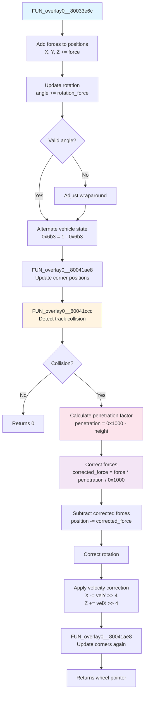
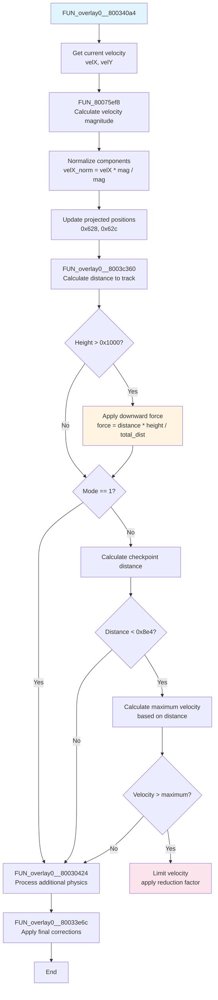
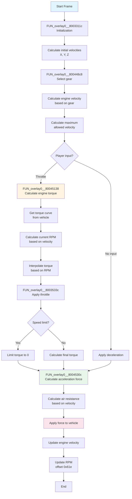
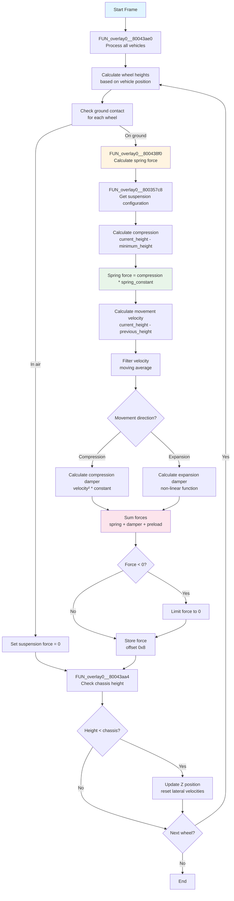

```mermaid
flowchart TD
    Start([Frame Start]) --> MainLoop[FUN_overlay0__80034480]
    
    MainLoop --> ResetLoop[Loop: Reset Flags]
    ResetLoop --> ResetFlags[FUN_overlay0__8003360c<br/>Reset collision counters]
    ResetFlags --> ResetNext{Next vehicle?}
    ResetNext -->|Yes| ResetLoop
    ResetNext -->|No| TrackCollision
    
    TrackCollision[FUN_overlay0__80034320<br/>Track collision] --> TrackLoop[Loop per vehicle]
    TrackLoop --> CheckCollision[FUN_overlay0__80033e6c<br/>Check collision]
    CheckCollision --> CollisionResult{Collision?}
    CollisionResult -->|No| UpdateAngle[Update rotation angle]
    CollisionResult -->|Yes| ApplyPhysics[FUN_overlay0__800340a4<br/>Apply collision physics]
    UpdateAngle --> TrackNext{Next vehicle?}
    ApplyPhysics --> TrackNext
    TrackNext -->|Yes| TrackLoop
    TrackNext -->|No| CalcPositions
    
    CalcPositions[FUN_overlay0__800400cc<br/>Calculate relative positions] --> PosLoop[Loop per vehicle pair]
    PosLoop --> CalcCorners[Calculate 4 corners each vehicle]
    CalcCorners --> ProjectCoords[Project coordinates local space]
    ProjectCoords --> CalcMask[Calculate collision mask]
    CalcMask --> PosNext{Next pair?}
    PosNext -->|Yes| PosLoop
    PosNext -->|No| DetectCollisions
    
    DetectCollisions[FUN_overlay0__800407a0<br/>Detect collisions] --> DetectLoop[Loop per vehicle pair]
    DetectLoop --> CheckPair[FUN_overlay0__80040478<br/>Check pair collision]
    CheckPair --> StoreResult[Store distance and type]
    StoreResult --> DetectNext{Next pair?}
    DetectNext -->|Yes| DetectLoop
    DetectNext -->|No| ApplyForces
    
    ApplyForces[FUN_overlay0__80040924<br/>Apply collision forces] --> ForceLoop[Loop per colliding vehicles]
    ForceLoop --> CalcMomentum[Calculate total momentum]
    CalcMomentum --> DistributeMomentum[Distribute momentum proportionally]
    DistributeMomentum --> ApplyForce[FUN_overlay0__80033e6c<br/>Apply force]
    ApplyForce --> ForceNext{Next?}
    ForceNext -->|Yes| ForceLoop
    ForceNext -->|No| UpdateBuffer
    
    UpdateBuffer[FUN_overlay0__80040f30<br/>Update collision buffer] --> UpdateLoop[Loop per collided vehicles]
    UpdateLoop --> UpdateCorners[FUN_overlay0__80041ae8<br/>Update corners]
    UpdateCorners --> RecalcMask[Recalculate masks]
    RecalcMask --> UpdateNext{Next?}
    UpdateNext -->|Yes| UpdateLoop
    UpdateNext -->|No| WheelForces
    
    WheelForces[FUN_overlay0__800412d4<br/>Forces between wheels] --> WheelLoop[Loop per vehicle]
    WheelLoop --> ResetWheelForces[Reset wheel forces]
    ResetWheelForces --> WheelPairLoop[Loop per other vehicle]
    WheelPairLoop --> CheckWheelCollision[Check wheel collision]
    CheckWheelCollision --> CalcWheelForce[Calculate repulsion force]
    CalcWheelForce --> ApplyWheelForce[Apply wheel force]
    ApplyWheelForce --> WheelPairNext{Next other vehicle?}
    WheelPairNext -->|Yes| WheelPairLoop
    WheelPairNext -->|No| WheelNext{Next vehicle?}
    WheelNext -->|Yes| WheelLoop
    WheelNext -->|No| ProcessWheels
    
    ProcessWheels[Loop: Wheel collision] --> WheelCollision[FUN_overlay0__8003373c<br/>Process wheel collision]
    WheelCollision --> CalcRelativeVel[Calculate relative velocities]
    CalcRelativeVel --> ApplySeparation[Apply separation forces]
    ApplySeparation --> WheelCollNext{Next pair?}
    WheelCollNext -->|Yes| ProcessWheels
    WheelCollNext -->|No| FinalProcessing
    
    FinalProcessing[Final Processing] --> FinalLoop[Loop per vehicle]
    FinalLoop --> CheckForce{Collision force > 0?}
    CheckForce -->|Yes| LimitForce[Limit maximum force 0x1000]
    CheckForce -->|No| FinalNext
    LimitForce --> CheckState[FUN_overlay0__800419e8<br/>Check state]
    CheckState --> PlaySound{Play sound?}
    PlaySound -->|Yes| Sound[Play collision sound]
    PlaySound -->|No| FinalNext
    Sound --> FinalNext{Next vehicle?}
    FinalNext -->|Yes| FinalLoop
    FinalNext -->|No| End([Frame End])
    
    style MainLoop fill:#e1f5ff
    style TrackCollision fill:#fff4e1
    style CalcPositions fill:#e8f5e9
    style DetectCollisions fill:#fce4ec
    style ApplyForces fill:#f3e5f5
    style WheelForces fill:#e0f2f1
    style FinalProcessing fill:#fff9c4
```

# Car Physics System - Gran Turismo 2

## Overview

This document describes in detail the car physics system of Gran Turismo 2, including all involved functions, their specific calculations, and the complete execution flow.

## Table of Contents

1. [Main Loop Function](#main-loop-function)
2. [Sequential Processing Functions](#sequential-processing-functions)
3. [Physics Integration Functions](#physics-integration-functions)
4. [Detection and Calculation Functions](#detection-and-calculation-functions)
5. [Auxiliary Functions](#auxiliary-functions)
6. [Vehicle Physics Systems (Execution Order)](#vehicle-physics-systems)
   - [Phase 1: Main Loop and Coordination](#phase-1-main-loop-and-coordination)
     - [Main Physics Loop](#main-physics-loop)
     - [Physics Coordination System](#physics-coordination-system)
     - [Vertical Physics System](#vertical-physics-system)
     - [Aerodynamics System](#aerodynamics-system)
     - [Traction Limitation System](#traction-limitation-system)
     - [Slip Angle System](#slip-angle-system)
     - [Traction Control System](#traction-control-system)
     - [Differential Traction System](#differential-traction-system)
   - [Phase 2: Collisions and Integration](#phase-2-collisions-and-integration)
     - [Main Loop Function](#main-loop-function-1)
     - [Collision Flags Reset](#collision-flags-reset)
     - [Track Collision System](#track-collision-system)
     - [Vehicle-to-Vehicle Collision System](#vehicle-to-vehicle-collision-system)
     - [Physics Integration](#physics-integration)
   - [Phase 3: Wheels and Surface](#phase-3-wheels-and-surface)
     - [Transformation Matrices System](#transformation-matrices-system)
     - [Collision Matrices System](#collision-matrices-system)
     - [Traction and Friction System](#traction-and-friction-system)
   - [Phase 4: Steering and Movement](#phase-4-steering-and-movement)
     - [Suspension and Dampers System](#suspension-and-dampers-system)
     - [Steering Processing System](#steering-processing-system)
     - [Chassis Height Calculation System](#chassis-height-calculation-system)
     - [Force Transmission to Wheels System](#force-transmission-to-wheels-system)
   - [Phase 5: Engine and Control](#phase-5-engine-and-control)
     - [Engine and Transmission System](#engine-and-transmission-system)
     - [Input and Control System](#input-and-control-system)
     - [Brake System](#brake-system)
   - [Phase 6: Effects and Auxiliaries](#phase-6-effects-and-auxiliaries)
     - [Slipstream System](#slipstream-system)
7. [Execution Flowchart](#execution-flowchart)
8. [Quick Reference Table](#quick-reference-table)

---

## Main Loop Function

### FUN_overlay0__80034480

**File:** `scus_944.88_part_020.c:2429`  
**Type:** `void FUN_overlay0__80034480(int param_1, int param_2)`

**Description:**  
Main function that orchestrates the entire physics cycle of the game. This function is called once per frame and coordinates all stages of physics processing.

**Parameters:**
- `param_1`: Pointer to array of vehicle structures (each vehicle occupies 0xb40 bytes)
- `param_2`: Number of vehicles to process

**Execution Flow:**

1. **Flags Reset (lines 2438-2443):**
   - For each vehicle, resets collision flag (offset 0x669) to 0
   - Calls `FUN_overlay0__8003360c()` to reset collision counters

2. **Track Collision Processing (line 2445):**
   - Calls `FUN_overlay0__80034320(param_1, param_2)` to detect and process collisions with the track

3. **Vehicle-to-Vehicle Collision Processing (lines 2447-2451):**
   - `FUN_overlay0__800400cc`: Calculates relative positions between vehicles
   - `FUN_overlay0__800407a0`: Detects collisions between vehicle pairs
   - `FUN_overlay0__80040924`: Applies collision forces using momentum conservation
   - `FUN_overlay0__80040f30`: Updates collision buffer after collisions
   - `FUN_overlay0__800412d4`: Applies contact forces between wheels

4. **Wheel-to-Wheel Collision Processing (lines 2453-2464):**
   - Nested loop comparing each vehicle with all others
   - Calls `FUN_overlay0__8003373c` for each vehicle pair processing wheel collisions

5. **Final Processing (lines 2466-2486):**
   - Checks accumulated collision force (offset 0x76c)
   - Limits maximum force to 0x1000
   - Calls `FUN_overlay0__800419e8` to check vehicle state
   - Plays collision sound if necessary (offset 0x726)

---

## Sequential Processing Functions

### FUN_overlay0__8003360c

**File:** `scus_944.88_part_020.c:1850`  
**Type:** `void FUN_overlay0__8003360c(int param_1)`

**Description:**  
Resets all collision counters and flags for a specific vehicle.

**Specific Operations:**
- Resets lateral collision force counter (offset 0x774) to 0
- Resets longitudinal collision force counter (offset 0x76a) to 0
- Resets collision flags array (offsets 0x76c-0x773, 8 bytes) to 0

**Utility:**  
Ensures that collision flags from previous frames do not interfere with current processing, allowing clean detection of new collisions.

---

### FUN_overlay0__80034320

**File:** `scus_944.88_part_020.c:2378`  
**Type:** `void FUN_overlay0__80034320(int param_1, int param_2)`

**Description:**  
Processes track collision detection for each vehicle and applies physics corrections.

**Parameters:**
- `param_1`: Pointer to array of vehicles
- `param_2`: Number of vehicles

**Detailed Flow:**

1. **Loop per Vehicle (line 2391):**
   - For each vehicle, gets pointer to physics structure (offset 0x2c)

2. **Collision Check (line 2393):**
   - Calls `FUN_overlay0__80033e6c` with iteration parameter (0xb4 incremented by 0x10 per vehicle)
   - Stores result in collision flag (offset 0x7b1)

3. **If No Collision Occurred (lines 2396-2405):**
   - Calculates new rotation angle: `current_angle - (DAT_801c856c * 0x555)`
   - If result is negative, limits to 0
   - Resets collision force (offset 0x76c) to 0

4. **If Collision Occurred (lines 2406-2420):**
   - Sets collision flag (bit 0 of offset 0x669)
   - Calls `FUN_overlay0__800340a4` to apply collision physics
   - Calls `FUN_overlay0__800419e8` to check vehicle state
   - If state == 2 (in air) and collision force > 0x155:
     - Calculates damage: `(force - 0x155) >> 3 + current_damage`
     - Limits maximum damage to 0xff
     - Stores in offset 0x482 of collided wheel

**Utility:**  
Detects when vehicles are in contact with the track and applies appropriate reaction forces, in addition to calculating impact damage.

---

### FUN_overlay0__800400cc

**File:** `scus_944.88_part_022.c:1769`  
**Type:** `void FUN_overlay0__800400cc(int param_1, int param_2)`

**Description:**  
Calculates relative positions between all vehicle pairs and projects the 4 corners of each vehicle into the local space of the other vehicle.

**Parameters:**
- `param_1`: Pointer to array of vehicles
- `param_2`: Number of vehicles

**Specific Calculations:**

1. **Buffer Alternation (line 1803):**
   - Alternates collision buffer: `DAT_801c8608 = 1 - DAT_801c8608`
   - Uses double buffering to avoid race conditions

2. **Loop per Vehicle Pair (lines 1807-1910):**
   - For each active vehicle (flag 0x48a == 0 and state 0x7b5 != 4)
   - For each other different vehicle

3. **Relative Position Calculation (lines 1829-1834):**
   - Copies center position of current vehicle (offsets 0x197-0x199) to local array
   - Calculates Z height difference: `other_height - current_height`

4. **Proximity Check (line 1839):**
   - If height difference < 0x2000 (vehicles close vertically):
     - For each of the 4 corners of the other vehicle:
       - Calculates corner position in local space of current vehicle
       - Uses rotation based on current vehicle angle (offset 0x674)

5. **Coordinate Projection (lines 1861-1875):**
   - Projects coordinates using rotation matrix:
     - `X_local = cos(angle) * X_global + sin(angle) * Z_global`
     - `Z_local = -sin(angle) * X_global + cos(angle) * Z_global`
   - Stores projected coordinates in buffer (offsets +4 and +0xc)

6. **Collision Mask Calculation (lines 1877-1892):**
   - Checks which side of the vehicle rectangle the corner is on:
     - Bit 3 (0x8): Corner is behind vehicle (Z_local < -width/2)
     - Bit 2 (0x4): Corner is in front (Z_local > width/2)
     - Bit 1 (0x2): Corner is to the left (X_local < -length/2)
     - Bit 0 (0x1): Corner is to the right (X_local > length/2)
   - If corner is outside limits, marks as 0xf (no collision possible)

**Utility:**  
Prepares pre-calculated collision data that will be used by subsequent functions to detect collisions efficiently without recalculating transformations every frame.

---

### FUN_overlay0__800407a0

**File:** `scus_944.88_part_022.c:2037`  
**Type:** `void FUN_overlay0__800407a0(int param_1, int param_2)`

**Description:**  
Detects collisions between all vehicle pairs using data pre-calculated by `FUN_overlay0__800400cc`.

**Parameters:**
- `param_1`: Pointer to array of vehicles
- `param_2`: Number of vehicles

**Specific Calculations:**

1. **Loop per Vehicle (line 2062):**
   - For each active vehicle

2. **Loop per Other Vehicle (line 2069):**
   - For each other different vehicle

3. **Collision Detection (line 2075):**
   - Calls `FUN_overlay0__80040478` to detect collision between the pair
   - Passes vehicle indices, structure pointers, and result buffers

4. **Result Storage (lines 2077-2080):**
   - Stores collision distance in `DAT_801c8610[offset]`
   - Stores collided wheel index in `DAT_801c8650[offset]`
   - Stores collision type in `DAT_801c8670[offset]`
   - Offset calculated as: `vehicle_index * 10 + other_vehicle_index`

**Utility:**  
Identifies which vehicles are colliding and stores detailed information about the collision (distance, type, involved wheel) for use in force application functions.

---

### FUN_overlay0__80040924

**File:** `scus_944.88_part_022.c:2095`  
**Type:** `void FUN_overlay0__80040924(int param_1, int param_2)`

**Description:**  
Applies collision forces between vehicles using linear momentum conservation physics.

**Parameters:**
- `param_1`: Pointer to array of vehicles
- `param_2`: Number of vehicles

**Physics Calculations:**

1. **Colliding Vehicle Pair Selection (lines 2157-2174):**
   - Compares collision distances from both sides
   - Selects vehicle with smaller distance as "vehicle 1" (closer to collision)

2. **Relative Velocity Calculation (lines 2180-2210):**
   - Gets vehicle 1 angle (offset 0x674)
   - Calculates velocity components using sine/cosine tables:
     - `velocityX = DAT_80093150[angle]`
     - `velocityY = DAT_80093950[angle]`
   - Adjusts direction based on collision type (0-3):
     - Type 0: Front collision
     - Type 1: Rear collision
     - Type 2: Left side collision
     - Type 3: Right side collision

3. **Total Momentum Calculation (lines 2221-2235):**
   - For each X, Y, Z component:
     - `momentum1 = velocity1 * mass1`
     - `momentum2 = velocity2 * mass2`
     - `total_momentum = momentum1 + momentum2`
   - Uses fixed-point multiplication (`FUN_80075a5c`)

4. **Momentum Distribution (lines 2246-2260):**
   - Calculates shared final velocity:
     - `final_velocity = total_momentum / (mass1 + mass2)`
   - Uses 64-bit division for precision (`FUN_80086084`)
   - Calculates applied force:
     - `force = final_velocity - current_velocity`
     - Multiplied by scale factor (0xa4 >> 12)

5. **Force Application (lines 2273-2290):**
   - For each component:
     - `applied_force = force * scale_factor`
     - Subtracts force from vehicle 1: `position1 -= applied_force`
     - Adds force to vehicle 2: `position2 += applied_force`

6. **Rotation Calculation (lines 2297-2308):**
   - Calculates torque based on angular velocity difference
   - Applies rotation using `FUN_8007598c` (multiplication with constant)

7. **Physics Integration (lines 2325-2357):**
   - Calls `FUN_overlay0__80033e6c` for both vehicles
   - If one vehicle didn't collide with track, applies position correction to the other

**Utility:**  
Simulates realistic collisions between vehicles using momentum physics, ensuring energy is conserved and distributed proportionally to vehicle masses.

---

### FUN_overlay0__80040f30

**File:** `scus_944.88_part_022.c:2371`  
**Type:** `void FUN_overlay0__80040f30(int param_1, int param_2)`

**Description:**  
Updates collision buffer for vehicles that collided, recalculating relative positions after force application.

**Parameters:**
- `param_1`: Pointer to array of vehicles
- `param_2`: Number of vehicles

**Operations:**

1. **Collision Check (line 2404):**
   - Checks if vehicle had collision (bit 2 of offset 0x669)
   - If yes, calls `FUN_overlay0__80041ae8` to update corner positions

2. **Position Recalculation (lines 2409-2491):**
   - Similar to `FUN_overlay0__800400cc`, but only for vehicles that collided
   - Recalculates coordinate projections using updated positions
   - Updates collision masks in alternated buffer

**Utility:**  
Maintains collision data updated after force application, ensuring subsequent detections use correct positions.

---

### FUN_overlay0__800412d4

**File:** `scus_944.88_part_022.c:2504`  
**Type:** `void FUN_overlay0__800412d4(int param_1, int param_2)`

**Description:**  
Applies contact forces between wheels of different vehicles when they are very close, simulating friction and repulsion.

**Parameters:**
- `param_1`: Pointer to array of vehicles
- `param_2`: Number of vehicles

**Detailed Calculations:**

1. **Force Reset (lines 2540-2548):**
   - For each vehicle, resets accumulated wheel forces (offset 0x778, 4 components)

2. **Dimension Calculation (lines 2561-2577):**
   - Calculates half vehicle width: `(width * 15 + 15) >> 4`
   - Calculates half length: `(length * 15 + 15) >> 4`
   - Uses rounding up for negative values

3. **Wheel Collision Check (lines 2597-2621):**
   - For each of the 4 wheels of the other vehicle:
     - Checks if there's collision using collision buffer
     - Checks if projected coordinates are within limits:
       - `|X_projected| < half_width`
       - `-half_length < Z_projected < half_length`

4. **Collision Direction Calculation (lines 2625-2635):**
   - Calculates position difference between wheels
   - Projects into local space of current wheel using rotation angle (offset 0x648)
   - Calculates X and Z components of projected difference

5. **Main Direction Determination (lines 2652-2700):**
   - Compares ratio between components to determine main direction:
     - If `|Z|/width < |X|/length`: Lateral collision
     - Else: Front/rear collision
   - Selects best contact point based on collision intensity

6. **Force Calculation (lines 2702-2732):**
   - Calculates force direction vector based on collision direction:
     - Direction 0: Left (`-sin, cos`)
     - Direction 1: Right (`sin, -cos`)
     - Direction 2: Rear (`-cos, -sin`)
     - Direction 3: Front (`cos, sin`)
   - Calculates intensity: `(intensity + 0x800) * 0x4c901 / 0x1000`
   - Limits maximum intensity to 0x1000

7. **Force Application (lines 2738-2749):**
   - For each X, Z component:
     - `force_component = direction_component * intensity`
     - Adds force to other vehicle: `other_force += force_component`
     - Subtracts force from current vehicle: `current_force -= force_component`

**Utility:**  
Simulates physical contact between wheels of different vehicles, creating repulsion forces that prevent vehicles from passing through each other and adding realism to collision behavior.

---

### FUN_overlay0__8003373c

**File:** `scus_944.88_part_020.c:1933`  
**Type:** `undefined4 FUN_overlay0__8003373c(int *param_1, int *param_2)`

**Description:**  
Processes collision between two specific vehicles, calculating relative velocities and applying separation forces.

**Parameters:**
- `param_1`: Pointer to first vehicle structure
- `param_2`: Pointer to second vehicle structure

**Calculations:**

1. **Initial Checks (lines 1966-1969):**
   - Checks if both vehicles are active
   - Checks if they are in the same state (bit 0x10 of offset 0x78d)

2. **Distance Calculation (lines 1972-1974):**
   - Calculates 3D distance between vehicles using `FUN_overlay0__8003c398`
   - If distance < 0x64001 (approximately 400 units):

3. **Relative Velocity Calculation (lines 2006-2022):**
   - For each X, Y, Z component:
     - Calculates relative velocity projected in direction between vehicles
     - Uses fixed-point multiplication with vehicle directions (offsets 0x19a-0x19c)

4. **Separation Force Application (lines 2031-2052):**
   - If distance < 0x14001 (very close):
     - Calls `FUN_overlay0__80033634` for both vehicles
     - Calculates sum of dimensions to determine separation direction
     - Applies opposite forces to separate vehicles

**Utility:**  
Ensures vehicles don't completely pass through each other, applying separation forces when they are very close.

---

## Physics Integration Functions

### FUN_overlay0__80033e6c

**File:** `scus_944.88_part_020.c:2195`  
**Type:** `int FUN_overlay0__80033e6c(int param_1, int *param_2, int *param_3, int param_4)`

**Description:**  
Integrates forces applied to vehicle position using Euler method, detects collisions with track and applies corrections.

**Parameters:**
- `param_1`: Pointer to vehicle physics structure (offset 0x2c)
- `param_2`: Array of 4 integers containing forces to apply (X, Y, Z, rotation)
- `param_3`: Pointer to store penetration factor (0-0x1000)
- `param_4`: Integration mode (0=normal, 1=alternated, 2=collision)

**Position Integration (lines 2213-2219):**
- Adds forces to current positions:
  - `position_X += force_X` (offset 0x65c)
  - `position_Y += force_Y` (offset 0x660)
  - `position_Z += force_Z` (offset 0x664)

**Rotation Integration (lines 2221-2228):**
- Adds rotation to current angle (offset 0x648)
- Applies wraparound: if angle > 0xfff, subtracts 0x1000; if < -0xfff, adds 0x1000

**State Alternation (lines 2230-2232):**
- If mode != 1, alternates vehicle state (offset 0x6b3): `state = 1 - state`
- Used for double buffering of calculations

**Corner Positions Update (line 2234):**
- Calls `FUN_overlay0__80041ae8` to update positions of vehicle's 4 corners

**Track Collision Detection (line 2241):**
- Calls `FUN_overlay0__80041ccc` to detect collision between wheels and track
- Returns pointer to collided wheel or 0 if no collision occurred

**Penetration Correction (lines 2255-2279):**
- If collision detected:
  - Calculates penetration factor: `penetration = 0x1000 - collision_height`
  - For each force component:
    - `corrected_force = force * penetration / 0x1000`
    - Subtracts corrected force from position: `position -= corrected_force`
  - Corrects rotation proportionally
  - Applies position correction based on velocity:
    - `position_X -= velocity_Y >> 4`
    - `position_Z += velocity_X >> 4`
    - Simulates vehicle rotation effect

**Utility:**  
This is the central physics function that integrates all forces applied to the vehicle and ensures it doesn't penetrate the track, applying realistic physics corrections.

---

### FUN_overlay0__800340a4

**File:** `scus_944.88_part_020.c:2293`  
**Type:** `void FUN_overlay0__800340a4(int param_1, undefined4 param_2, undefined4 param_3, int param_4)`

**Description:**  
Processes track collision physics, calculates projected velocity, applies downward forces and limits velocity near checkpoints.

**Parameters:**
- `param_1`: Pointer to vehicle physics structure
- `param_2`: Array of physics parameters
- `param_3`: Additional value
- `param_4`: Mode flag (0=normal, 1=skip some checks)

**Projected Velocity Calculation (lines 2309-2318):**
- Gets current position (offsets 0x628, 0x62c) and velocity (offsets 0x654, 0x656)
- Calculates velocity magnitude using `FUN_80075ef8`: `sqrt(velX² + velY²)`
- Normalizes velocity components:
  - `velX_normalized = velX * magnitude / magnitude`
  - `velY_normalized = velY * magnitude / magnitude`
- Updates projected positions (offsets 0x628, 0x62c)

**Distance to Track Calculation (line 2320):**
- Calls `FUN_overlay0__8003c360` to calculate distance to track
- Uses projected position as reference

**Downward Force Application (lines 2322-2325):**
- If vehicle height > 0x1000 (above track):
  - Calculates force proportional to distance: `force = distance * height / total_distance`
  - Applies downward force (offset 0x630)

**Velocity Limitation Near Checkpoints (lines 2328-2369):**
- If mode != 1:
  - Calculates distance to next checkpoint
  - If distance < 0x8e4:
    - Calculates maximum allowed velocity based on distance
    - Uses different constants depending on game mode (0x29 or 0x1b)
    - If current velocity > maximum velocity:
      - Limits velocity
      - Applies reduction factor: `(100 - reduction_factor) / 100`
      - Reduces velocity components proportionally

**Additional Processing (lines 2371-2372):**
- Calls `FUN_overlay0__80030424` for additional physics processing
- Calls `FUN_overlay0__80033e6c` to apply final corrections

**Utility:**  
Ensures vehicles remain in contact with the track, applies gravity when in air and limits velocity in critical track areas for better game control.

---

### FUN_overlay0__80030424

**File:** `scus_944.88_part_020.c:55`  
**Type:** `void FUN_overlay0__80030424(int param_1, undefined4 *param_2, undefined4 param_3)`

**Description:**  
Applies additional transformations to vehicle velocities using scale factors.

**Parameters:**
- `param_1`: Pointer to physics structure
- `param_2`: Output array for transformed velocities
- `param_3`: Scale factor (0-0x1000)

**Calculations (lines 68-82):**
- For each X, Y, Z component:
  - `transformed_velocity = current_velocity * scale_factor`
  - Applies additional multiplication with `DAT_1f800000` (global factor)
  - Stores result in output array
- For rotation component (offset 0x64c):
  - `transformed_rotation = rotation * scale_factor / DAT_1f800000 * 128`

**Utility:**  
Allows applying global scale factors to velocities, useful for effects like slow-motion or physics adjustments.

---

## Detection and Calculation Functions

### FUN_overlay0__80041ae8

**File:** `scus_944.88_part_022.c:2855`  
**Type:** `void FUN_overlay0__80041ae8(undefined4 *param_1)`

**Description:**  
Updates the positions of the vehicle's 4 corners in local space, based on center position, velocity and dimensions.

**Parameters:**
- `param_1`: Pointer to vehicle physics structure

**Detailed Calculations:**

1. **Data Retrieval (lines 2866-2868):**
   - Gets current vehicle state (offset 0x6b3, alternates between 0 and 1)
   - Gets vehicle angle (offset 0x192, mask 0xfff)
   - Calculates direction components using tables:
     - `velocityX_dir = DAT_80093150[angle]` (sine)
     - `velocityY_dir = DAT_80093950[angle]` (cosine)

2. **Corner Velocity Calculation (lines 2870-2873):**
   - For each corner, projects velocity in movement direction:
     - `velX_corner = position_X * velocityX_dir`
     - `velY_corner = position_Y * velocityY_dir`
   - Uses fixed-point multiplication (`FUN_8007596c`)

3. **Dimension Offset Calculation (lines 2875-2876):**
   - Gets vehicle width (offset 2, short)
   - Calculates corner offsets:
     - `offset_X = width * velocityX_dir`
     - `offset_Y = width * velocityY_dir`
   - Uses multiplication with rounding (`FUN_800759cc`)

4. **Position Storage (lines 2878-2885):**
   - Calculates positions of the 4 corners:
     - Corner 0: `(center_X - offset_Y) - velX1, (center_Y - offset_X) + velY1`
     - Corner 1: `(center_X - offset_Y) + velX2, (center_Y - offset_X) - velY2`
     - Corner 2: `(center_X + offset_Y) - velX1, (center_Y + offset_X) + velY1`
     - Corner 3: `(center_X + offset_Y) + velX2, (center_Y + offset_X) - velY2`
   - Stores in alternated offsets based on state (0x1ad-0x1b4)

**Utility:**  
Maintains vehicle corner positions updated for accurate collision detection, using double buffering to avoid inconsistencies during calculations.

---

### FUN_overlay0__80041ccc

**File:** `scus_944.88_part_022.c:2912`  
**Type:** `uint FUN_overlay0__80041ccc(int param_1, int *param_2, uint *param_3)`

**Description:**  
Detects collision between vehicle wheels and track geometry, returning information about the closest collision.

**Parameters:**
- `param_1`: Pointer to physics structure
- `param_2`: Pointer to store collision height (0-0x1000)
- `param_3`: Pointer to store collided wheel index (0-3)

**Processing:**

1. **Data Preparation (lines 2927-2944):**
   - Gets slip data offset based on state (0x6b3)
   - For each of the 4 wheels:
     - Converts wheel position to collision space (multiplies by 16)
     - Prepares data for collision test:
       - Wheel X position (offset 0x6b4) << 4
       - Wheel Y position (offset 0x6b8) << 4
       - Initial height = 0

2. **Collision Test (line 2946):**
   - Calls `FUN_overlay0__80028968` to test collision with track geometry
   - Passes pointer to collision structure, track ID and position array

3. **Result Processing (lines 2948-2977):**
   - For each wheel, checks collision height (offset +6 in results array)
   - Finds wheel with smallest collision height (closest to track)
   - If height != 0x1000 (collision occurred):
     - Stores height in `*param_2`
     - Stores wheel index in `*param_3`
     - Updates vehicle lateral velocities:
       - `lateral_velocity_X = result[wheel].velocity_X` (offset 0x654)
       - `lateral_velocity_Y = result[wheel].velocity_Y` (offset 0x656)
     - Returns flag indicating collision (bits set for colliding wheels)

**Utility:**  
Detects when wheels are in contact with the track and updates lateral velocities based on track geometry, essential for traction and slip simulation.

---

### FUN_overlay0__80033d34

**File:** `scus_944.88_part_020.c:2143`  
**Type:** `void FUN_overlay0__80033d34(int param_1)`

**Description:**  
Calculates the slip angle difference between front and rear wheels, used to detect oversteer and understeer.

**Parameters:**
- `param_1`: Pointer to physics structure

**Calculations:**

1. **Data Retrieval (lines 2153-2158):**
   - Gets lateral velocities:
     - `lateral_velocity_Y = offset 0x656` (front)
     - `lateral_velocity_X = offset 0x654` (rear)
   - Calculates offsets for alternated slip data:
     - `offset_front = state * 8 + (1 - state) * 0x20`
     - `offset_rear = state * 8 + state * 0x20`

2. **Difference Calculation (lines 2160-2161):**
   - `difference_X = front_slip_X - rear_slip_X`
   - `difference_Y = front_slip_Y - rear_slip_Y`

3. **Difference Projection (line 2163):**
   - Projects difference in direction perpendicular to movement:
     - `projection = -velY_front * diffX + velX_rear * diffY`
   - Uses dot product to get perpendicular component

4. **Sign Adjustment (lines 2165-2168):**
   - If projection < 0:
     - Inverts calculation: `projection = velX_rear * diffX + velY_front * diffY`
     - Applies multiplier based on game speed: `projection *= DAT_801c8570`

5. **Normalization and Limitation (lines 2169-2189):**
   - Divides by 2048 (>> 11) to normalize
   - Limits result between -0x40 and 0x40
   - If absolute difference > threshold (0x1000 / DAT_801c8570):
     - Stores result in offset 0x63e
   - Else, stores 0

**Utility:**  
Detects vehicle slip behavior, allowing the physics system to adjust traction forces and stability based on oversteer/understeer.

---

### FUN_overlay0__8003c360

**File:** `scus_944.88_part_021.c:3420`  
**Type:** `int FUN_overlay0__8003c360(int param_1, int param_2)`

**Description:**  
Calculates approximate distance using optimized "taxicab distance" method (Manhattan distance with correction).

**Parameters:**
- `param_1`: X component of distance
- `param_2`: Y component of distance

**Calculation (lines 3425-3437):**
- Calculates absolute values of both components
- Finds minimum value: `min = min(|X|, |Y|)`
- Returns: `(|X| + |Y|) - (min >> 1)`

**Utility:**  
Fast approximation of euclidean distance without needing square root, useful for performance calculations where absolute precision is not critical. Result is always >= real distance and <= 1.5x real distance.

---

### FUN_overlay0__80040478

**File:** `scus_944.88_part_022.c:1928`  
**Type:** `int FUN_overlay0__80040478(int param_1, int param_2, int *param_3, int *param_4, undefined4 *param_5)`

**Description:**  
Detects collision between two specific vehicles by analyzing pre-calculated collision masks and calculating penetration distances.

**Parameters:**
- `param_1`: First vehicle index
- `param_2`: Second vehicle index
- `param_3`: Pointer to first vehicle structure
- `param_4`: Buffer to store collision index
- `param_5`: Buffer to store collision type

**Processing:**

1. **Mask Retrieval (lines 1951-1968):**
   - Gets collision masks from both buffers (current and previous)
   - Compares masks to detect changes
   - Calculates difference: `difference = mask1 XOR mask2`
   - Checks if there's overlap: `(mask1 AND mask2) == 0`

2. **Side Detection (lines 1983-2025):**
   - For each bit of difference (4 sides):
     - **Bit 3 (0x8) - Rear:**
       - Calculates penetration distance using segment projection
       - Checks if penetration is within vehicle limits
     - **Bit 2 (0x4) - Front:**
       - Similar to previous, but for front
     - **Bit 1 (0x2) - Left:**
       - Calculates lateral penetration
     - **Bit 0 (0x1) - Right:**
       - Calculates opposite lateral penetration

3. **Best Collision Selection (lines 1952-2034):**
   - Maintains record of smallest collision distance found
   - Stores type and index of best collision
   - Returns minimum distance

**Utility:**  
Identifies precisely which side of vehicles is colliding and calculates penetration depth, essential for applying collision forces in the correct direction.

---

### FUN_overlay0__80044ea4

**File:** `scus_944.88_part_023.c:280`  
**Type:** `void FUN_overlay0__80044ea4(undefined2 *param_1, undefined2 *param_2, undefined2 *param_3, uint param_4, uint param_5, uint param_6)`

**Description:**  
Calculates composite 3x3 rotation matrix from three rotation angles (Euler angles).

**Parameters:**
- `param_1`: Output array for first matrix row (3 shorts)
- `param_2`: Output array for second matrix row (3 shorts)
- `param_3`: Output array for third matrix row (3 shorts)
- `param_4`: X rotation angle (0-0xfff)
- `param_5`: Y rotation angle (0-0xfff)
- `param_6`: Z rotation angle (0-0xfff)

**Matrix Calculation:**

1. **Sine and Cosine Retrieval (lines 296-301):**
   - For each angle, gets values from tables:
     - `sin_X = DAT_80093150[angle_X & 0xfff]`
     - `cos_X = DAT_80093950[angle_X & 0xfff]`
     - Similar for Y and Z

2. **Matrix Multiplication (lines 303-340):**
   - Multiplies three rotation matrices: Rz * Ry * Rx
   - Calculates each element of resulting matrix:
     - `matrix[0][0] = cos_Z * cos_Y`
     - `matrix[0][1] = sin_Z * cos_Y`
     - `matrix[0][2] = -sin_Y`
     - `matrix[1][0] = cos_Z * sin_Y * sin_X - sin_Z * cos_X`
     - `matrix[1][1] = sin_Z * sin_Y * sin_X + cos_Z * cos_X`
     - `matrix[1][2] = cos_Y * sin_X`
     - `matrix[2][0] = cos_Z * sin_Y * cos_X + sin_Z * sin_X`
     - `matrix[2][1] = sin_Z * sin_Y * cos_X - cos_Z * sin_X`
     - `matrix[2][2] = cos_Y * cos_X`
   - Uses fixed-point multiplication with rounding (>> 12)

**Utility:**  
Creates transformation matrices to rotate 3D coordinates, used extensively to project vehicle positions between different coordinate systems.

---

### FUN_overlay0__800431a0

**File:** `scus_944.88_part_022.c:3802`  
**Type:** `void FUN_overlay0__800431a0(int param_1)`

**Description:**  
Updates front wheel steering angles based on vehicle rotation angle and steering wheel angle.

**Parameters:**
- `param_1`: Pointer to vehicle physics structure

**Calculations:**

1. **Rotation Component Calculation (lines 3811-3815):**
   - Gets vehicle rotation angle (offset 0x66c)
   - Gets steering wheel angle (offset 0x674)
   - Gets vehicle width (offsets 0xc, 0xe)
   - Calculates components using rotation:
     - `comp1 = vehicle_rotation * width_X`
     - `comp2 = vehicle_rotation * width_Y`
     - `comp3 = steering_angle * width_X`
     - `comp4 = steering_angle * width_Y`

2. **Wheel Angle Calculation (lines 3817-3820):**
   - Front left wheel (offset 0x488): `comp1 - comp3`
   - Front right wheel (offset 0x4f0): `comp3 + comp1`
   - Rear left wheel (offset 0x558): `-comp2 - comp4`
   - Rear right wheel (offset 0x5c0): `comp4 - comp2`

**Utility:**  
Simulates realistic wheel steering, where front wheels turn more than rear wheels and outer wheels in curves turn more than inner wheels (Ackermann geometry).

---

### FUN_overlay0__8004323c

**File:** `scus_944.88_part_022.c:3825`  
**Type:** `void FUN_overlay0__8004323c(int param_1)`

**Description:**  
Updates angles of all 4 wheels considering lateral and longitudinal velocities to simulate slip.

**Parameters:**
- `param_1`: Pointer to physics structure

**Calculations:**

1. **Velocity Retrieval (lines 3838-3846):**
   - Gets lateral velocities (offsets 0x668, 0x66a)
   - Gets longitudinal velocities (offsets 0x670, 0x672)
   - Gets vehicle dimensions (offsets 0xc, 0xe, 0x18, 0x1a)

2. **Component Calculation (lines 3838-3846):**
   - For each combination of velocity and dimension:
     - `component = velocity * dimension`
     - Uses fixed-point multiplication

3. **Final Angle Calculation (lines 3848-3855):**
   - Front left wheel: `lat_vel_X * dim_X - long_vel_X * dim_X`
   - Front right wheel: `long_vel_X * dim_X + lat_vel_X * dim_X`
   - Rear left wheel: `-lat_vel_Y * dim_Y - long_vel_Y * dim_Y`
   - Rear right wheel: `long_vel_Y * dim_Y - lat_vel_Y * dim_Y`
   - Similar for other combinations

**Utility:**  
Simulates realistic wheel behavior during slip, where wheels don't point in movement direction but rather in the direction of resulting velocity.

---

### FUN_overlay0__80035714

**File:** `scus_944.88_part_020.c:3135`  
**Type:** `bool FUN_overlay0__80035714(int param_1)`

**Description:**  
Checks if a vehicle is within valid track limits.

**Parameters:**
- `param_1`: Pointer to vehicle structure

**Checks:**

1. **Flag Check (line 3143):**
   - If `DAT_801d586b == 0` or flag 0x78d bit 2 is set:
     - Returns false (off track)

2. **State Check (line 3149):**
   - Calls `FUN_overlay0__8003d138()` to check game state
   - If state == 0:
     - Gets maximum number of allowed laps
     - If track position (offset 0x604) < half length:
       - Increments lap counter
     - Compares completed laps (offset 0x608) with maximum
     - Returns true if within limit

**Utility:**  
Ensures vehicles cannot complete more laps than allowed and detects when they are outside track limits.

---

### FUN_overlay0__800419e8

**File:** `scus_944.88_part_022.c:2813`  
**Type:** `undefined4 FUN_overlay0__800419e8(int param_1)`

**Description:**  
Checks current vehicle state (on ground, in air, etc.).

**Parameters:**
- `param_1`: Pointer to physics structure

**Checks (lines 2820-2823):**
- If vehicle is active (offset 0x45d == 0) and normal state (offset 0x786 == 0):
  - Calls `FUN_overlay0__800418e8()` to check game state
  - Returns result
- Else, returns 0

**Return Values:**
- 0: Vehicle inactive or invalid state
- 1: Vehicle on ground
- 2: Vehicle in air
- 3: Other special state

**Utility:**  
Provides information about vehicle physical state for other functions to make appropriate decisions.

---

## Auxiliary Functions

### FUN_8007596c
**Type:** `int FUN_8007596c(int a, int b)`  
**Description:** Integer multiplication with fixed scale (fixed-point arithmetic).  
**Calculation:** `result = (a * b) >> 12`  
**Utility:** Performs multiplications maintaining decimal precision without using floating point.

### FUN_80075a5c
**Type:** `int FUN_80075a5c(int a, int b)`  
**Description:** Integer division with fixed scale.  
**Calculation:** `result = (a << 12) / b`  
**Utility:** Performs divisions maintaining decimal precision.

### FUN_80075ef8
**Type:** `int FUN_80075ef8(int x1, int y1, int x2, int y2, int param_5)`  
**Description:** Calculates 2D vector magnitude (euclidean distance).  
**Calculation:** `result = sqrt((x1-x2)² + (y1-y2)²)`  
**Utility:** Calculates distances and vector magnitudes.

### FUN_80075bf4
**Type:** `int FUN_80075bf4(int a, int b)`  
**Description:** Simple integer multiplication.  
**Calculation:** `result = a * b`  
**Utility:** Basic integer multiplication.

### FUN_800759cc
**Type:** `int FUN_800759cc(int a, int b, int c)`  
**Description:** Multiplication with rounding.  
**Calculation:** `result = (a * b + c/2) / c`  
**Utility:** Multiplication with rounding up.

### FUN_80075e90
**Type:** `int FUN_80075e90(int a, int b, int c)`  
**Description:** Division with rounding.  
**Calculation:** `result = (a + b/2) / b`  
**Utility:** Division with rounding to nearest value.

### FUN_overlay0__800450a0
**File:** `scus_944.88_part_023.c:345`  
**Type:** `int FUN_overlay0__800450a0(int param_1)`  
**Description:** Normalizes an angle to valid range of -0x800 to 0x800 (equivalent to -180° to +180° in units where 0x1000 = 360°).  
**Calculation:**
- If `param_1 < -0x800`: Adds 0x1000 repeatedly until in valid range
- If `param_1 >= 0x800`: Subtracts 0x1000 repeatedly until in valid range
- Returns normalized value in range -0x800 to 0x800  
**Utility:** Ensures angles are always in valid range for direction and rotation calculations, avoiding overflow and maintaining consistency in angular difference calculations.

### FUN_overlay0__800450e0
**File:** `scus_944.88_part_023.c:371`  
**Type:** `int FUN_overlay0__800450e0(int param_1, int param_2)`  
**Description:** Calculates difference between two normalized angles, returning the shortest angular path between them.  
**Calculation:**
1. Normalizes both angles using `FUN_overlay0__800450a0`
2. Calculates difference: `difference = param_1 - param_2`
3. If difference < -0x800: Adds 0x1000 (takes path through other side)
4. If difference >= 0x800: Subtracts 0x1000 (takes path through other side)
5. Returns difference in range -0x800 to 0x800  
**Utility:** Calculates smallest angular difference between two angles, essential for steering calculations where one needs to know the shortest path to rotate from one angle to another, used extensively in steering processing system.

### FUN_overlay0__8003dfdc
**File:** `scus_944.88_part_022.c:335`  
**Type:** `int FUN_overlay0__8003dfdc(int param_1, int param_2, int param_3)`  
**Description:** Calculates reduction factor based on difference between current value and reference value, used to apply progressive reductions in physics systems.  
**Calculation:**
1. Calculates absolute value of `param_1`: `|param_1|`
2. If `|param_1| - param_3 < 0`: Returns 0x1000 (no reduction, value is below threshold)
3. Else:
   - Calculates reduction: `reduction = (|param_1| - param_3) * param_2 >> 12`
   - If reduction < 0x1001: Returns `0x1000 - reduction` (reduction factor)
   - Else: Returns 0 (maximum reduction)  
**Utility:** Used in physics coordination system to calculate progressive reduction factors based on value differences, allowing smooth application of limitations and adjustments in systems like traction control and speed limitation.

### FUN_overlay0__8003e020
**File:** `scus_944.88_part_022.c:356`  
**Type:** `void FUN_overlay0__8003e020(int param_1, ushort *param_2)`  
**Description:** Processes vehicle configuration based on flags and configuration values, updating vehicle-specific parameters.  
**Processing:**
1. **Flag 1 Processing (bit 0 of param_2[0]):**
   - If flag is not set:
     - If `param_2[1] == 0`: Sets offset 0x768 to 0
     - Else: Calculates value based on `param_2[1]`:
       - If `param_2[1] < 1`: value = 0x9c (156)
       - Else: value = 100
   - If flag is set: Calculates value as `param_2[1] * 0x19 >> 10`
   - Stores in offset 0x768
2. **Flag 2 Processing (bit 1 of param_2[0]):**
   - Similar to previous, but processes offset 0x6fd based on `param_2[3]`  
**Utility:** Applies vehicle-specific configurations based on flags and configuration values, allowing dynamic parameter adjustments during physics processing, used in physics coordination system to configure vehicles individually.

### FUN_overlay0__8003c250
**File:** `scus_944.88_part_021.c:3387`  
**Type:** `void FUN_overlay0__8003c250(uint *param_1, int param_2)`  
**Description:** Prepares vehicle configuration based on current state, initializing configuration buffer and calling specific functions depending on vehicle state.  
**Processing:**
1. **Initialization (line 3394):**
   - Clears configuration buffer: `FUN_8008ce30(param_1, 0, 0xc)` (12 bytes)
2. **State Check (line 3395):**
   - Gets vehicle state (offset 0x18)
   - **State 2:** Calls `FUN_overlay0__80013ef0` to process specific configuration
   - **State 1:** 
     - Checks game conditions using `FUN_overlay0__80012360`
     - If conditions satisfied: Calls `FUN_overlay0__80014074` to process configuration
     - Else: Clears buffer again
   - **State 3:** Calls `FUN_overlay0__80014030` to process specific configuration  
**Utility:** Prepares vehicle configuration before physics processing, ensuring each vehicle has appropriate configurations based on its current state, used in physics coordination system to initialize per-vehicle processing.

### FUN_overlay0__8004335c
**File:** `scus_944.88_part_022.c:3860`  
**Type:** `void FUN_overlay0__8004335c(int param_1)`  
**Description:** Wrapper that updates angles of all vehicle wheels, sequentially calling front wheel angle update and all wheels update functions.  
**Processing:**
1. Calls `FUN_overlay0__800431a0()` to update front wheel angles
2. Calls `FUN_overlay0__8004323c(param_1)` to update angles of all wheels considering slip  
**Utility:** Simplifies wheel angle update process, ensuring both steering angles and slip adjustments are applied correctly, used in steering processing system to maintain synchronization between steering and slip.

---

## Execution Flowchart

---

## Integration Functions Detail

### FUN_overlay0__80033e6c - Detailed Flow

### FUN_overlay0__800340a4 - Detailed Flow

---

## Quick Reference Table

| Function | File | Line | Main Description |
|----------|------|------|------------------|
| `FUN_overlay0__80034480` | part_020.c | 2429 | Main physics loop |
| `FUN_overlay0__8003360c` | part_020.c | 1850 | Reset collision flags |
| `FUN_overlay0__80034320` | part_020.c | 2378 | Process track collision |
| `FUN_overlay0__800400cc` | part_022.c | 1769 | Calculate relative positions between vehicles |
| `FUN_overlay0__800407a0` | part_022.c | 2037 | Detect collisions between vehicles |
| `FUN_overlay0__80040924` | part_022.c | 2095 | Apply collision forces (momentum) |
| `FUN_overlay0__80040f30` | part_022.c | 2371 | Update collision buffer |
| `FUN_overlay0__800412d4` | part_022.c | 2504 | Apply forces between wheels |
| `FUN_overlay0__8003373c` | part_020.c | 1933 | Process collision between two vehicles |
| `FUN_overlay0__80033e6c` | part_020.c | 2195 | Integrate forces and detect track collision |
| `FUN_overlay0__800340a4` | part_020.c | 2293 | Process track collision physics |
| `FUN_overlay0__80030424` | part_020.c | 55 | Apply velocity transformations |
| `FUN_overlay0__80041ae8` | part_022.c | 2855 | Update corner positions |
| `FUN_overlay0__80041ccc` | part_022.c | 2912 | Detect wheel-track collision |
| `FUN_overlay0__80033d34` | part_020.c | 2143 | Calculate slip difference |
| `FUN_overlay0__8003c360` | part_021.c | 3420 | Calculate approximate distance |
| `FUN_overlay0__80040478` | part_022.c | 1928 | Detect collision between two vehicles |
| `FUN_overlay0__80044ea4` | part_023.c | 280 | Calculate 3x3 rotation matrix |
| `FUN_overlay0__800431a0` | part_022.c | 3802 | Update front wheel angles |
| `FUN_overlay0__8004323c` | part_022.c | 3825 | Update all wheel angles |
| `FUN_overlay0__80035714` | part_020.c | 3135 | Check track limits |
| `FUN_overlay0__800419e8` | part_022.c | 2813 | Check vehicle state |
| `FUN_overlay0__8003311c` | part_020.c | 1645 | Initialize vehicle physics system |
| `FUN_overlay0__800448c8` | part_023.c | 2 | Select gear based on velocity |
| `FUN_overlay0__80045138` | part_023.c | 396 | Calculate engine torque and RPM |
| `FUN_overlay0__8003533c` | part_020.c | 2983 | Calculate final applied torque |
| `FUN_overlay0__800304dc` | part_020.c | 87 | Process velocity and acceleration |
| `FUN_overlay0__8004530c` | part_023.c | 475 | Calculate acceleration force |
| `FUN_overlay0__800438f0` | part_022.c | 4091 | Calculate suspension and damper force |
| `FUN_overlay0__80043aa4` | part_022.c | 4163 | Check suspension height |
| `FUN_overlay0__80043ae0` | part_022.c | 4185 | Process suspension for all wheels |
| `FUN_overlay0__800357c8` | part_020.c | 3164 | Calculate suspension configuration |
| `FUN_overlay0__80043578` | part_022.c | 3950 | Process friction and surface |
| `FUN_overlay0__80043388` | part_022.c | 3871 | Calculate transformation matrices for wheels |
| `FUN_overlay0__800434dc` | part_022.c | 3924 | Process collision matrices |
| `FUN_overlay0__80043108` | part_022.c | 3751 | Process steering input |
| `FUN_overlay0__8003daa8` | part_022.c | 111 | Calculate aerodynamic drag |
| `FUN_overlay0__800306c0` | part_020.c | 179 | Apply torque to individual wheels |
| `FUN_overlay0__8003e7ec` | part_022.c | 684 | Calculate chassis height, roll and pitch |
| `FUN_overlay0__8003dbe8` | part_022.c | 175 | Apply differential traction (FWD/RWD/AWD) |
| `FUN_overlay0__80039de8` | part_021.c | 2110 | Calculate wheel slip angle |
| `FUN_overlay0__80039a4c` | part_021.c | 1966 | Limit traction based on wheel velocity |
| `FUN_overlay0__8004232c` | part_022.c | 3184 | Calculate vehicle vertical velocity |
| `FUN_overlay0__800420ac` | part_022.c | 3068 | Apply slipstream boost |
| `FUN_overlay0__80042174` | part_022.c | 3104 | Apply aerodynamic penalty |
| `FUN_overlay0__8003e8e4` | part_022.c | 718 | Coordinate steering processing |
| `FUN_overlay0__8003de68` | part_022.c | 270 | Adjust throttle based on traction control |
| `FUN_overlay0__8003e0c4` | part_022.c | 393 | Coordinate multiple physics systems |
| `FUN_overlay0__8003ebf0` | part_022.c | 825 | Main physics loop |
| `FUN_overlay0__800450a0` | part_023.c | 345 | Normalize angle to valid range |
| `FUN_overlay0__800450e0` | part_023.c | 371 | Calculate difference between two angles |
| `FUN_overlay0__8003dfdc` | part_022.c | 335 | Calculate progressive reduction factor |
| `FUN_overlay0__8003e020` | part_022.c | 356 | Process vehicle configurations |
| `FUN_overlay0__8003c250` | part_021.c | 3387 | Prepare configurations based on state |
| `FUN_overlay0__8004335c` | part_022.c | 3860 | Wrapper to update wheel angles |

---

## Important Memory Offsets

### Vehicle Structure (base + 0x2c for physics)

| Offset | Size | Description |
|--------|------|-------------|
| 0x628 | int | Projected X position |
| 0x62c | int | Projected Y position |
| 0x630 | int | Height/downward force |
| 0x634 | int | Projected velocity X |
| 0x638 | int | Projected velocity Y |
| 0x63c | int | Projected velocity Z |
| 0x640 | short | Maximum allowed velocity |
| 0x648 | short | Wheel rotation angle |
| 0x654 | short | Lateral velocity X |
| 0x656 | short | Lateral velocity Y |
| 0x65c | int | Position X |
| 0x660 | int | Position Y |
| 0x664 | int | Position Z |
| 0x668 | short | Front lateral velocity |
| 0x66a | short | Rear lateral velocity |
| 0x66c | short | Vehicle rotation angle |
| 0x670 | short | Front longitudinal velocity |
| 0x672 | short | Rear longitudinal velocity |
| 0x674 | short | Steering wheel angle |
| 0x6b3 | byte | Alternated state (0 or 1) |
| 0x6b4 | int | Wheel X position (array) |
| 0x6b8 | int | Wheel Y position (array) |
| 0x778 | int | Accumulated wheel force (array) |
| 0x618 | byte | Current gear |
| 0x61e | short | Engine RPM |
| 0x624 | int | Engine velocity |
| 0x6ac | short | Maximum allowed velocity (km/h) |
| 0x6ae | ushort | Current velocity (km/h) |
| 0x6f8 | ushort | Maximum achieved velocity (km/h) |
| 0x708 | short | Throttle (accelerator, 0-0x1000) |
| 0x610 | short | Steering input X |
| 0x612 | short | Steering input Y |
| 0x60a | short | Applied brake force (0-0x1000) |
| 0x60c | short | Brake application rate |
| 0x60e | short | Additional brake value |
| 0x61c | byte | Gear change counter |
| 0x61d | byte | Speed limit flag |
| 0x642 | byte | Manual transmission flag |
| 0x64c | int | Vehicle rotation |
| 0x704 | int | Vehicle vertical velocity |
| 0x710 | int | Maximum engine torque |
| 0x714 | int | Minimum engine torque |
| 0x758 | byte | Engine sound pitch |
| 0x759 | byte | Engine sound modulation |
| 0x71a | short | Longitudinal aerodynamic drag force |
| 0x71c | int | Lateral aerodynamic drag force (Y and Z) |
| 0x766 | short | Performance factor (slipstream) |
| 0x774 | short | Current drag factor |
| 0x776 | short | Drag accumulator |
| 0x77e | short | Smoothed steering angle |
| 0x6f4 | short | Chassis roll angle |
| 0x6f6 | short | Chassis pitch angle |
| 0x688 | int | Chassis height |
| 0x680 | int | Previous chassis X position |
| 0x684 | int | Previous chassis Y position |
| 0x72a | short | Processing scale factor |

### Wheel Structure (base offset + 0x460 for first wheel, +0x68 per wheel)

| Offset | Size | Description |
|--------|------|-------------|
| 0x8 | int | Total suspension force |
| 0x10 | short | Current suspension height |
| 0x12 | short | Compression/expansion velocity |
| 0x18 | int | Projected velocity X |
| 0x2a | short | Wheel friction factor |
| 0x2c | int | Projected velocity X (alternative) |
| 0x30 | int | Projected velocity Y (alternative) |
| 0x40 | short | Wheel velocity |
| 0x42 | short | Surface friction coefficient |
| 0x48 | int | Spring force (suspension) |
| 0x4c | int | Damper force |
| 0x5 | byte | Surface type (0=air, 1-6=different surfaces) |
| 0x34 | int | Traction force applied to wheel |
| 0x38 | short | Traction limitation factor |
| 0x50 | short | Slip angle direction |
| 0x52 | short | Slip angle magnitude (0-0x1000) |
| 0x60 | short | Wheel traction force (0-0x1000) |
| 0x63 | byte | Active wheel flag |

### Main Vehicle Structure

| Offset | Size | Description |
|--------|------|-------------|
| 0x2c | - | Pointer to physics structure |
| 0x669 | byte | Collision flags (bit 0=track collision, bit 1=vehicle collision, bit 2=active collision) |
| 0x674 | short | Vehicle angle (0-0xfff) |
| 0x690 | int | Vehicle height |
| 0x76a | short | Longitudinal collision force |
| 0x76c | short | Accumulated collision force |
| 0x774 | short | Lateral collision force |
| 0x786 | byte | Vehicle state (0=normal, 2=in air, 3=special) |
| 0x789 | byte | Additional state |
| 0x78d | byte | State flags (bit 2=off track, bit 4=special state) |
| 0x7b1 | byte | Track collision flag |
| 0x7b5 | byte | Activity state (4=inactive) |
| 0x48a | byte | Active vehicle flag |

---

## Vehicle Physics Systems

This section documents the internal physics systems of each vehicle in the exact order they are executed at runtime, facilitating understanding of the complete processing flow.

---

## Phase 1: Main Loop and Coordination

### Main Physics Loop

### FUN_overlay0__8003ebf0

**File:** `scus_944.88_part_022.c:825`  
**Type:** `void FUN_overlay0__8003ebf0(void)`

**Description:**  
Main loop that coordinates all physics systems in the correct execution order, being the main entry point for physics processing of all vehicles in the game.

**Processing:**

1. **Initialization (lines 835-836):**
   - Gets pointer to vehicle array (DAT_800a9688)
   - Gets number of vehicles (DAT_800af231)

2. **Physics Coordination (line 838):**
   - Calls `FUN_overlay0__8003e0c4` to process flags, vertical physics, aerodynamics, traction limitation and slip angle

3. **Main Physics Loop (lines 840-842):**
   - If special mode disabled (DAT_800a9520 == 0):
     - Calls `FUN_overlay0__80034480` to process complete main physics loop (collisions, integration, etc.)

4. **Matrix and Collision Processing (lines 844-846):**
   - Calls `FUN_overlay0__80043388` to calculate transformation matrices for wheels
   - Calls `FUN_overlay0__800434dc` to process collision matrices
   - Calls `FUN_overlay0__80043578` to process friction and surface

5. **Steering Processing (line 847):**
   - Calls `FUN_overlay0__8003e8e4` to coordinate complete steering processing

6. **Performance Processing (line 848):**
   - Calls `FUN_overlay0__8003cf94` to process performance and ranking data

7. **Time Update (line 849):**
   - Calls `FUN_overlay0__8003d168` to update time counters

8. **Special Processing (lines 851-859):**
   - If special mode == 3:
     - For each vehicle:
       - Calls `FUN_overlay0__8003d5f8` for specific additional processing

9. **Final Processing (lines 861-872):**
   - Checks game state
   - If state == 0:
     - For each vehicle:
       - Calls `FUN_overlay0__800133f0` for final rendering/update processing

**Complete Execution Order:**
1. Physics Coordination (`FUN_overlay0__8003e0c4`)
2. Main Loop (`FUN_overlay0__80034480`) - if not in special mode
3. Transformation Matrices (`FUN_overlay0__80043388`)
4. Collision Matrices (`FUN_overlay0__800434dc`)
5. Friction and Surface (`FUN_overlay0__80043578`)
6. Steering Processing (`FUN_overlay0__8003e8e4`)
7. Performance and Ranking (`FUN_overlay0__8003cf94`)
8. Time Update (`FUN_overlay0__8003d168`)
9. Special Processing (if applicable)
10. Final Processing (if applicable)

**Utility:**  
Serves as centralized entry point for all physics processing, ensuring all systems are executed in the correct order and dependencies between systems are respected, creating consistent and predictable physics simulation.

---

### Physics Coordination System

### FUN_overlay0__8003e0c4

**File:** `scus_944.88_part_022.c:393`  
**Type:** `void FUN_overlay0__8003e0c4(int param_1, int param_2)`

**Description:**  
Coordinates multiple physics systems in a single pass, processing state flags, vertical physics, aerodynamics, traction limitation and slip angle for all vehicles efficiently.

**Parameters:**
- `param_1`: Pointer to vehicle array
- `param_2`: Number of vehicles

**Processing:**

1. **Flags and State Processing (lines 420-443):**
   - For each vehicle:
     - Sets special mode flag (offset 0x744) based on game state
     - Checks special conditions and updates appropriate flags
     - Decrements timer counters:
       - Collision counter (offset 0x76a)
       - Additional counter (offset 0x7ba)
       - State counter (offset 0x791)
     - Calls `FUN_overlay0__8004232c` to calculate vertical physics

2. **Aerodynamics Processing (lines 445-454):**
   - For each vehicle:
     - Sets scale factor (offset 0x72a)
     - Calls `FUN_overlay0__8003daa8` to calculate aerodynamic drag

3. **Transformation Calculation (lines 456-465):**
   - For each vehicle:
     - Calculates transformation using arctan: `transformation = arctan(offset_0xa8, lateral_velocity_X)`
     - Stores in offset 0x73c
     - Calculates multiplication: `value = velocity_Y * lateral_velocity_X >> 12`
     - Stores in offset 0x740

4. **Traction and Slip Angle Processing (lines 467-468):**
   - Calls `FUN_overlay0__80039a4c` to process traction limitation for all vehicles
   - Calls `FUN_overlay0__80039de8` to calculate slip angle for all wheels

5. **Additional Per-Vehicle Processing (lines 470-679):**
   - For each vehicle:
     - Prepares configuration data (local buffer)
     - Sets scale factor
     - Marks vehicle as processed (offset 0x729 = 1)
     - If vehicle is not in special mode:
       - Calls `FUN_overlay0__8003e020` to process configurations
       - Calculates reduction factors using `FUN_overlay0__8003dfdc`
       - Calls `FUN_overlay0__8003de68` to apply traction control
       - Calls `FUN_overlay0__8003dbe8` to apply differential traction

**Utility:**  
Optimizes physics processing by grouping multiple systems in a single pass, reducing loop overhead and ensuring all systems are updated consistently before main physics processing.

---

### Vertical Physics System

### FUN_overlay0__8004232c

**File:** `scus_944.88_part_022.c:3184`  
**Type:** `void FUN_overlay0__8004232c(int param_1)`

**Description:**  
Calculates vehicle vertical velocity based on performance factor (slipstream), adjusting height and vertical velocity to simulate aerodynamic effects.

**Parameters:**
- `param_1`: Pointer to physics structure

**Calculations:**

1. **Maximum Factor Check (lines 3189-3195):**
   - If performance factor (offset 0x766) == 0x1000 (maximum):
     - Sets default vertical velocity: `vertical_velocity = DAT_801c8570 << 12`
     - Sets default height: `height = DAT_801c856c`
     - Stores in offsets 0x704 and 0x6fe

2. **Reduced Factor Calculation (lines 3198-3201):**
   - If factor < 0x1000:
     - Calculates adjusted height: `height = DAT_801c856c * performance_factor >> 12`
     - Calculates vertical velocity: `vertical_velocity = (DAT_801c8570 << 24) / performance_factor`
     - Stores in offsets 0x6fe and 0x704

**Utility:**  
Adjusts vehicle vertical physics based on external factors like slipstream, where vehicles behind others have reduced vertical velocity (less downforce), simulating realistic aerodynamic effects.

---

### Aerodynamics System

### FUN_overlay0__8003daa8

**File:** `scus_944.88_part_022.c:111`  
**Type:** `void FUN_overlay0__8003daa8(int param_1)`

**Description:**  
Calculates and applies aerodynamic drag forces based on vehicle velocity, simulating air resistance that increases with the square of velocity.

**Parameters:**
- `param_1`: Pointer to vehicle physics structure

**Detailed Calculations:**

1. **Absolute Velocity Calculation (lines 121-124):**
   - Gets vehicle X velocity (offset 0x6a4)
   - If velocity < 0: inverts to absolute value
   - `absolute_velocity = |velocity_X|`

2. **Drag Accumulator Update (lines 126-149):**
   - If drag factor (offset 0x774) == 0:
     - Decrements accumulator: `accumulator = accumulator - (DAT_1f800000 >> 6)`
     - Limits minimum accumulator to 0
   - Else:
     - Increments accumulator: `accumulator = accumulator + (drag_factor * DAT_1f800000 >> 16)`
     - Limits maximum accumulator to 0x1000

3. **Velocity-Based Drag Factor Calculation (lines 151-153):**
   - Calculates factor based on velocity squared:
     - `base_factor = DAT_overlay0__80046ef4 + ((0x1000 - DAT_overlay0__80046ef4) * (0x1000 - accumulator) >> 12)`
     - `velocity_squared = (absolute_velocity >> 5) * (absolute_velocity >> 5) >> 12`
     - `final_drag_factor = base_factor * velocity_squared >> 12`

4. **Longitudinal Force Application (lines 155-161):**
   - Gets longitudinal drag coefficient (offset 0x43c)
   - Calculates force: `longitudinal_force = drag_coefficient * final_drag_factor >> 12`
   - If velocity_X >= 0: inverts force (drag opposes movement)
   - Stores in offset 0x71a

5. **Lateral Forces Application (lines 163-171):**
   - For Y and Z components (loop of 2 iterations):
     - Gets lateral drag coefficient (offsets 0x440, 0x444)
     - Calculates force: `lateral_force = drag_coefficient * final_drag_factor >> 12`
     - Stores in offset 0x71c (increments pointer for next component)

**Utility:**  
Simulates realistic aerodynamic drag where resistance increases proportionally to the square of velocity, creating behavior where vehicles at high speed encounter greater resistance, realistically limiting maximum speeds.

---

### Traction Limitation System

### FUN_overlay0__80039a4c

**File:** `scus_944.88_part_021.c:1966`  
**Type:** `void FUN_overlay0__80039a4c(int param_1, int param_2)`

**Description:**  
Limits wheel traction based on rotation velocity and surface conditions, applying reduction factors when wheels are spinning too fast or in adverse conditions.

**Parameters:**
- `param_1`: Pointer to vehicle array
- `param_2`: Number of vehicles

**Processing:**

1. **Active System Check (lines 1997-1999):**
   - If limitation system is enabled (DAT_overlay0__80046f48 != 0):
     - Checks if vehicle is not in special mode (flag 0x7b9 bit 4 == 0)

2. **Per-Wheel Processing (lines 2005-2073):**
   - For each of the 4 wheels:
     - Gets wheel velocity (offset +100)
     - If velocity < maximum_limit (DAT_overlay0__80046f48):
       - Calculates difference: `difference = velocity - minimum_limit`
       - If velocity < minimum_limit (DAT_overlay0__80046f5c):
         - If velocity < 0:
           - Calculates reduction factor based on negative velocity
           - `reduction_factor = DAT_overlay0__80046f58 * interpolation >> 12`
           - `limited_traction = 0x1000 - reduction_factor`
         - Else:
           - Calculates reduction factor based on positive velocity
           - `reduction_factor = DAT_overlay0__80046f60 * interpolation >> 12`
           - `limited_traction = 0x1000 - reduction_factor`
       - Else:
         - Calculates progressive reduction factor:
           - `reduction_factor = interpolation * (DAT_overlay0__80046f4c - DAT_overlay0__80046f60) >> 12`
           - `limited_traction = (0x1000 - reduction_factor) - DAT_overlay0__80046f60`
       - Stores factor in offset +0x38
     - Else:
       - Sets velocity as maximum limit
       - `limited_traction = 0x1000 - DAT_overlay0__80046f4c` (maximum reduction)

3. **Limitation Application to Forces (lines 2076-2103):**
   - Calculates velocity difference between axles:
     - `axle_difference = rear_longitudinal_velocity - front_longitudinal_velocity`
   - For each wheel:
     - Gets suspension force (offset +0x8)
     - If limitation active:
       - Applies factor: `limited_force = suspension_force * reduction_factor >> 12`
     - Calculates final force considering axle difference and lateral velocity
     - `final_force = lateral_axle_velocity * (curve_factor * limited_force >> 12) >> 8`
     - Stores in offset +0x34

**Utility:**  
Prevents wheels from spinning excessively fast (wheelspin), simulating traction control system that reduces applied force when detecting excessive slip, improving stability and acceleration in low grip conditions.

---

### Slip Angle System

### FUN_overlay0__80039de8

**File:** `scus_944.88_part_021.c:2110`  
**Type:** `void FUN_overlay0__80039de8(int param_1, int param_2)`

**Description:**  
Calculates slip angle of each wheel based on lateral and longitudinal velocities, determining when wheels are sliding relative to movement direction.

**Parameters:**
- `param_1`: Pointer to vehicle array
- `param_2`: Number of vehicles

**Calculations:**

1. **Loop per Vehicle and Wheel (lines 2125-2173):**
   - For each vehicle:
     - For each of the 4 wheels:

2. **Velocity Retrieval (lines 2133-2134):**
   - Gets wheel X velocity (offset +0x2c)
   - Gets wheel Y velocity (offset +0x30)

3. **Velocity Limit Check (lines 2136-2156):**
   - If velocities are within valid limits:
     - `vel_X + 0x2c74 < 0x58e9` and `vel_Y < 0x2c75`
     - If `vel_Y >= -0x2c75`:
       - Calculates magnitude: `magnitude = sqrt((vel_Y² >> 12) + (vel_X² >> 12))`
       - If magnitude < 0x2c73:
         - If magnitude < 0x472:
           - `slip_factor = 0` (no slip)
         - Else:
           - `slip_factor = (magnitude - 0x472) * 0x666 >> 12` (proportional slip)
       - Else:
         - `slip_factor = 0x1000` (maximum slip)
     - Else:
       - `slip_factor = 0x1000` (outside limits, maximum slip)

4. **Slip Angle Direction Calculation (lines 2160-2167):**
   - If slip_factor == 0:
     - `direction = 0` (no slip)
   - Else:
     - Calculates direction using arctan: `direction = arctan(-vel_Y, vel_X)`
   - Stores factor in offset +0x52
   - Stores direction in offset +0x50

**Utility:**  
Detects when wheels are sliding relative to movement direction, allowing physics system to adjust traction behavior and stability based on slip level, creating realistic behavior where excessive slip reduces traction.

---

### Traction Control System

### FUN_overlay0__8003de68

**File:** `scus_944.88_part_022.c:270`  
**Type:** `void FUN_overlay0__8003de68(int param_1, int param_2, int param_3, int param_4)`

**Description:**  
Traction control system that adjusts vehicle throttle based on wheel conditions, reducing power when detecting excessive slip (wheelspin) to improve stability and acceleration.

**Parameters:**
- `param_1`: Pointer to vehicle physics structure
- `param_2`: Traction control sensitivity factor
- `param_3`: Reference value for comparison
- `param_4`: Additional adjustment factor

**Detailed Calculations:**

1. **Initial Conditions Check (lines 282-283):**
   - Checks if traction control is enabled (offset 0x619 == 1)
   - Checks if maximum available torque > 0 (offset 0x710)
   - Checks if current throttle != 0 (offset 0x708)
   - If any condition fails, function returns without modifying throttle

2. **Traction Type Determination (lines 287-318):**
   - Gets vehicle traction type (offset 0x370):
     - Type 0: Front-wheel drive (FWD)
     - Type 1: Rear-wheel drive (RWD)
     - Type 5: All-wheel drive (AWD)
   - For each axle (front and rear):
     - If traction type requires axle processing:
       - For each wheel of axle (left and right):
         - Gets wheel velocity (offset +0x4a4)
         - Checks if wheel has traction applied (offset +0x468 != 0)
         - Finds wheel with lowest velocity (greatest slip)
         - Stores minimum velocity and corresponding reference value

3. **Reduction Factor Calculation (line 320):**
   - Calculates difference: `difference = minimum_velocity - (reference_value * param_3 >> 12)`
   - Calculates reduction factor: `reduction_factor = difference * param_2 * (0x1000 - param_4) >> 12`
   - Adds offset: `final_factor = reduction_factor + 0x1000`

4. **Limitation and Application (lines 323-330):**
   - Limits factor between 0 and 0x1000
   - Applies to current throttle: `new_throttle = current_throttle * final_factor >> 12`
   - Stores in offset 0x708

**Utility:**  
Simulates realistic traction control system where vehicle detects when wheels are sliding excessively and automatically reduces engine power to restore traction, improving acceleration on slippery surfaces and overall vehicle stability.

---

### Differential Traction System

### FUN_overlay0__8003dbe8

**File:** `scus_944.88_part_022.c:175`  
**Type:** `void FUN_overlay0__8003dbe8(int param_1, int param_2, int param_3)`

**Description:**  
Applies different traction forces to front and rear wheels based on vehicle traction type (FWD, RWD, AWD), also considering surface conditions and wheel velocities.

**Parameters:**
- `param_1`: Pointer to physics structure
- `param_2`: Traction control parameter
- `param_3`: Reference value for comparison

**Calculations:**

1. **Base Forces Initialization (lines 186-191):**
   - Gets base wheel forces:
     - Front left wheel (offset 0x1fe)
     - Front right wheel (offset 0x1fe)
     - Rear left wheel (offset 0x2d6)
     - Rear right wheel (offset 0x2d6)

2. **Multiplier Application by Traction Type (lines 193-220):**
   - Gets vehicle traction type (offset 0x45c)
   - If type has configured multiplier:
     - Calculates multiplier: `multiplier = 0x1000 - (table_value * 100) / 100`
     - Limits minimum multiplier to 0
     - Applies multiplier to wheels based on type:
       - If front-wheel drive (offset 0x64c < 1):
         - `front_force = base_force * multiplier >> 12`
         - `rear_force = base_force * multiplier >> 12`
       - If rear-wheel drive:
         - `front_force = base_force * multiplier >> 12`
         - `rear_force = base_force` (maintains original)
     - Limits all forces maximum to 0x1000

3. **Traction Adjustment Based on Conditions (lines 222-237):**
   - If control parameter != 0 and condition satisfied:
     - Determines affected axle based on traction type
     - Calculates adjustment: `adjustment = control * (table_value - reference) >> 9`
     - Adds to current wheel value (offset +0x60)
     - Limits maximum to 0x1000

4. **Final Force Application (lines 239-266):**
   - For each of the 4 wheels:
     - If wheel has traction (offset +0x60 != 0):
       - Calculates factor based on lateral velocity and friction:
         - `factor = (suspension_force * lateral_velocity >> 12) * (0x1000 - ((wheel_height - reference_height) * wheel_friction * friction_multiplier >> 12) >> 12) >> 12`
       - Limits factor between 0 and 0x1000
       - Applies factor to traction: `final_traction = factor * current_traction >> 12`
       - If traction == 0 after calculation: sets to 1 (minimum)

**Utility:**  
Simulates different traction types (FWD, RWD, AWD) by applying differentiated forces to wheels, creating realistic behavior where front-wheel drive vehicles behave differently from rear-wheel drive in curves and acceleration.

---

## Phase 2: Collisions and Integration

This phase processes all collisions and integrates forces applied to the vehicle.

### Main Loop Function

### FUN_overlay0__80034480

**File:** `scus_944.88_part_020.c:2429`  
**Type:** `void FUN_overlay0__80034480(int param_1, int param_2)`

**Description:**  
Main function that orchestrates the entire physics cycle of the game. This function is called once per frame and coordinates all stages of physics processing.

**Parameters:**
- `param_1`: Pointer to array of vehicle structures (each vehicle occupies 0xb40 bytes)
- `param_2`: Number of vehicles to process

**Execution Flow:**

1. **Flags Reset (lines 2438-2443):**
   - For each vehicle, resets collision flag (offset 0x669) to 0
   - Calls `FUN_overlay0__8003360c()` to reset collision counters

2. **Track Collision Processing (line 2445):**
   - Calls `FUN_overlay0__80034320(param_1, param_2)` to detect and process collisions with the track

3. **Vehicle-to-Vehicle Collision Processing (lines 2447-2451):**
   - `FUN_overlay0__800400cc`: Calculates relative positions between vehicles
   - `FUN_overlay0__800407a0`: Detects collisions between vehicle pairs
   - `FUN_overlay0__80040924`: Applies collision forces using momentum conservation
   - `FUN_overlay0__80040f30`: Updates collision buffer after collisions
   - `FUN_overlay0__800412d4`: Applies contact forces between wheels

4. **Wheel-to-Wheel Collision Processing (lines 2453-2464):**
   - Nested loop comparing each vehicle with all others
   - Calls `FUN_overlay0__8003373c` for each vehicle pair processing wheel collisions

5. **Final Processing (lines 2466-2486):**
   - Checks accumulated collision force (offset 0x76c)
   - Limits maximum force to 0x1000
   - Calls `FUN_overlay0__800419e8` to check vehicle state
   - Plays collision sound if necessary (offset 0x726)

---

### Collision Flags Reset

### FUN_overlay0__8003360c

**File:** `scus_944.88_part_020.c:1850`  
**Type:** `void FUN_overlay0__8003360c(int param_1)`

**Description:**  
Resets all collision counters and flags for a specific vehicle.

**Specific Operations:**
- Resets lateral collision force counter (offset 0x774) to 0
- Resets longitudinal collision force counter (offset 0x76a) to 0
- Resets collision flags array (offsets 0x76c-0x773, 8 bytes) to 0

**Utility:**  
Ensures collision flags from previous frames do not interfere with current processing, allowing clean detection of new collisions.

---

### Track Collision System

### FUN_overlay0__80034320

**File:** `scus_944.88_part_020.c:2378`  
**Type:** `void FUN_overlay0__80034320(int param_1, int param_2)`

**Description:**  
Processes track collision detection for each vehicle and applies physics corrections.

**Parameters:**
- `param_1`: Pointer to array of vehicles
- `param_2`: Number of vehicles

**Detailed Flow:**

1. **Loop per Vehicle (line 2391):**
   - For each vehicle, gets pointer to physics structure (offset 0x2c)

2. **Collision Check (line 2393):**
   - Calls `FUN_overlay0__80033e6c` with iteration parameter (0xb4 incremented by 0x10 per vehicle)
   - This function integrates applied forces and detects collision with track

3. **Detected Collision Processing (lines 2395-2402):**
   - If collision was detected (flag 0x669 bit 0 set):
     - Calls `FUN_overlay0__800340a4` to process collision physics
     - This function calculates projected velocity, normalizes velocity, calculates distance to track and applies forces

4. **Rotation Update (lines 2404-2408):**
   - If vehicle collided with track:
     - Gets vehicle rotation angle (offset 0x674)
     - Calls rotation update function based on collision

**Utility:**  
Coordinates track collision detection and processing, ensuring vehicles don't pass through terrain and collisions are processed correctly.

---

### Vehicle-to-Vehicle Collision System

Vehicle-to-vehicle collision functions are documented in the "Sequential Processing Functions" and "Detection and Calculation Functions" sections above. They include:

- `FUN_overlay0__800400cc`: Calculates relative positions between vehicles
- `FUN_overlay0__800407a0`: Detects collisions between vehicle pairs
- `FUN_overlay0__80040924`: Applies collision forces using momentum conservation
- `FUN_overlay0__80040f30`: Updates collision buffer after collisions
- `FUN_overlay0__800412d4`: Applies contact forces between wheels
- `FUN_overlay0__8003373c`: Processes collision between two specific vehicles

---

### Physics Integration

### FUN_overlay0__80033e6c

**File:** `scus_944.88_part_020.c:2195`  
**Type:** `void FUN_overlay0__80033e6c(int param_1, undefined4 param_2)`

**Description:**  
Integrates all forces applied to vehicle using Euler method, updates position and detects collisions with track.

**Parameters:**
- `param_1`: Pointer to physics structure
- `param_2`: Iteration value (incremented per vehicle)

**Calculations:**

1. **Position Integration (lines 2210-2220):**
   - For each X, Y, Z component:
     - Gets current velocity (offsets 0x628, 0x62c, 0x630)
     - Calculates new position: `new_position = current_position + velocity * delta_time`
     - Uses fixed-point multiplication for precision
     - Stores new position (offsets 0x65c, 0x660, 0x664)

2. **Wheel Rotation Update (lines 2222-2228):**
   - For each of the 4 wheels:
     - Gets wheel angular velocity (offset +0x20)
     - Calculates new rotation: `new_rotation = current_rotation + angular_velocity * delta_time`
     - Normalizes rotation to range 0-0xfff

3. **Corner Positions Update (line 2230):**
   - Calls `FUN_overlay0__80041ae8` to update positions of vehicle's 4 corners based on new center position

4. **Track Collision Detection (line 2232):**
   - Calls `FUN_overlay0__80041ccc` to detect collision between wheels and track
   - This function converts wheel positions to collision space and tests against track geometry

5. **Position Correction in Case of Collision (lines 2234-2248):**
   - If collision was detected:
     - Reverts movement: `position = previous_position`
     - Calculates correction based on surface normal
     - Applies position correction to avoid penetration

**Utility:**  
Integrates all forces applied to vehicle using Euler method, updating position and rotation, and detects collisions with track to apply appropriate corrections.

---

## Phase 3: Wheels and Surface

This phase processes transformation matrices, wheel collision and friction with surfaces.

### Transformation Matrices System

### FUN_overlay0__80043388

**File:** `scus_944.88_part_022.c:3871`  
**Type:** `void FUN_overlay0__80043388(int param_1, int param_2)`

**Description:**  
Calculates transformation matrices for all wheels, preparing data for collision detection and force calculation.

**Parameters:**
- `param_1`: Pointer to vehicle array
- `param_2`: Number of vehicles

**Processing:**

1. **Wheel Angles Update (lines 3884-3887):**
   - For each vehicle:
     - Calls `FUN_overlay0__8004323c` to update angles of all wheels

2. **Matrix Calculation (lines 3890-3919):**
   - For each vehicle:
     - For each of the 4 wheels:
       - Calculates wheel velocity: `velocity = sqrt(velocity_X² + velocity_Y²) * 0x52 / 0x1000`
       - Limits maximum velocity to 0x1000
       - Stores in wheel offset 0x40
       - Calculates wheel position in collision space:
         - `pos_X = (vehicle_position_X + wheel_offset_X) * 16`
         - `pos_Y = (vehicle_position_Y + wheel_offset_Y) * 16`
         - `pos_Z = (vehicle_position_Z + wheel_offset_Z) * 16`
       - Stores in matrix buffer (DAT_1f80000c, DAT_1f800010, DAT_1f800014)
       - Stores ground height in DAT_1f800008

**Utility:**  
Prepares transformation data for all wheels, allowing collision and physics system to calculate positions and velocities correctly in 3D space.

---

### Collision Matrices System

### FUN_overlay0__800434dc

**File:** `scus_944.88_part_022.c:3924`  
**Type:** `void FUN_overlay0__800434dc(undefined4 param_1, int param_2)`

**Description:**  
Processes collision matrices for all wheels, preparing data for track collision test.

**Parameters:**
- `param_1`: Unused parameter
- `param_2`: Number of vehicles

**Processing:**

1. **Loop per Vehicle (lines 3934-3944):**
   - For each vehicle:
     - For each of the 4 wheels:
       - Calls `FUN_overlay0__80028830` to process collision matrix
       - Passes pointer to wheel matrix in buffer

**Utility:**  
Prepares transformation matrices for efficient collision tests, allowing system to detect when wheels are in contact with track.

---

### Traction and Friction System

### FUN_overlay0__80043578

**File:** `scus_944.88_part_022.c:3950`  
**Type:** `void FUN_overlay0__80043578(int param_1, int param_2)`

**Description:**  
Processes interaction between wheels and surface, calculating wheel heights, friction and applying forces based on ground contact.

**Parameters:**
- `param_1`: Pointer to vehicle array
- `param_2`: Number of vehicles

**Processing:**

1. **Wheel Height Calculation (lines 3965-3995):**
   - For each vehicle:
     - For each of the 4 wheels:
       - Gets wheel position in collision space
       - Calls height test function to calculate distance to ground
       - Stores height in wheel offset +0x44
       - Determines if wheel is in air or in contact with surface

2. **Friction Calculation (lines 3997-4025):**
   - For each wheel in contact:
     - Gets surface type (offset +0x46)
     - Gets surface friction coefficient
     - Calculates friction factor based on velocity:
       - `friction_factor = base_coefficient * (1 - normalized_velocity)`
     - Stores in wheel offset +0x48

3. **Force Application (lines 4027-4047):**
   - For each wheel:
     - If wheel is in contact:
       - Calculates normal force: `normal_force = vehicle_weight / 4`
       - Calculates friction force: `friction_force = normal_force * friction_factor`
       - Applies force to vehicle based on wheel direction
     - Else (wheel in air):
       - Sets force to 0

**Utility:**  
Simulates different surface types (asphalt, grass, dirt, etc.) with different friction coefficients, creating realistic behavior where vehicle has less traction on slippery surfaces.

---

## Phase 4: Steering and Movement

This phase processes suspension, steering, chassis height and force transmission to wheels.

### Suspension and Dampers System

This section is documented below in the "Suspension and Dampers System" section.

---

### Steering Processing System

This section is documented below in the "Steering Processing System" section.

---

### Chassis Height Calculation System

This section is documented below in the "Chassis Height Calculation System" section.

---

### Force Transmission to Wheels System

This section is documented below in the "Force Transmission to Wheels System" section.

---

## Phase 5: Engine and Control

This phase processes engine, transmission, player input and brake.

### Engine and Transmission System

This section is documented below in the "Engine and Transmission System" section.

---

### Input and Control System

This section is documented below in the "Input and Control System" section.

---

### Brake System

This section is documented below in the "Brake System" section.

---

## Phase 6: Effects and Auxiliaries

This phase processes special effects like slipstream and auxiliary systems.

### Slipstream System

This section is documented below in the "Slipstream System" section.

---

## Systems Documented in Detail

Below are the systems documented in detail, organized by functional category:

### FUN_overlay0__8003311c

**File:** `scus_944.88_part_020.c:1645`  
**Type:** `void FUN_overlay0__8003311c(int param_1, int param_2)`

**Description:**  
Initializes vehicle physics system, configuring initial velocities, gears and engine parameters.

**Parameters:**
- `param_1`: Pointer to vehicle structure
- `param_2`: Initial velocity (multiplied by 0x472)

**Specific Operations:**

1. **Velocity Initialization (lines 1664-1671):**
   - For each X, Y, Z component:
     - Gets initial velocity (offsets 0x668, 0x66a, 0x66c)
     - Calculates scaled velocity: `scaled_velocity = initial_velocity * velocity_param / 0x1000`
     - Stores in offsets 0x628, 0x62c, 0x630

2. **Maximum Velocity Calculation (line 1673):**
   - Calculates maximum velocity in km/h: `(velocity_param * 1000000) / 0x3edd`
   - Stores in offsets 0x6ae and 0x6f8

3. **Gear Selection (line 1677):**
   - Calls `FUN_overlay0__800448c8` to determine appropriate gear based on velocity
   - Stores selected gear in offset 0x618

4. **Engine Velocity Calculation (lines 1679-1687):**
   - Gets maximum velocity of selected gear (offset 0x3c4 + gear * 4)
   - Calculates engine velocity: `engine_velocity = max_gear_velocity * velocity_param / 0x1000`
   - Limits velocity between vehicle minimum (0x10a) and maximum (0x108) velocities
   - Stores in offset 0x624

5. **Maximum Allowed Velocity Calculation (lines 1691-1696):**
   - Converts engine velocity to km/h: `(engine_velocity * 0x3c) >> 12`
   - Stores in offset 0x6ac

6. **Manual Transmission Configuration (lines 1698-1710):**
   - If manual transmission (offset 0x128 != 0):
     - Configures maximum velocities per gear (offsets 0x620, 0x622)
     - Calculates torque curve using `FUN_80075074`
     - Initializes engine RPM (offset 0x61e) to 0x1000
     - Configures transmission parameters (offsets 0x742, 0x744, 0x746)

7. **Wheel Initialization (lines 1718-1722):**
   - For each of the 4 wheels:
     - Initializes velocities (offsets +0x18, +0x2c) with velocity_param

8. **Projected Velocities Initialization (lines 1724-1733):**
   - For X and Y components:
     - Gets initial velocity (offset 1000, 1002)
     - Calculates projected velocity: `projected_velocity = initial_velocity * velocity_param / 0x1000`
     - Stores in offsets 0x634, 0x638

**Utility:**  
Prepares vehicle for physics simulation, configuring all initial velocities, selecting appropriate gear and initializing transmission system.

---

### FUN_overlay0__800448c8

**File:** `scus_944.88_part_023.c:2`  
**Type:** `uint FUN_overlay0__800448c8(int param_1, int param_2)`

**Description:**  
Selects appropriate gear based on current vehicle velocity, comparing with maximum velocities of each gear.

**Parameters:**
- `param_1`: Pointer to vehicle structure
- `param_2`: Current vehicle velocity

**Calculations:**

1. **Initial Check (line 12):**
   - If velocity < 0 or number of gears (offset 0x372) <= 2:
     - Returns gear 1 (initial gear)

2. **Loop per Gears (lines 16-28):**
   - For each gear from 1 to total_number - 1:
     - Calculates maximum gear velocity:
       - `max_velocity = ((max_RPM + 500) * 0x1000) / 0x3c`
       - Gets gear transmission ratio (offset 0x374 + gear * 4 + 0x54)
       - Calculates effective maximum velocity: `effective_max_velocity = max_velocity / transmission_ratio`
       - Uses 64-bit division (`FUN_80086084`) for precision
     - If current_velocity < effective_max_velocity:
       - Returns this gear (appropriate gear found)

3. **Maximum Gear Return (line 30):**
   - If no gear was found, returns last available gear

**Utility:**  
Implements automatic gear selection based on velocity, ensuring engine operates in appropriate RPM range for maximum efficiency.

---

### FUN_overlay0__80045138

**File:** `scus_944.88_part_023.c:396`  
**Type:** `void FUN_overlay0__80045138(int param_1)`

**Description:**  
Calculates engine torque and updates RPM based on current velocity, throttle and engine torque curve.

**Parameters:**
- `param_1`: Pointer to vehicle structure

**Detailed Calculations:**

1. **Manual Transmission Check (line 409):**
   - If manual transmission (offset 0x618 != 0x101):
     - Processes torque calculation
   - Else, uses default value of 0x1000

2. **RPM-Based Torque Calculation (lines 411-427):**
   - Gets current engine velocity (offset 0x624)
   - Calculates torque using vehicle torque curve:
     - `torque = torque_curve[engine_velocity]`
     - Uses torque table specific to vehicle type (offset 0x45c)
     - Limits minimum torque to value in offset 0x3ac
     - Limits maximum torque to 0x1000

3. **Maximum RPM Torque Calculation (lines 429-439):**
   - Gets maximum engine RPM (offset 0x398)
   - Calculates torque for maximum RPM using same curve
   - If torque_RPM_max < current_torque:
     - Uses torque_RPM_max as limit

4. **Torque Interpolation (lines 441-459):**
   - If current_torque != torque_RPM_max:
     - Calculates change rate: `rate = (DAT_1f800000 >> 7) * throttle_sensitivity / 0x1000`
     - If current_torque < torque_RPM_max:
       - Increments torque: `torque += rate`
     - Else:
       - Decrements torque: `torque -= rate`
     - Limits torque to target value

5. **Storage and Final Calculation (lines 461-472):**
   - Stores calculated torque in vehicle table
   - Gets current throttle (offset 0x708)
   - Calls `FUN_overlay0__8003533c` to calculate final torque considering throttle
   - Updates engine RPM (offset 0x61e) with calculated value
   - Calculates and stores engine velocity: `engine_velocity = final_torque * transmission_ratio`

**Utility:**  
Simulates realistic engine behavior, where torque varies based on current RPM and vehicle-specific torque curve, creating differentiated behavior for each engine type.

---

### FUN_overlay0__8003533c

**File:** `scus_944.88_part_020.c:2983`  
**Type:** `int FUN_overlay0__8003533c(int param_1, undefined4 param_2)`

**Description:**  
Calculates final torque applied to vehicle considering throttle and engine limits.

**Parameters:**
- `param_1`: Pointer to vehicle structure
- `param_2`: Throttle factor (0-0x1000)

**Calculations:**

1. **Speed Limit Check (lines 2991-2999):**
   - If limit flag disabled (offset 0x61d == 0):
     - If current_velocity >= maximum_velocity (offset 0x108):
       - Enables limit (offset 0x61d = 1)
   - Else:
     - If current_velocity < maximum_velocity - 500:
       - Disables limit (offset 0x61d = 0)

2. **Torque Calculation (lines 3001-3005):**
   - If limit disabled:
     - `torque = throttle * (max_torque + min_torque) / 0x1000`
   - Else:
     - `torque = 0`
   - Returns: `torque - min_torque`

**Utility:**  
Applies speed limit when vehicle reaches its maximum velocity, simulating engine or aerodynamic limitation, and calculates effective torque based on throttle.

---

### FUN_overlay0__800304dc

**File:** `scus_944.88_part_020.c:87`  
**Type:** `void FUN_overlay0__800304dc(int param_1)`

**Description:**  
Processes vehicle velocity and acceleration, calculating velocities per wheel and applying rotation effects.

**Calculations:**

1. **Total Velocity Calculation (lines 113-125):**
   - For each X, Y, Z component:
     - Gets projected velocity (offset 0x628)
     - Gets wheel velocity multiplier (offset 0x680 + wheel * 2 + 0xc)
     - Calculates wheel velocity: `wheel_velocity = projected_velocity * multiplier`
     - Accumulates velocities: `total_velocity_X += wheel_velocity_X`
     - Calculates rotation component: `rotation += projected_velocity * rotation_multiplier`
   - Stores total velocity in offsets 0x6a4 (X) and 0x6a8 (Y)

2. **Velocity Calculation in km/h (lines 127-136):**
   - Calculates absolute velocity: `|velocity_X|`
   - Converts to km/h: `velocity_kmh = absolute_velocity * 0xdfbdd / 0x1000`
   - Stores in offset 0x6ae
   - Updates maximum achieved velocity (offset 0x6f8) if necessary

3. **Rotation Effects Calculation (lines 142-174):**
   - Calculates rotation factor: `rotation_factor = rotation * 0x6488 / 0x1000`
   - For each of the 4 wheels:
     - Calculates velocity offset based on wheel position:
       - Front wheels: `offset_X = -width_X * rotation_factor`
       - Rear wheels: `offset_Y = width_Y * rotation_factor`
     - Calculates final wheel velocity:
       - `wheel_velocity_X = total_velocity_X + offset_X`
       - `wheel_velocity_Y = total_velocity_Y + offset_Y`
     - Calculates absolute wheel velocity
     - If velocity < 0x1bc88:
       - Calculates friction factor: `friction_factor = (velocity * 0x93 / 0x1000) << 11 / 0x1000 + 0x800`
     - Stores friction factor in wheel offset +0x2a

**Utility:**  
Distributes vehicle velocity among wheels considering rotation effects and curves, creating realistic behavior where outer wheels in curves have different velocities than inner ones.

---

### FUN_overlay0__8004530c

**File:** `scus_944.88_part_023.c:475`  
**Type:** `int FUN_overlay0__8004530c(int param_1)`

**Description:**  
Calculates acceleration force applied to vehicle based on engine torque, throttle and current velocity.

**Parameters:**
- `param_1`: Pointer to vehicle structure

**Calculations:**

1. **Wheel Velocity Calculation (lines 492-498):**
   - Gets projected velocity of drive wheel (offset 0x634 + traction_type * 4)
   - Gets current gear transmission ratio (offset 0x3a4 + gear * 4)
   - Calculates wheel velocity: `wheel_velocity = projected_velocity * transmission_ratio * 0x28c / 0x1000`
   - If gear == 0 (reverse):
     - Inverts velocity

2. **Base Force Calculation (lines 500-507):**
   - Gets throttle (offset 0x708)
   - Calculates base force: `base_force = wheel_velocity * 0x310`
   - If gear == 1 (first):
     - Adds throttle component: `base_force += throttle`

3. **Air Resistance Calculation (lines 509-528):**
   - Gets current velocity (offset 0x6a4)
   - Calculates resistance based on velocity ranges:
     - If velocity < 0xd55: resistance = 0
     - If velocity < 0x2c74: resistance = 0x10aaa (constant)
     - If velocity < 0x241e5: linearly interpolated resistance
     - If velocity >= 0x241e5: resistance = max_RPM * 0x1000 / 0x3c
   - Uses 64-bit division for precision

4. **Acceleration Force Calculation (lines 530-543):**
   - Calculates available force: `available_force = (throttle_component * air_resistance) >> 12`
   - If force < 0x10a67: force = 0
   - Calculates difference: `difference = available_force - current_motor_velocity`
   - Limits difference between 0 and 0x1000
   - Calculates torque using `FUN_overlay0__8003533c`

5. **Engine Velocity Update (lines 548-560):**
   - Calculates increment: `increment = torque * transmission_ratio / 0x1000`
   - Updates engine velocity: `engine_velocity += increment`
   - If throttle == 0 and engine_velocity < 0x8555:
     - Applies deceleration: `engine_velocity /= 2`
   - If engine_velocity > 0x10aaa and base_force > 0x8555:
     - Applies additional component based on torque difference

6. **Sound Effects Calculation (lines 562-571):**
   - If engine_velocity > 0x1aaa:
     - Calculates engine sound pitch: `pitch = (RPM * 3 + 0x1000) >> 7`
     - Calculates modulation: `modulation = (engine_velocity << 6) / 0x42aaa`
     - Stores in offsets 0x758 and 0x757

7. **Final Force Calculation (line 586):**
   - Returns: `base_force - air_resistance / 0x53555`

**Utility:**  
Simulates realistic vehicle acceleration, considering engine torque, air resistance, throttle and transmission characteristics, creating differentiated behavior for different vehicle types.

---

## Suspension and Dampers System

### FUN_overlay0__800438f0

**File:** `scus_944.88_part_022.c:4091`  
**Type:** `int FUN_overlay0__800438f0(int param_1, int *param_2, int param_3, ushort *param_4)`

**Description:**  
Calculates suspension (spring) and damper forces for a specific wheel based on current height and compression velocity.

**Parameters:**
- `param_1`: Pointer to vehicle physics structure
- `param_2`: Pointer to wheel structure
- `param_3`: Current wheel height relative to chassis
- `param_4`: Pointer to suspension configuration

**Detailed Calculations:**

1. **Fully Extended Suspension Check (lines 4101-4109):**
   - If current_height < minimum_height (param_4[2]):
     - Suspension is fully extended
     - Sets height as minimum_height
     - Suspension force = -preload_value (param_4[0x19])
     - Damper force = 0
     - Returns total force

2. **Spring Force Calculation (lines 4112-4118):**
   - Limits height between minimum_height (param_4[1]) and current_height
   - Calculates compression: `compression = current_height`
   - Calculates spring force: `spring_force = compression * spring_constant (param_4[6])`
   - Force is negative (opposes compression): `spring_force = -spring_force`

3. **Compression Damper Calculation (lines 4120-4124):**
   - If current_height < reference_height (param_4[0]):
     - Calculates compression velocity: `velocity = reference_height - current_height`
     - Calculates damper force: `damper_force = velocity² * compression_constant (param_4[0x16])`
     - Adds to spring force: `total_force += damper_force`

4. **Movement Velocity Calculation (line 4126):**
   - Calculates suspension movement velocity:
     - `movement_velocity = vehicle_vertical_velocity (param_1[0x704]) * (current_height - previous_height) / 0x1000`

5. **Velocity Filtering (lines 4127-4129):**
   - Stores current velocity (offset 0x12)
   - Calculates average: `filtered_velocity = (current_velocity + previous_velocity) / 2`
   - Uses moving average filter to smooth changes

6. **Expansion Damper Calculation (lines 4131-4146):**
   - If velocity < 0 (compression):
     - Limits minimum velocity to -0x1000
     - Calculates factor: `factor = FUN_80081288(-compression_limit - velocity, 6)`
     - Calculates force: `damper_force = expansion_compression_constant (param_4[0xc]) * factor`
     - Final force: `force = compression_offset (param_4[10]) + damper_force`
   - If velocity >= 0 (expansion):
     - Limits maximum velocity to 0x1000
     - Calculates factor: `factor = FUN_80081288(velocity - expansion_limit, 6)`
     - Calculates force: `damper_force = expansion_constant (param_4[0x12]) * factor`
     - Final force: `force = -damper_force - expansion_offset (param_4[0x10])`

7. **Total Force Calculation (lines 4148-4157):**
   - Stores spring force (offset 0x48)
   - Stores current height (offset 0x10)
   - Stores damper force (offset 0x4c)
   - Calculates total force: `total_force = spring_force + damper_force + preload`
   - Stores in offset 0x8
   - If total_force < 0: limits to 0 (suspension cannot push downward)

**Utility:**  
Simulates realistic suspension physics using spring-damper model, where spring resists compression proportionally to distance and damper resists movement proportionally to velocity, creating smooth and realistic behavior.

---

### FUN_overlay0__80043aa4

**File:** `scus_944.88_part_022.c:4163`  
**Type:** `undefined4 FUN_overlay0__80043aa4(int param_1, int param_2)`

**Description:**  
Checks if calculated suspension height is below vehicle chassis, indicating wheel is in contact with ground.

**Parameters:**
- `param_1`: Pointer to physics structure
- `param_2`: Calculated suspension height

**Calculations:**

1. **Total Height Calculation (line 4167):**
   - `total_height = base_chassis_height (offset 0x688) + suspension_height`

2. **Contact Check (lines 4169-4182):**
   - If total_height <= current_Z_position (offset 0x664):
     - Wheel is in contact with ground
     - Updates Z position: `position_Z = total_height`
     - Resets lateral velocities (offsets 0x652, 0x650, 0x646, 0x644)
     - Resets downward force (offset 0x630)
     - Returns 1 (contact detected)
   - Else:
     - Returns 0 (wheel in air)

**Utility:**  
Detects when wheels make contact with ground, allowing physics system to adjust forces and velocities appropriately.

---

### FUN_overlay0__80043ae0

**File:** `scus_944.88_part_022.c:4185`  
**Type:** `void FUN_overlay0__80043ae0(int param_1, int param_2)`

**Description:**  
Processes suspension for all wheels of all vehicles, calculating heights, forces and detecting ground contact.

**Parameters:**
- `param_1`: Pointer to vehicle array
- `param_2`: Number of vehicles

**Processing:**

1. **Wheel Heights Calculation (lines 4234-4292):**
   - For each vehicle:
     - Calculates scale factor: `scale = (angular_velocity << 12) / velocity_Y`
     - For each of the 4 wheels:
       - Calculates wheel height: `height = (vehicle_position_Y + wheel_offset_Y - wheel_position) - suspension_offset * scale`
       - Stores calculated height in temporary buffer

2. **Wheels on Ground Detection (lines 4274-4286):**
   - For each wheel, checks if calculated height < minimum chassis height
   - Creates bit mask indicating which wheels are on ground (offset 0x745)

3. **Suspension Processing (lines 4297-4320):**
   - For each wheel of each vehicle:
     - Calls `FUN_overlay0__800438f0` to calculate suspension forces
     - Passes wheel-specific suspension configuration

4. **Final Heights Calculation (lines 4322-4376):**
   - For each vehicle:
     - Calculates height differences between front and rear wheels
     - Applies roll and pitch effects:
       - `roll = (left_wheel_height - right_wheel_height) * roll_constant`
       - `pitch = (front_wheel_height - rear_wheel_height) * pitch_constant`
     - Calculates final heights considering roll and pitch
     - Stores in buffer for later use

**Utility:**  
Coordinates complete suspension processing for all vehicles, ensuring all wheels have their forces calculated correctly and vehicle responds realistically to terrain changes.

---

### FUN_overlay0__800357c8

**File:** `scus_944.88_part_020.c:3164`  
**Type:** `int FUN_overlay0__800357c8(int param_1, undefined4 *param_2)`

**Description:**  
Calculates suspension configuration based on vehicle velocity, returning different configurations for different velocity ranges.

**Parameters:**
- `param_1`: Current vehicle velocity
- `param_2`: Pointer to store configuration type (0=low, 1=medium, 2=high velocity)

**Calculations:**

1. **High Velocity Configuration (lines 3168-3171):**
   - If velocity >= `DAT_801c8570 * 5 - DAT_801c8570 / 2`:
     - Type = 1 (high velocity)
     - Returns: `((DAT_801c8570 * 5 - velocity) * 0x4cc) / (DAT_801c8570 / 2)`
     - Interpolation factor between medium and high configurations

2. **Low Velocity Configuration (lines 3174-3177):**
   - If velocity < `DAT_801c8570 / 2`:
     - Type = 0 (low velocity)
     - Returns 0 (uses default configuration)

3. **Medium Velocity Configuration (lines 3180-3181):**
   - Else:
     - Type = 2 (medium velocity)
     - Returns 0x4cc (maximum adjustment factor)

**Utility:**  
Allows suspension to adjust dynamically based on velocity, simulating adaptive suspension systems where stiffness and height can vary.

---

## Traction and Friction System

### FUN_overlay0__80043578

**File:** `scus_944.88_part_022.c:3950`  
**Type:** `void FUN_overlay0__80043578(int param_1, int param_2)`

**Description:**  
Processes friction and traction for all wheels, calculating friction coefficients based on surface type and applying slip effects.

**Parameters:**
- `param_1`: Pointer to vehicle array
- `param_2`: Number of vehicles

**Processing:**

1. **Loop per Vehicle (lines 3979-4048):**
   - For each vehicle:
     - Initializes counters for wheels on ground and in air
     - Gets ground height from collision buffer (offset +8)

2. **Per-Wheel Processing (lines 3994-4043):**
   - For each of the 4 wheels:
     - Gets collision height from buffer
     - If height == 0x7fffffff (no collision):
       - Wheel is in air
       - Sets friction coefficient = 0
     - Else:
       - Updates previous and current wheel height
       - Calculates average height: `average_height = (current_height + previous_height) >> 5`
       - Gets surface type from buffer (offset +5)
       - Gets friction coefficient from table: `friction = DAT_overlay0__80046f88[surface_type]`
       - Gets surface resistance: `resistance = DAT_overlay0__80046f98[surface_type]`
       - Calculates ground angle using resistance and surface normal
       - If surface has special effect (DAT_overlay0__80046fa8[type] != 0):
         - Applies multiplier based on wheel height
       - Calculates final coefficient: `final_friction = ground_height * friction >> 12`
       - Stores in wheel offset 0x42

3. **Vehicle State Processing (lines 4049-4074):**
   - If no wheel is in collision or special mode:
     - Processes vehicle state
   - Updates flags for wheels on ground and in air

**Utility:**  
Simulates different surface types (asphalt, grass, dirt, etc.) with different friction coefficients, creating realistic behavior where vehicle has less traction on slippery surfaces.

---

### FUN_overlay0__80043388

**File:** `scus_944.88_part_022.c:3871`  
**Type:** `void FUN_overlay0__80043388(int param_1, int param_2)`

**Description:**  
Calculates transformation matrices for all wheels, preparing data for collision detection and force calculation.

**Parameters:**
- `param_1`: Pointer to vehicle array
- `param_2`: Number of vehicles

**Processing:**

1. **Wheel Angles Update (lines 3884-3887):**
   - For each vehicle:
     - Calls `FUN_overlay0__8004323c` to update angles of all wheels

2. **Matrix Calculation (lines 3890-3919):**
   - For each vehicle:
     - For each of the 4 wheels:
       - Calculates wheel velocity: `velocity = sqrt(velocity_X² + velocity_Y²) * 0x52 / 0x1000`
       - Limits maximum velocity to 0x1000
       - Stores in wheel offset 0x40
       - Calculates wheel position in collision space:
         - `pos_X = (vehicle_position_X + wheel_offset_X) * 16`
         - `pos_Y = (vehicle_position_Y + wheel_offset_Y) * 16`
         - `pos_Z = (vehicle_position_Z + wheel_offset_Z) * 16`
       - Stores in matrix buffer (DAT_1f80000c, DAT_1f800010, DAT_1f800014)
       - Stores ground height in DAT_1f800008

**Utility:**  
Prepares transformation data for all wheels, allowing collision and physics system to calculate positions and velocities correctly in 3D space.

---

### FUN_overlay0__800434dc

**File:** `scus_944.88_part_022.c:3924`  
**Type:** `void FUN_overlay0__800434dc(undefined4 param_1, int param_2)`

**Description:**  
Processes collision matrices for all wheels, preparing data for track collision test.

**Parameters:**
- `param_1`: Unused parameter
- `param_2`: Number of vehicles

**Processing:**

1. **Loop per Vehicle (lines 3934-3944):**
   - For each vehicle:
     - For each of the 4 wheels:
       - Calls `FUN_overlay0__80028830` to process collision matrix
       - Passes pointer to wheel matrix in buffer

**Utility:**  
Prepares transformation matrices for efficient collision tests, allowing system to detect when wheels are in contact with track.

---

## Brake System

The brake system in Gran Turismo 2 is integrated with the acceleration system and is controlled through offsets related to input and velocity.

### Offsets Related to Brake

| Offset | Size | Description |
|--------|------|-------------|
| 0x60a | short | Brake force applied (0-0x1000) |
| 0x60c | short | Brake application rate (smooth control) |
| 0x60e | short | Additional brake value |

### Brake System Functionality

The brake system works integrated with the acceleration system:

1. **When Throttle == 0 (line 553 in FUN_overlay0__8004530c):**
   - If engine velocity < 0x8555:
     - Applies deceleration: `engine_velocity /= 2`
   - Simulates natural resistance and friction when there's no acceleration

2. **Brake Application (offset 0x60a):**
   - When brake input is detected (offset 0x60a != 0):
     - Brake force is applied proportionally
     - Maximum brake value: 0x1000 (100%)
   - When brake and steering are applied simultaneously (lines 575-584):
     - Activates controlled drift effect
     - Calculates additional force: `additional_force = |base_force| * 0x3c`
     - Stores in offset 0x746

3. **Smooth Brake Control (offset 0x60c):**
   - Uses interpolation to apply brake gradually
   - Avoids instant application that would cause locking
   - Change rate controlled for realistic behavior

**Utility:**  
Simulates realistic brake system where deceleration occurs naturally when there's no acceleration, and applied brake reduces velocity proportionally to applied force, with support for controlled drift when combined with steering.

---

## Input and Control System

### FUN_overlay0__80043108

**File:** `scus_944.88_part_022.c:3751`  
**Type:** `void FUN_overlay0__80043108(char param_1, int *param_2, int *param_3, int *param_4)`

**Description:**  
Processes player steering input, converting input values into steering components for vehicle application.

**Parameters:**
- `param_1`: Steering input value (-0x40 to 0x40)
- `param_2`: Pointer to store X steering component
- `param_3`: Pointer to store Y steering component
- `param_4`: Pointer to store Z steering component

**Calculations:**

1. **Negative Input (Left) (lines 3763-3776):**
   - If input < 0 and >= -0x40:
     - X component = 0
     - Y component = `input * 2 + 0x7e`
     - Z component = `input * -2`
   - If input < -0x40:
     - All components = 0

2. **Small Positive Input (Light Right) (lines 3779-3781):**
   - If 0 <= input < 0x20:
     - X component = `input << 2`
     - Y component = 0x7e
     - Z component = 0

3. **Medium Positive Input (Moderate Right) (lines 3783-3787):**
   - If 0x20 <= input < 0x40:
     - X component = 0x7e
     - Y component = `(0x5f - input) * 2`
     - Z component = 0

4. **Large Positive Input (Maximum Right) (lines 3790-3797):**
   - If input >= 0x40:
     - X component = 0x7e
     - Y component = `0x7f - input`
     - Z component = 0

**Utility:**  
Converts analog controller input into steering components that can be applied to vehicle, creating smooth and progressive response to player input.

---

## Systems Integration

Vehicle physics systems work together in the execution order defined by the Main Loop (`FUN_overlay0__8003ebf0`):

**Complete Processing Order (Main Loop `FUN_overlay0__8003ebf0`):**
1. **Phase 1: Physics Coordination** (`FUN_overlay0__8003e0c4`)
   - Processes flags and states
   - Vertical physics (`FUN_overlay0__8004232c`)
   - Aerodynamics (`FUN_overlay0__8003daa8`)
   - Traction limitation (`FUN_overlay0__80039a4c`)
   - Slip angle (`FUN_overlay0__80039de8`)
   - Traction control (`FUN_overlay0__8003de68`)
   - Differential traction (`FUN_overlay0__8003dbe8`)

2. **Phase 2: Main Loop** (`FUN_overlay0__80034480`) - if not in special mode
   - Flags reset
   - Track collision
   - Vehicle-to-vehicle collision
   - Physics integration (`FUN_overlay0__80033e6c`)

3. **Phase 3: Wheels and Surface**
   - Transformation Matrices (`FUN_overlay0__80043388`)
   - Collision Matrices (`FUN_overlay0__800434dc`)
   - Friction and Surface (`FUN_overlay0__80043578`)

4. **Phase 4: Steering and Movement** (`FUN_overlay0__8003e8e4`)
   - Suspension processing (`FUN_overlay0__80043ae0`)
   - Updates steering angles
   - Calculates chassis height (`FUN_overlay0__8003e7ec`)
   - Applies torque to wheels (`FUN_overlay0__800306c0`)

5. **Phase 5: Engine and Control**
   - Engine and Transmission (`FUN_overlay0__8003311c`, `FUN_overlay0__80045138`, `FUN_overlay0__8004530c`)
   - Input and Control (`FUN_overlay0__80043108`)
   - Brake System

6. **Phase 6: Effects and Auxiliaries**
   - Slipstream (`FUN_overlay0__800420ac`, `FUN_overlay0__80042174`)
   - Performance and Ranking (`FUN_overlay0__8003cf94`)
   - Time Update (`FUN_overlay0__8003d168`)

**Processing Order by System:**
- **Engine:** Initialization (`FUN_overlay0__8003311c`) → Torque calculation (`FUN_overlay0__80045138`) → Force (`FUN_overlay0__8004530c`)
- **Traction:** Differential traction (`FUN_overlay0__8003dbe8`) → Traction control (`FUN_overlay0__8003de68`) → Limitation (`FUN_overlay0__80039a4c`)
- **Suspension:** Processing (`FUN_overlay0__80043ae0`) → Force calculation (`FUN_overlay0__800438f0`) → Chassis height (`FUN_overlay0__8003e7ec`)

---

## Execution Flowchart

**File:** `scus_944.88_part_020.c:179`  
**Type:** `void FUN_overlay0__800306c0(int param_1, int param_2)`

**Description:**  
Applies engine torque to individual wheels, calculating projected velocities of each wheel based on vehicle velocity and rotation, updating wheel angles.

**Parameters:**
- `param_1`: Pointer to vehicle array
- `param_2`: Number of vehicles

**Processing:**

1. **Loop per Vehicle (lines 199-267):**
   - For each vehicle:
     - Calls `FUN_overlay0__800304dc` to process vehicle velocity
     - Initializes active wheel flags

2. **Wheel Projected Velocities Calculation (lines 206-218):**
   - For each of the 4 wheels:
     - If wheel is active (offset +0x63 == 0):
       - Gets wheel angle (offset +0xc)
       - Calculates X component: `vel_X = sin(angle) * projected_velocity_X`
       - Calculates Y component: `vel_Y = cos(angle) * projected_velocity_Y`
       - Stores projected velocity: `projected_velocity = vel_X - vel_Y` (offset +0x18)
       - Marks wheel as active in buffer

3. **Velocities per Axle Calculation (lines 226-240):**
   - For front and rear axles:
     - If axle wheels are active or traction type allows:
       - Calculates axle average velocity:
         - `average_velocity = (left_wheel_velocity + right_wheel_velocity) / 2`
       - Gets vehicle velocity for axle (offset 0x3e8 + axle * 2)
       - Calculates projected velocity: `projected_velocity = vehicle_velocity * average_velocity`
       - Stores in offset 0x634 + axle * 4

4. **Wheel Angles Update (lines 242-264):**
   - For each of the 4 wheels:
     - Calculates angle increment:
       - `increment = (DAT_1f800000 * wheel_projected_velocity) >> 12`
       - `increment = increment * axle_velocity >> 12 * 0x28c`
     - Adds to current angle: `new_angle = current_angle + increment`
     - Normalizes angle to range 0-0xfff (removes multiples of 0x1000)
     - Stores in offset +0x20

**Utility:**  
Distributes engine torque to individual wheels based on traction type (FWD, RWD, AWD), updates wheel rotation based on velocity, and maintains synchronization between vehicle velocity and wheel rotation.

---

## Chassis Height Calculation System

### FUN_overlay0__8003e7ec

**File:** `scus_944.88_part_022.c:684`  
**Type:** `void FUN_overlay0__8003e7ec(int param_1)`

**Description:**  
Calculates chassis height, roll and pitch based on front and rear wheel heights, updating vehicle rotation matrix.

**Parameters:**
- `param_1`: Pointer to physics structure

**Calculations:**

1. **Front Wheel Heights Calculation (lines 692-694):**
   - Gets front left wheel height (offset 0x460)
   - Gets front right wheel height (offset 0x530)
   - Calculates front average height:
     - `difference = right_height - left_height`
     - `front_height = left_height + (difference * base_length >> 12)`
     - Uses vehicle base length (offset 0x14)

2. **Rear Wheel Heights Calculation (lines 696-698):**
   - Gets rear left wheel height (offset 0x4c8)
   - Gets rear right wheel height (offset 0x598)
   - Calculates rear average height using same method

3. **Chassis Height Calculation (line 702):**
   - `chassis_height = (front_height + rear_height) / 2`
   - Stores in offset 0x688

4. **Roll Calculation (lines 704-707):**
   - Calculates difference between left and right wheels:
     - `roll_difference = ((left_front_height + left_rear_height) - (right_front_height + right_rear_height)) / 2`
   - Calculates roll angle using arctan:
     - `roll = arctan(roll_difference / base_width)`
     - Uses vehicle base width (offset 0x10)
   - Stores in offset 0x6f4

5. **Pitch Calculation (lines 709-710):**
   - Calculates difference between front and rear wheels:
     - `pitch_difference = front_height - rear_height`
   - Calculates pitch angle using arctan:
     - `pitch = arctan(pitch_difference / base_length)`
     - Uses vehicle base length (offset 0x12)
   - Stores in offset 0x6f6

6. **Rotation Matrix Update (lines 712-714):**
   - Calls `FUN_overlay0__80044ea4` to update 3x3 rotation matrix
   - Passes vehicle position (offsets 0x68c, 0x694, 0x69c)
   - Passes roll, pitch and Y rotation (offsets 0x6f4, 0x6f6, 0x648)

**Utility:**  
Simulates realistic chassis behavior where height, roll and pitch are calculated dynamically based on wheel heights, allowing vehicle to lean in curves (roll) and accelerate/brake (pitch).

---

## Differential Traction System

### FUN_overlay0__8003dbe8

**File:** `scus_944.88_part_022.c:175`  
**Type:** `void FUN_overlay0__8003dbe8(int param_1, int param_2, int param_3)`

**Description:**  
Applies different traction forces to front and rear wheels based on vehicle traction type (FWD, RWD, AWD), also considering surface conditions and wheel velocities.

**Parameters:**
- `param_1`: Pointer to physics structure
- `param_2`: Traction control parameter
- `param_3`: Reference value for comparison

**Calculations:**

1. **Base Forces Initialization (lines 186-191):**
   - Gets base wheel forces:
     - Front left wheel (offset 0x1fe)
     - Front right wheel (offset 0x1fe)
     - Rear left wheel (offset 0x2d6)
     - Rear right wheel (offset 0x2d6)

2. **Multiplier Application by Traction Type (lines 193-220):**
   - Gets vehicle traction type (offset 0x45c)
   - If type has configured multiplier:
     - Calculates multiplier: `multiplier = 0x1000 - (table_value * 100) / 100`
     - Limits minimum multiplier to 0
     - Applies multiplier to wheels based on type:
       - If front-wheel drive (offset 0x64c < 1):
         - `front_force = base_force * multiplier >> 12`
         - `rear_force = base_force * multiplier >> 12`
       - If rear-wheel drive:
         - `front_force = base_force * multiplier >> 12`
         - `rear_force = base_force` (maintains original)
     - Limits all forces maximum to 0x1000

3. **Traction Adjustment Based on Conditions (lines 222-237):**
   - If control parameter != 0 and condition satisfied:
     - Determines affected axle based on traction type
     - Calculates adjustment: `adjustment = control * (table_value - reference) >> 9`
     - Adds to current wheel value (offset +0x60)
     - Limits maximum to 0x1000

4. **Final Force Application (lines 239-266):**
   - For each of the 4 wheels:
     - If wheel has traction (offset +0x60 != 0):
       - Calculates factor based on lateral velocity and friction:
         - `factor = (suspension_force * lateral_velocity >> 12) * (0x1000 - ((wheel_height - reference_height) * wheel_friction * friction_multiplier >> 12) >> 12) >> 12`
       - Limits factor between 0 and 0x1000
       - Applies factor to traction: `final_traction = factor * current_traction >> 12`
       - If traction == 0 after calculation: sets to 1 (minimum)

**Utility:**  
Simulates different traction types (FWD, RWD, AWD) by applying differentiated forces to wheels, creating realistic behavior where front-wheel drive vehicles behave differently from rear-wheel drive in curves and acceleration.

---

## Slip Angle System

### FUN_overlay0__80039de8

**File:** `scus_944.88_part_021.c:2110`  
**Type:** `void FUN_overlay0__80039de8(int param_1, int param_2)`

**Description:**  
Calculates slip angle of each wheel based on lateral and longitudinal velocities, determining when wheels are sliding relative to movement direction.

**Parameters:**
- `param_1`: Pointer to vehicle array
- `param_2`: Number of vehicles

**Calculations:**

1. **Loop per Vehicle and Wheel (lines 2125-2173):**
   - For each vehicle:
     - For each of the 4 wheels:

2. **Velocity Retrieval (lines 2133-2134):**
   - Gets wheel X velocity (offset +0x2c)
   - Gets wheel Y velocity (offset +0x30)

3. **Velocity Limit Check (lines 2136-2156):**
   - If velocities are within valid limits:
     - `vel_X + 0x2c74 < 0x58e9` and `vel_Y < 0x2c75`
     - If `vel_Y >= -0x2c75`:
       - Calculates magnitude: `magnitude = sqrt((vel_Y² >> 12) + (vel_X² >> 12))`
       - If magnitude < 0x2c73:
         - If magnitude < 0x472:
           - `slip_factor = 0` (no slip)
         - Else:
           - `slip_factor = (magnitude - 0x472) * 0x666 >> 12` (proportional slip)
       - Else:
         - `slip_factor = 0x1000` (maximum slip)
     - Else:
       - `slip_factor = 0x1000` (outside limits, maximum slip)

4. **Slip Angle Direction Calculation (lines 2160-2167):**
   - If slip_factor == 0:
     - `direction = 0` (no slip)
   - Else:
     - Calculates direction using arctan: `direction = arctan(-vel_Y, vel_X)`
   - Stores factor in offset +0x52
   - Stores direction in offset +0x50

**Utility:**  
Detects when wheels are sliding relative to movement direction, allowing physics system to adjust traction behavior and stability based on slip level, creating realistic behavior where excessive slip reduces traction.

---

## Traction Limitation System

### FUN_overlay0__80039a4c

**File:** `scus_944.88_part_021.c:1966`  
**Type:** `void FUN_overlay0__80039a4c(int param_1, int param_2)`

**Description:**  
Limits wheel traction based on rotation velocity and surface conditions, applying reduction factors when wheels are spinning too fast or in adverse conditions.

**Parameters:**
- `param_1`: Pointer to vehicle array
- `param_2`: Number of vehicles

**Processing:**

1. **Active System Check (lines 1997-1999):**
   - If limitation system is enabled (DAT_overlay0__80046f48 != 0):
     - Checks if vehicle is not in special mode (flag 0x7b9 bit 4 == 0)

2. **Per-Wheel Processing (lines 2005-2073):**
   - For each of the 4 wheels:
     - Gets wheel velocity (offset +100)
     - If velocity < maximum_limit (DAT_overlay0__80046f48):
       - Calculates difference: `difference = velocity - minimum_limit`
       - If velocity < minimum_limit (DAT_overlay0__80046f5c):
         - If velocity < 0:
           - Calculates reduction factor based on negative velocity
           - `reduction_factor = DAT_overlay0__80046f58 * interpolation >> 12`
           - `limited_traction = 0x1000 - reduction_factor`
         - Else:
           - Calculates reduction factor based on positive velocity
           - `reduction_factor = DAT_overlay0__80046f60 * interpolation >> 12`
           - `limited_traction = 0x1000 - reduction_factor`
       - Else:
         - Calculates progressive reduction factor:
           - `reduction_factor = interpolation * (DAT_overlay0__80046f4c - DAT_overlay0__80046f60) >> 12`
           - `limited_traction = (0x1000 - reduction_factor) - DAT_overlay0__80046f60`
       - Stores factor in offset +0x38
     - Else:
       - Sets velocity as maximum limit
       - `limited_traction = 0x1000 - DAT_overlay0__80046f4c` (maximum reduction)

3. **Limitation Application to Forces (lines 2076-2103):**
   - Calculates velocity difference between axles:
     - `axle_difference = rear_longitudinal_velocity - front_longitudinal_velocity`
   - For each wheel:
     - Gets suspension force (offset +0x8)
     - If limitation active:
       - Applies factor: `limited_force = suspension_force * reduction_factor >> 12`
     - Calculates final force considering axle difference and lateral velocity
     - `final_force = lateral_axle_velocity * (curve_factor * limited_force >> 12) >> 8`
     - Stores in offset +0x34

**Utility:**  
Prevents wheels from spinning excessively fast (wheelspin), simulating traction control system that reduces applied force when detecting excessive slip, improving stability and acceleration in low grip conditions.

---

## Vertical Physics System

### FUN_overlay0__8004232c

**File:** `scus_944.88_part_022.c:3184`  
**Type:** `void FUN_overlay0__8004232c(int param_1)`

**Description:**  
Calculates vehicle vertical velocity based on performance factor (slipstream), adjusting height and vertical velocity to simulate aerodynamic effects.

**Parameters:**
- `param_1`: Pointer to physics structure

**Calculations:**

1. **Maximum Factor Check (lines 3189-3195):**
   - If performance factor (offset 0x766) == 0x1000 (maximum):
     - Sets default vertical velocity: `vertical_velocity = DAT_801c8570 << 12`
     - Sets default height: `height = DAT_801c856c`
     - Stores in offsets 0x704 and 0x6fe

2. **Reduced Factor Calculation (lines 3198-3201):**
   - If factor < 0x1000:
     - Calculates adjusted height: `height = DAT_801c856c * performance_factor >> 12`
     - Calculates vertical velocity: `vertical_velocity = (DAT_801c8570 << 24) / performance_factor`
     - Stores in offsets 0x6fe and 0x704

**Utility:**  
Adjusts vehicle vertical physics based on external factors like slipstream, where vehicles behind others have reduced vertical velocity (less downforce), simulating realistic aerodynamic effects.

---

## Slipstream System

### FUN_overlay0__800420ac

**File:** `scus_944.88_part_022.c:3068`  
**Type:** `void FUN_overlay0__800420ac(int param_1, int param_2, int param_3)`

**Description:**  
Applies positive performance factor (boost) based on relative position between vehicles, simulating slipstream effect where vehicles behind others gain extra velocity.

**Parameters:**
- `param_1`: Pointer to vehicle structure receiving boost
- `param_2`: Position difference on track (laps)
- `param_3`: Distance difference on track

**Calculations:**

1. **Conditions Check (lines 3075-3094):**
   - If vehicle is not in special mode (flag 0x78d bit 4 == 0):
     - If position ahead (param_2 > 0) or distance too large (param_3 >= DAT_overlay0__80046f80):
       - `performance_factor = DAT_overlay0__80046f78 + 0x1000` (maximum boost)
     - Else:
       - Calculates difference: `difference = param_3 - DAT_overlay0__80046f7c`
       - If difference > 0:
         - Interpolates factor based on distance:
           - `interpolated_factor = 64bit_interpolation(difference, DAT_overlay0__80046f80 - DAT_overlay0__80046f7c)`
           - `performance_factor = (interpolated_factor * DAT_overlay0__80046f78 >> 12) + 0x1000`
       - Stores factor in offset 0x766

**Utility:**  
Simulates slipstream effect where vehicles following others gain extra velocity due to reduced aerodynamic drag, creating racing strategy where following another vehicle can be advantageous.

---

### FUN_overlay0__80042174

**File:** `scus_944.88_part_022.c:3104`  
**Type:** `void FUN_overlay0__80042174(int param_1, int param_2, int param_3)`

**Description:**  
Applies negative performance factor (penalty) based on relative position, simulating effect where vehicles in front lose performance due to additional drag.

**Parameters:**
- `param_1`: Pointer to vehicle structure receiving penalty
- `param_2`: Position difference on track (laps)
- `param_3`: Distance difference on track

**Calculations:**

1. **Conditions Check (lines 3111-3131):**
   - If position behind (param_2 < 1) and small distance (param_3 < DAT_overlay0__80046f74):
     - Calculates difference: `difference = param_3 - DAT_overlay0__80046f70`
     - If difference > 0:
       - Interpolates factor based on distance:
         - `interpolated_factor = 64bit_interpolation(difference, DAT_overlay0__80046f74 - DAT_overlay0__80046f70)`
         - `performance_factor = 0x1000 - (interpolated_factor * DAT_overlay0__80046f6c >> 12)`
     - Else:
       - `performance_factor = 0x1000` (no penalty)
   - Else:
     - `performance_factor = 0x1000 - DAT_overlay0__80046f6c` (maximum penalty)

2. **Factor Application (line 3133):**
   - Stores factor in offset 0x766

**Utility:**  
Simulates aerodynamic penalty for vehicles in front, where additional drag reduces performance, creating balance where slipstream partially compensates for advantage of being in front.

---

## Steering Processing System

### FUN_overlay0__8003e8e4

**File:** `scus_944.88_part_022.c:718`  
**Type:** `void FUN_overlay0__8003e8e4(int param_1, int param_2)`

**Description:**  
Coordinates complete steering processing, updating steering angles, lateral velocities, and integrating all systems related to vehicle steering.

**Parameters:**
- `param_1`: Pointer to vehicle array
- `param_2`: Number of vehicles

**Processing:**

1. **Suspension Processing (lines 732-733):**
   - If special mode disabled:
     - Calls `FUN_overlay0__80043ae0` to process suspension of all vehicles

2. **Sound Processing (lines 736-745):**
   - For each vehicle:
     - Sets scale factor (offset 0x72a)
     - Calls `FUN_overlay0__800426f0` to process engine and drift sounds

3. **Steering Angles Update (lines 748-794):**
   - For each vehicle:
     - Gets current vehicle angle (offset 0x674)
     - Gets steering factors based on mode (DAT_801c9990)
     - If special mode and large distance:
       - Adjusts angle using arctan based on position
     - Calculates angle difference: `difference = normalize_angle(current_angle - steering_angle)`
     - Updates steering accumulator:
       - `accumulator = moving_average(current_accumulator, difference)`
       - `smoothed_steering = interpolation(accumulator, DAT_1f800000)`
     - Updates steering angle (offset 0x774)
     - Normalizes angle
     - Calculates performance factor based on steering (offset 0x766)
     - Updates lateral velocities (offsets 0x778, 0x77a) based on angle difference

4. **Wheel Angles Update (lines 797-800):**
   - For each vehicle:
     - Calls `FUN_overlay0__8004335c` to update angles of all wheels

5. **Rotation Matrices Update (lines 802-813):**
   - For each vehicle:
     - Calls `FUN_overlay0__80044ea4` to update 3x3 rotation matrix
     - Passes position and lateral velocities

6. **Chassis Height Calculation (lines 815-819):**
   - For each vehicle:
     - Calls `FUN_overlay0__8003e7ec` to calculate height, roll and pitch

7. **Force Transmission to Wheels (line 821):**
   - Calls `FUN_overlay0__800306c0` to apply torque to wheels

**Utility:**  
Coordinates all systems related to vehicle steering, ensuring angles, lateral velocities, rotation and height are updated consistently and integrated, creating smooth and realistic steering behavior.

---

## Traction Control System

### FUN_overlay0__8003de68

**File:** `scus_944.88_part_022.c:270`  
**Type:** `void FUN_overlay0__8003de68(int param_1, int param_2, int param_3, int param_4)`

**Description:**  
Traction control system that adjusts vehicle throttle based on wheel conditions, reducing power when detecting excessive slip (wheelspin) to improve stability and acceleration.

**Parameters:**
- `param_1`: Pointer to vehicle physics structure
- `param_2`: Traction control sensitivity factor
- `param_3`: Reference value for comparison
- `param_4`: Additional adjustment factor

**Detailed Calculations:**

1. **Initial Conditions Check (lines 282-283):**
   - Checks if traction control is enabled (offset 0x619 == 1)
   - Checks if maximum available torque > 0 (offset 0x710)
   - Checks if current throttle != 0 (offset 0x708)
   - If any condition fails, function returns without modifying throttle

2. **Traction Type Determination (lines 287-318):**
   - Gets vehicle traction type (offset 0x370):
     - Type 0: Front-wheel drive (FWD)
     - Type 1: Rear-wheel drive (RWD)
     - Type 5: All-wheel drive (AWD)
   - For each axle (front and rear):
     - If traction type requires axle processing:
       - For each wheel of axle (left and right):
         - Gets wheel velocity (offset +0x4a4)
         - Checks if wheel has traction applied (offset +0x468 != 0)
         - Finds wheel with lowest velocity (greatest slip)
         - Stores minimum velocity and corresponding reference value

3. **Reduction Factor Calculation (line 320):**
   - Calculates difference: `difference = minimum_velocity - (reference_value * param_3 >> 12)`
   - Calculates reduction factor: `reduction_factor = difference * param_2 * (0x1000 - param_4) >> 12`
   - Adds offset: `final_factor = reduction_factor + 0x1000`

4. **Limitation and Application (lines 323-330):**
   - Limits factor between 0 and 0x1000
   - Applies to current throttle: `new_throttle = current_throttle * final_factor >> 12`
   - Stores in offset 0x708

**Utility:**  
Simulates realistic traction control system where vehicle detects when wheels are sliding excessively and automatically reduces engine power to restore traction, improving acceleration on slippery surfaces and overall vehicle stability.

---

## Physics Coordination System

### FUN_overlay0__8003e0c4

**File:** `scus_944.88_part_022.c:393`  
**Type:** `void FUN_overlay0__8003e0c4(int param_1, int param_2)`

**Description:**  
Coordinates multiple physics systems in a single pass, processing state flags, vertical physics, aerodynamics, traction limitation and slip angle for all vehicles efficiently.

**Parameters:**
- `param_1`: Pointer to vehicle array
- `param_2`: Number of vehicles

**Processing:**

1. **Flags and States Processing (lines 420-443):**
   - For each vehicle:
     - Sets special mode flag (offset 0x744) based on game state
     - Checks special conditions and updates appropriate flags
     - Decrements timer counters:
       - Collision counter (offset 0x76a)
       - Additional counter (offset 0x7ba)
       - State counter (offset 0x791)
     - Calls `FUN_overlay0__8004232c` to calculate vertical physics

2. **Aerodynamics Processing (lines 445-454):**
   - For each vehicle:
     - Sets scale factor (offset 0x72a)
     - Calls `FUN_overlay0__8003daa8` to calculate aerodynamic drag

3. **Transformation Calculation (lines 456-465):**
   - For each vehicle:
     - Calculates transformation using arctan: `transformation = arctan(offset_0xa8, lateral_velocity_X)`
     - Stores in offset 0x73c
     - Calculates multiplication: `value = velocity_Y * lateral_velocity_X >> 12`
     - Stores in offset 0x740

4. **Traction and Slip Angle Processing (lines 467-468):**
   - Calls `FUN_overlay0__80039a4c` to process traction limitation of all vehicles
   - Calls `FUN_overlay0__80039de8` to calculate slip angle of all wheels

5. **Additional Processing per Vehicle (lines 470-679):**
   - For each vehicle:
     - Prepares configuration data (local buffer)
     - Sets scale factor
     - Marks vehicle as processed (offset 0x729 = 1)
     - If vehicle is not in special mode:
       - Calls `FUN_overlay0__8003e020` to process configurations
       - Calculates reduction factors using `FUN_overlay0__8003dfdc`
       - Calls `FUN_overlay0__8003de68` to apply traction control
       - Calls `FUN_overlay0__8003dbe8` to apply differential traction

**Utility:**  
Optimizes physics processing by grouping multiple systems in a single pass, reducing loop overhead and ensuring all systems are updated consistently before main physics processing.

---

## Main Physics Loop

### FUN_overlay0__8003ebf0

**File:** `scus_944.88_part_022.c:825`  
**Type:** `void FUN_overlay0__8003ebf0(void)`

**Description:**  
Main loop that coordinates all physics systems in the correct execution order, serving as the main entry point for physics processing of all vehicles in the game.

**Processing:**

1. **Initialization (lines 835-836):**
   - Gets pointer to vehicle array (DAT_800a9688)
   - Gets number of vehicles (DAT_800af231)

2. **Physics Coordination (line 838):**
   - Calls `FUN_overlay0__8003e0c4` to process flags, vertical physics, aerodynamics, traction limitation and slip angle

3. **Main Physics Loop (lines 840-842):**
   - If special mode disabled (DAT_800a9520 == 0):
     - Calls `FUN_overlay0__80034480` to process complete main physics loop (collisions, integration, etc.)

4. **Matrix and Collision Processing (lines 844-846):**
   - Calls `FUN_overlay0__80043388` to calculate transformation matrices for wheels
   - Calls `FUN_overlay0__800434dc` to process collision matrices
   - Calls `FUN_overlay0__80043578` to process friction and surface

5. **Steering Processing (line 847):**
   - Calls `FUN_overlay0__8003e8e4` to coordinate complete steering processing

6. **Performance Processing (line 848):**
   - Calls `FUN_overlay0__8003cf94` to process performance and ranking data

7. **Time Update (line 849):**
   - Calls `FUN_overlay0__8003d168` to update time counters

8. **Special Processing (lines 851-859):**
   - If special mode == 3:
     - For each vehicle:
       - Calls `FUN_overlay0__8003d5f8` for additional specific processing

9. **Final Processing (lines 861-872):**
   - Checks game state
   - If state == 0:
     - For each vehicle:
       - Calls `FUN_overlay0__800133f0` for final rendering/update processing

**Complete Execution Order:**
1. Physics Coordination (`FUN_overlay0__8003e0c4`)
2. Main Loop (`FUN_overlay0__80034480`) - if not in special mode
3. Transformation Matrices (`FUN_overlay0__80043388`)
4. Collision Matrices (`FUN_overlay0__800434dc`)
5. Friction and Surface (`FUN_overlay0__80043578`)
6. Steering Processing (`FUN_overlay0__8003e8e4`)
7. Performance and Ranking (`FUN_overlay0__8003cf94`)
8. Time Update (`FUN_overlay0__8003d168`)
9. Special Processing (if applicable)
10. Final Processing (if applicable)

**Utility:**  
Serves as centralized entry point for all physics processing, ensuring all systems are executed in correct order and dependencies between systems are respected, creating consistent and predictable physics simulation.

---

## Physics Systems Flowcharts

### Engine and Transmission System Flowchart

### Suspension System Flowchart

---

## Systems Integration

Vehicle physics systems work together as follows:

1. **Player Input** → `FUN_overlay0__80043108` processes steering
2. **Engine and Transmission** → `FUN_overlay0__8003311c` initializes, `FUN_overlay0__80045138` calculates torque, `FUN_overlay0__8004530c` applies force
3. **Suspension** → `FUN_overlay0__80043ae0` processes all wheels, `FUN_overlay0__800438f0` calculates forces
4. **Traction and Friction** → `FUN_overlay0__80043578` calculates friction coefficients based on surface
5. **Aerodynamics** → `FUN_overlay0__8003daa8` calculates drag based on velocity
6. **Slipstream** → `FUN_overlay0__800420ac` and `FUN_overlay0__80042174` apply performance factors
7. **Vertical Physics** → `FUN_overlay0__8004232c` adjusts vertical velocity based on external factors
8. **Steering Processing** → `FUN_overlay0__8003e8e4` coordinates steering, chassis height and transmission
9. **Transmission to Wheels** → `FUN_overlay0__800306c0` applies torque to individual wheels
10. **Differential Traction** → `FUN_overlay0__8003dbe8` applies forces based on traction type
11. **Slip Angle** → `FUN_overlay0__80039de8` calculates wheel slip
12. **Traction Limitation** → `FUN_overlay0__80039a4c` limits traction based on wheel velocities
13. **Traction Control** → `FUN_overlay0__8003de68` adjusts throttle when detecting slip
14. **Physics Coordination** → `FUN_overlay0__8003e0c4` coordinates multiple systems in one pass
15. **Physics Integration** → `FUN_overlay0__80033e6c` integrates all applied forces

**Complete Processing Order (Main Loop `FUN_overlay0__8003ebf0`):**
1. Physics Coordination (`FUN_overlay0__8003e0c4`)
   - Processes flags and states
   - Vertical physics (`FUN_overlay0__8004232c`)
   - Aerodynamics (`FUN_overlay0__8003daa8`)
   - Traction limitation (`FUN_overlay0__80039a4c`)
   - Slip angle (`FUN_overlay0__80039de8`)
2. Main Loop (`FUN_overlay0__80034480`) - if not in special mode
   - Flags reset
   - Track collision
   - Vehicle-to-vehicle collision
   - Physics integration (`FUN_overlay0__80033e6c`)
3. Transformation Matrices (`FUN_overlay0__80043388`)
4. Collision Matrices (`FUN_overlay0__800434dc`)
5. Friction and Surface (`FUN_overlay0__80043578`)
6. Steering Processing (`FUN_overlay0__8003e8e4`)
   - Updates steering angles
   - Calculates chassis height (`FUN_overlay0__8003e7ec`)
   - Applies torque to wheels (`FUN_overlay0__800306c0`)
7. Performance and Ranking (`FUN_overlay0__8003cf94`)
8. Time Update (`FUN_overlay0__8003d168`)

**Processing Order by System:**
- **Engine:** Initialization (`FUN_overlay0__8003311c`) → Torque calculation (`FUN_overlay0__80045138`) → Force (`FUN_overlay0__8004530c`)
- **Traction:** Differential traction (`FUN_overlay0__8003dbe8`) → Traction control (`FUN_overlay0__8003de68`) → Limitation (`FUN_overlay0__80039a4c`)
- **Suspension:** Processing (`FUN_overlay0__80043ae0`) → Force calculation (`FUN_overlay0__800438f0`) → Chassis height (`FUN_overlay0__8003e7ec`)

---

## Related Systems (Non-Physical)

Some systems mentioned in the main physics loop are not pure physics systems, but are related and executed in the same cycle:

### FUN_overlay0__800426f0
**File:** `scus_944.88_part_022.c:3354`  
**Type:** `void FUN_overlay0__800426f0(int param_1)`  
**Description:** Processes engine and drift sounds based on vehicle physical parameters.  
**Note:** This system is not pure physics, but processes physics data (RPM, velocity, slip) to generate appropriate sounds. It is called during steering processing (`FUN_overlay0__8003e8e4`).

### FUN_overlay0__8003cf94
**File:** `scus_944.88_part_021.c:3827`  
**Type:** `void FUN_overlay0__8003cf94(int param_1, int param_2)`  
**Description:** Processes vehicle performance and ranking data.  
**Note:** Game logic system that processes performance data based on physics, but is not part of the physics system itself.

### FUN_overlay0__8003d168
**File:** `scus_944.88_part_021.c:3892`  
**Type:** `void FUN_overlay0__8003d168(void)`  
**Description:** Updates game time counters.  
**Note:** Time management system, not directly related to physics.

### FUN_overlay0__8003d5f8
**File:** `scus_944.88_part_021.c:4065`  
**Type:** `void FUN_overlay0__8003d5f8(int param_1)`  
**Description:** Special processing executed only when special mode == 3.  
**Note:** Conditional special processing system, not part of standard physics system.

### FUN_overlay0__800133f0
**File:** `scus_944.88_part_013.c:2369`  
**Type:** `void FUN_overlay0__800133f0(int param_1)`  
**Description:** Final rendering and vehicle update processing.  
**Note:** Rendering system that processes physics data for display, not part of the physics system itself.

**Note:** These systems are mentioned in the main loop (`FUN_overlay0__8003ebf0`) but are not documented in detail in this document, as they are not pure physics systems. They are included here only for reference and to indicate they are executed in the same processing cycle.

---

## Conclusion

This physics system implements a complete and realistic vehicle simulation, including:

- **Force integration** using Euler method
- **Efficient collision detection** using pre-calculations and alternating buffers
- **Momentum physics** for realistic collisions between vehicles
- **Traction simulation** based on wheel-track contact
- **Slip calculation** for realistic behavior
- **Speed limitation** in critical areas
- **Contact forces** between wheels to avoid penetration
- **Engine and transmission system** with realistic torque curves
- **Suspension system** with spring-damper physics
- **Traction system** with different friction coefficients per surface
- **Input system** with smooth and progressive response
- **Aerodynamics system** with drag proportional to square of velocity
- **Force transmission system** distributing torque to individual wheels
- **Chassis height system** with dynamic roll and pitch calculation
- **Differential traction system** simulating FWD, RWD and AWD
- **Slip angle system** detecting wheel slip
- **Traction limitation system** preventing excessive wheelspin
- **Vertical physics system** adjusting height based on external factors
- **Slipstream system** simulating aerodynamic effects between vehicles
- **Steering processing system** coordinating all related systems
- **Traction control system** reducing throttle when detecting slip
- **Physics coordination system** optimizing processing by grouping systems
- **Main physics loop** serving as centralized entry point

The system is optimized for performance using fixed-point arithmetic, pre-calculated sine/cosine tables, and double buffering to avoid race conditions.

